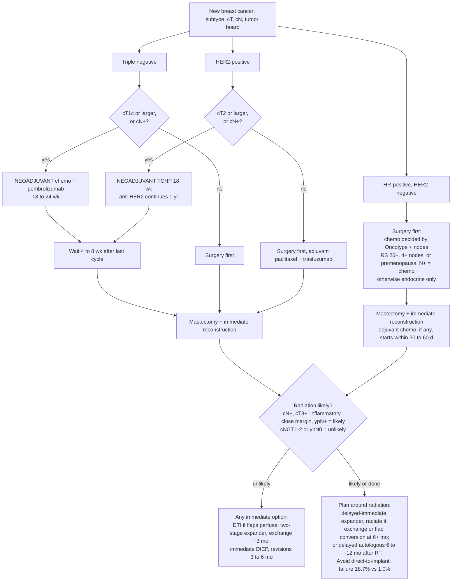
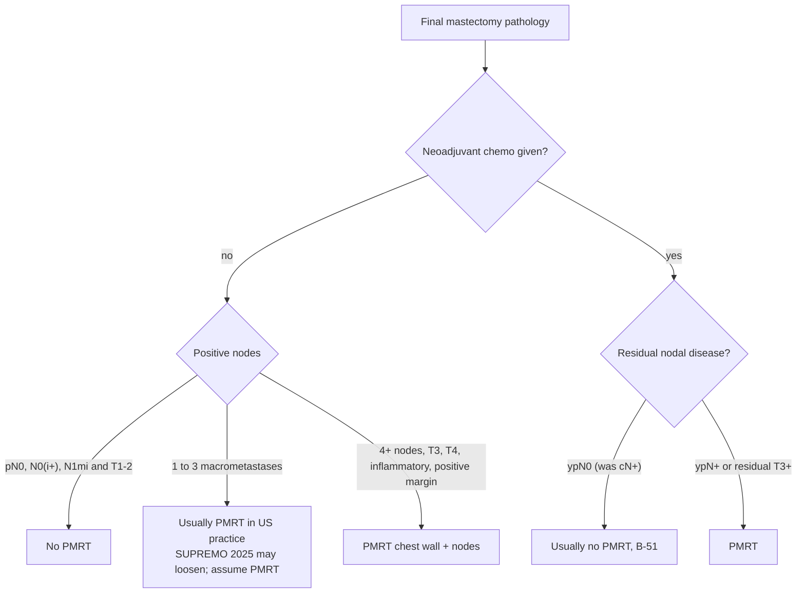

# ABPS Boards Prep: Complete Reference (single file)

Regenerated September 18, 2026. Order: standing instructions, handoff, clinic workflow, concerns assessment, consult template, interview and exam reminders, BOI coverage map, protocol, consult kit, oncology timing algorithm, note review log. The source files remain authoritative.

---

# Standing Instructions: Boards-Grade Breast Reconstruction Notes

Read this first in any new session, Claude Code or chat. It is the contract for how the surgeon and Claude work together during the ABPS case collection period and beyond.

## Who the user is

A plastic surgeon in independent practice since September 2026, in the ABPS oral board case collection period (July 1, 2026 to March 31, 2027), targeting the November 11 to 13, 2027 Oral Examination. Most consults are breast reconstruction referred by breast surgeons. The surgeon works with a scribe and an EMR, and has Claude open beside the EMR.

## What the user wants from every patient

When the user pastes a patient history (with or without a command), produce, in this order and in this format:

1. **Summary** of what is known, five to eight lines, stage and subtype stated plainly.
2. **What it means before the visit**: the predicted chemotherapy and radiation plan with the basis, the one oncologic fact that constrains reconstruction, radiation likelihood, and the timing rules that apply.
3. **Questions to ask**, at most 12, ordered by how much each answer changes the plan.
4. **What to document specifically**, split into history, exam as numbers, assessment, and plan.
5. **Suggested reconstruction plans**: usually two, with the decision rule between them, the nipple decision, the contralateral plan, and any gate on pending results.
6. **The consult note in sections** for copy and paste: reason for visit and HPI; oncologic history and timeline; past medical, surgical, medications, allergies; social and family history; review of systems; vitals and exam; data reviewed; assessment (four numbered items); plan (paragraphs A through K); before-signing check. In the assessment and plan, put a cue list beside each paragraph naming what can be added depending on what was discussed.
7. **Board note**: how the case enters the ABPS case list (co-surgeon rule, intra-op photo, outcome fields, three-per-patient cap).

Deliver as two documents when files are possible: a Summary (items 1 to 5 and 7) and a Consult Note (item 6). In chat without files, deliver both in the message with the note in code blocks.

## Voice and style (the user's own)

1. First person, past tense, for what the surgeon did: "I reviewed," "I explained," "I recommended."
2. The patient's response is its own sentence: "Patient verbalized understanding that..." "Patient wishes to proceed."
3. Conditions carry an explicit then: "If [ ], then [ ], and in that case [ ]."
4. Paragraphs open with sequence markers where they fit: "After discussion of the surgical options," "At the conclusion of the consultation."
5. Sentences close with purpose or contrast where it adds meaning: "in order to," "rather than risk a wound problem," "as well as."
6. Recurring nouns: surgical plan, surgical option, reconstructive goals, her concerns, a later stage, revision stage.
7. Plain sentences of 20 to 35 words, one idea each, in prose; the only list is inside the risk sentence.
8. No sentence may contradict the history, the exam, or another sentence. Delete education or consent text for any modality the patient is not receiving.

The five anchor sentences, verbatim:
- Options: "I reviewed the options with the patient, which included no surgical reconstruction with a flat closure or external prosthesis, delayed reconstruction after cancer treatment, implant-based reconstruction done in a one or two stage manner, and autologous reconstruction as well. For each surgical option I explained how it could or could not address her concerns and reconstructive goals."
- Borderline nipple: "The patient's anatomy raises my concern for nipple preservation. I explained that due to the anatomy the risk of losing part or all of the nipple is higher than usual. I explained that due to positioning her nipples will sit low after reconstruction and will likely need to be repositioned at a later revision stage in order to correct their position. I also explained that if the nipples look poorly perfused during surgery, then I will either convert them to a free nipple graft or remove them rather than risk a wound problem."
- Risks: "After discussion of the surgical options, I explained the risks of the surgery, specifically stating the risks of [list], as well as the alternatives to the surgical plan."
- Radiation: "I explained that if the final pathology of the specimen demonstrates a positive node, then radiation becomes likely, and in that case the expander will stay in place through radiation and be exchanged at a later stage, at least 6 months from the completion of radiation. Patient verbalized understanding that the need for radiation can change her expander fill and timing."
- Closing: "At the conclusion of the consultation, the patient verbalized her understanding of the plan back to me and stated that all of her questions had been answered. Patient wishes to proceed. Preoperative photographs were taken with the patient's consent."

## Fixed practice lines

- Bilateral DIEP: 6 to 8 hours, at least 2 inpatient nights, 6 to 8 weeks to full activity.
- Expander or direct-to-implant: 3 to 4 hours, 23-hour observation, 4 to 6 weeks.
- Expander plane decided intraoperatively on flap thickness, ICG perfusion, area of poorly perfused skin, pectoralis integrity, breast size and ptosis, expected implant volume, anticipated radiation, and patient risk factors; good flaps favor prepectoral with mesh, thin or marginal flaps favor subpectoral, lower fill, or a deflated expander.
- Wise-pattern versus skin-sparing for a grade III breast with a flap is discussed with the breast surgeon case by case.
- Risks listed in every note that offers a plan. A1C only for diabetics. Stages at least 3 months apart; definitive stage at least 6 months from the completion of radiation.

## What ABPS requires of every case (the reasons behind the note)

- Every operative case entered; at least 50 Major; at most 3 per patient count.
- Pre-op, intra-op (after incision, before closure), and post-op photos at 90 days or more for every case, taken by the surgeon where possible; ABPS records and photo consent with the Board's verbatim language.
- In-person visit at least the day before surgery; in-person post-op visit within 30 days; telemedicine only in between.
- Outcome at 4 to 6 weeks and 30-day mortality on every entry; oral antibiotics, extra visits, and prolonged dressings are adverse events.
- Examiners grade Diagnosis/Planning, Management/Treatment, Complications/Outcome, Safety, Ethics/Professionalism, and Case Report Organization. Passing requires one clear safe plan you can defend, recognition of complications, and a backup plan. Failing includes an unsafe or ambiguous plan and coding deception.
- Immediate reconstruction with a breast surgeon is entered but not flagged as co-surgeon, with the surgeon's own operative report and bill and only the plastic surgery portion's duration.
- Every stage is its own case with its own in-person pre-op visit, consent, note with risks, and three sets of photographs; any overnight stay including 23-hour observation is inpatient; consultants' reports go in the Initial Evaluation tab, so each is named with its date; modeling-software images, if any, are submitted; notes are signed the same day and nothing in a selected case is edited after the July 2027 notice without listing it on the EMR attestation.
- The template's Part 8 lists the Case Log fields to set at the consult; the full requirement-by-requirement map is `docs/BOI-Coverage-Map.md`.

## Evidence the notes cite

- Radiation: 4 or more nodes always; 1 to 3 macrometastatic nodes usually; ypN+ after neoadjuvant yes; ypN0 usually no. Reconstruction failure with radiation 18.7 percent implants versus 1.0 percent flaps (MROC). Expander exchange at least 6 months after radiation; delayed autologous at 6 to 12 months avoiding the 3 to 6 month window.
- Chemotherapy: triple negative at cT1c or larger and HER2-positive at cT2 or larger get neoadjuvant therapy; surgery 4 to 8 weeks after the last cycle; adjuvant chemotherapy within 30 to 60 days of surgery; T1a HER2-positive is surgery first with adjuvant paclitaxel and trastuzumab considered. DCIS: sentinel node at mastectomy, about 1 in 5 upstaged, no radiation unless margin positive.
- Flaps: DIEP total loss under 2 percent, fat necrosis about 10 to 15 percent, bulge or hernia 2 to 5 percent, higher satisfaction at every time point (MROC, MSKCC). Implants: about 10 percent rupture by 10 years; contracture 15 to 50 percent with radiation; FDA boxed warning and Patient Decision Checklist required.
- Nipple-sparing: necrosis about 9 percent with inframammary incisions versus 18 percent periareolar; tumor-to-nipple over 2 cm, ptosis grade 2 or less, SN-N about 25 cm or less favor it.
- Optimization: nicotine 4 weeks before and after; HbA1c under 8; Caprini as a number with chemoprophylaxis at 7 or higher; mammogram at 40 and older before elective breast surgery; tamoxifen 28-day hold before a free flap as a shared decision; bevacizumab 28-day holds; no hold for trastuzumab, pembrolizumab, aromatase inhibitors.

## Failure patterns to avoid (learned from nine colleague notes)

Template text contradicting the history; education for options that do not apply; "chemotherapy between stage one and two" in flap or neoadjuvant plans; candidacy asserted without measurements; no adjuvant estimate or oncologist named; no risk block, alternatives, or benefits; comorbidities recorded but not planned for; hedges contradicting facts; plans committed before pending results; laterality stated two ways; measured findings ignored in the plan; blank vitals; no Caprini; no in-person pre-op, 30-day, or 90-day visits; no photographs or Board consent line.

## Privacy

Initials only in file names and headings. Patient files stay in the local `patients/` folder, which is gitignored, or in chat. Nothing patient-identifiable is committed to the repository.

## Where the full material lives

Repository branch `claude/plastic-surgery-boards-checklist-du429b`, folder `docs/`: `Consult-Template-Final.md` (the template, v1.3 with Part 8 Case Log fields and modules M14 to M17 for the opening, mastectomy and nipple counseling, and the DIEP and implant procedure explanations), `BOI-Coverage-Map.md` (every Booklet requirement mapped to its prompt), `Interview-Exam-Reminders.md`, `Breast-Reconstruction-Consult-Kit.md` (Sections 10 to 13 hold the oncology model and evidence), `ABPS-Oral-Boards-Compliance-Protocol.md`, `Note-Review-Log.md`, `Oncology-Timing-Algorithm.md`, `Clinic-Workflow.md`. Commands in `.claude/skills/`: `/patient-brief`, `/patient-update`, `/note-draft`, `/note-check`, `/patient-package`. For a chat session without files, paste `docs/Portable-Context-Pack.md`.

---

# ABPS Oral Boards Prep: Handoff and Summary

**Last updated:** September 17, 2026 (evening). Continue from here in Claude Code desktop.
**Branch:** `claude/plastic-surgery-boards-checklist-du429b` (all work committed and pushed).

## Who and what

Plastic surgeon (chief@stentandsculpt.com) in the ABPS case collection period **July 1, 2026 to March 31, 2027**, independent practice started mid-September 2026, first clinic September 17, 2026 (3 immediate breast reconstruction consults, 1 delayed). Target: **November 11 to 13, 2027 Oral Examination**.

The certifying body is the **American Board of Plastic Surgery (ABPS)**, not ASPS. Every requirement was verified against the ABPS 2026-2027 Booklet of Information Oral Exam section (pages 37 to 62, supplied as a PDF) and ABPS candidate web pages.

## Files in this folder

| File | What it is |
|---|---|
| `00-START-HERE.md` | This handoff. |
| `Concerns-Assessment.md` | The six concerns your questions revealed, each rated for real risk, with the fix and a priority order. Read this second. |
| `ABPS-Oral-Boards-Compliance-Protocol.md` | The master protocol. Part A: every ABPS requirement and date. Part B: per-patient checklist. Part C: clinic note standard. Part D: evidence-based timing and optimization thresholds. Part E: cadence. |
| `Breast-Reconstruction-Consult-Kit.md` | Clinic kit: chart review, scribe brief, in-room flow, measured exam, decision framework, risk language, scribe-ready template, sign-off check (Sections 1 to 9); chemo and radiation prediction model and what to change when radiation is coming (Section 10); autologous versus implant evidence with MROC and MSKCC numbers (Section 11); nipple-sparing mastectomy with immediate DIEP in a ptotic breast, including the grade 3 plan without staged mastopexy or nipple delay (Section 12 and 12a); Caprini quick reference (Section 13). |
| `Oncology-Timing-Algorithm.md` | Mermaid flowcharts and timelines: subtype to reconstruction, radiation decision tree, four calendar pathways, option-by-radiation matrix, waiting intervals, counseling lines. Published page: https://claude.ai/artifact/ANsVZbRpEoWBsg9fzhCMy6 |
| `Note-Review-Log.md` | De-identified reviews of nine colleague consult notes (Providers A, B, C), reusable language, fourteen recurring failure patterns, ten template rules, and the practice defaults the user confirmed. |
| `Consult-Template-Final.md` and `.pdf` | v1.2. The consolidated assessment-and-plan template in the user's voice: style rules, fixed lines, assessment block, eleven plan paragraphs, three risk lists, thirteen modules, sign-off check. Published page: https://claude.ai/artifact/LNb9JXD6C6zkEXxwuwUMxh |
| `BOI-Coverage-Map.md` | Every requirement in the 2026-2027 Booklet Oral Exam section (pages 37 to 62) mapped to the template part, reminder, skill, or protocol section that carries it, with what was added on September 17 and two items to confirm with the practice. |
| `STANDING-INSTRUCTIONS.md` | The contract for any new session: outputs, two-document format, voice rules with the five anchor sentences, fixed practice lines, ABPS rules, evidence, failure patterns, privacy. Read first. |
| `Portable-Context-Pack.md` | Standing instructions plus template, reminders, and evidence in one file to paste into a chat session without file access. |
| `Global-CLAUDE-snippet.md` | Block to paste into `~/.claude/CLAUDE.md` on the laptop so every session knows the workflow. |
| `Clinic-Workflow.md` and `Interview-Exam-Reminders.md` | Laptop workflow: four Claude Code commands (`/patient-brief`, `/patient-update`, `/note-draft`, `/note-check`) in `.claude/skills/`, local gitignored `patients/` folder, and the reminder reference the commands read. |
| `ABPS-Boards-Prep-Complete.md` | All markdown files concatenated into one for reading or sending. Regenerated September 17, 2026 (evening). |

Published pages (private, checkboxes save per browser):
- Protocol page: https://claude.ai/artifact/F6VVvajeUBdLN5vbPqDegf
- Consult kit page: https://claude.ai/artifact/5K2BmFbfxD95u6nn5V5DFR (does not yet include Sections 10 to 13; the markdown is current)

## The ten facts that drive everything

1. Enter **every** operative case July 1 to March 31 at every facility; at least **50 must be Major** (auto-classified by CPT); **max 3 cases per patient** count. Affidavit: "ALL of my cases."
2. **Pre-op, intra-op, and post-op photos of every case**, including minor, office, ER, and hand. Intra-op means after incision and before closure. Post-op at **90 days or more**, preferably taken by you.
3. **In-person visit at least the day before surgery** for non-emergent cases; in-person post-op **within 30 days**; telemedicine only in between.
4. ABPS records and photo consent with the Board's verbatim language on every patient.
5. **Peer evaluations** from chiefs of surgery, staff, anesthesia, and OR nursing at each facility plus two ABPS surgeons, around April 1, 2027.
6. Case list package **physically received April 20, 2027**; late window April 21 to 23. Candidate Affidavit signed, not notarized; **one notarized Medical Records affidavit per facility**, including zero-case facilities.
7. Advertising April 2026 to April 2027 plus CV submitted; "Board Eligible" only after application approval; never "board certified."
8. July 2027: 5 selected cases and Registration (due July 31). **Case reports (11 tabs) finalized August 19, 2027, noon Eastern**; extra-case requests by August 16 are final.
9. Rating items: Diagnosis/Planning, Management/Treatment, Complications/Outcome, Safety, Ethics/Professionalism, Case Report Organization. Pass requires one clear safe plan you can defend plus a backup.
10. Outcome at 4 to 6 weeks and 30-day mortality on every entry; oral antibiotics, extra visits, and prolonged dressings are adverse events.

## Clinical rules of thumb captured

- Surgery 4 to 8 weeks after neoadjuvant chemo; adjuvant chemo within 30 to 60 days; bevacizumab 28-day holds; tamoxifen 28-day hold before free flaps as a shared decision; no hold for checkpoint inhibitors or aromatase inhibitors.
- Radiation: 4+ nodes always; 1 to 3 macrometastatic nodes usually; ypN+ yes; ypN0 usually no. Expander exchange 6+ months after radiation; delayed autologous at 6 to 12 months avoiding the 3 to 6 month window.
- Autologous versus implant: failure with radiation 18.7 versus 1.0 percent (MROC); DIEP total loss under 2 percent; radiated implant contracture 15 to 50 percent; autologous satisfaction higher at every time point over 8 years.
- Ptotic NSM with DIEP and no staged mastopexy or nipple delay: lateral inframammary incision, buried DIEP, nipple left in place with ICG-guided fallback to free graft or excision, mastopexy at 3 to 6 months.
- Caprini: not a Board requirement, but score every sedation or general anesthesia patient with the plan attached; breast reconstruction patients start at 4.
- Practice defaults: bilateral DIEP 6 to 8 hours, at least 2 nights, 6 to 8 weeks recovery; expander plane decided intraoperatively on flap thickness, ICG perfusion, pectoralis integrity, breast size, expected radiation, and patient risk factors; risks listed in every note with a plan; A1C only for diabetics; expander or direct-to-implant case 3 to 4 hours with 23-hour observation; Wise-pattern versus skin-sparing for grade III flap patients discussed with the breast surgeon case by case.
- The colleague notes shared five failure patterns worth remembering: template text contradicting the history, boilerplate "chemotherapy between stages" in flap and neoadjuvant plans, no adjuvant estimate or oncologist named, no risk block or alternatives, and comorbidities recorded but never converted into a plan.
- Nicotine 4 weeks before and after; HbA1c under 8; mammogram at 40+ before elective breast surgery; FDA implant checklist; 5 L liposuction and 6-hour office OR limits.

## Where we stopped

**September 17, 2026, late.** The Booklet's Oral Exam section (the July 14 file, identical to the earlier copy) was re-read in full against the template, reminders, and skills. Result: the administrative requirements were already in the protocol; the note-level gaps were closed in template v1.2 (Part 3 item 5 records reviewed with consultant dates and trial status; Part 4 C prevention-and-treatment sentence; I orders with indications; J surgeon-owned follow-up and per-stage visits; K modeling software and witnessed consent; Part 7 same-day signing and addenda; new Part 8 Case Log fields decided at the consult), in the reminders (four new questions, four new mentions, Case Log fields, and the 4-to-6-week outcome documentation), and in the four skills. The map is `BOI-Coverage-Map.md`. Patients 3 and 4 are still to come.

Evening of September 17, 2026. Nine colleague notes were reviewed and logged, the user supplied five sentences in their own voice, and the consolidated template was written around them (`Consult-Template-Final.md`). The user has read the template and approved it ("looks good"). The patient-by-patient review with pre-filled notes has not happened yet. Agreed workflow when it does:
- Send patients as Patient 1 to 4 with initials only; no names, DOB, MRN, or exact dates.
- Per patient: one-line summary and breast surgeon's plan; pathology and receptors; imaging with tumor-to-nipple distance; genetics; systemic therapy status and dates; radiation status; tumor board note; risk factors; patient goals.
- Return per patient: pre-filled note in the kit's template, questions still to ask, exam findings that decide the plan, draft assessment and plan with recommendation, backup, and risk block, and a board note if relevant.
- **Do not commit patient-specific content to the repo.**

## Open items

- Any template paragraph the user wants re-voiced: quote it and rewrite; conform the rest to the seven style rules in Part 1.
- Load the template into the practice's scribe system; run the sign-off check (Part 7) on the first five notes.
- Set up the laptop workflow per `docs/Clinic-Workflow.md`; Patients 1 and 2 briefs from September 17 exist only in the web chat and should be re-run locally with `/patient-brief`.

- Email oral@abplasticsurgery.org: 2026-2027 fee schedule, whether an employer start-date letter is wanted with the case list, case report webinar link.
- Update the practice photo consent with the ABPS language and a witness line (should be done before the first clinic).
- Confirm that every facility allows intraoperative photography, or request the waiver now (`BOI-Coverage-Map.md` Part D).
- Confirm surgery center accreditation and active admitting privileges before any sedation or general case; request an OR photography waiver if any facility restricts it.
- Build the tracker spreadsheet (twenty columns in the kit); can be generated as a workbook next session.
- Republish the consult kit page with Sections 10 to 13 if the phone version is wanted.

## How to continue on Claude Code desktop

```
git fetch origin claude/plastic-surgery-boards-checklist-du429b
git checkout claude/plastic-surgery-boards-checklist-du429b
```
Open Claude Code in the repo and say: "Read docs/STANDING-INSTRUCTIONS.md and docs/00-START-HERE.md, then continue." Laptop status as of September 17, 2026 (night): repository cloned, branch checked out, login working, global `~/.claude/CLAUDE.md` snippet installed, `/patient-brief` and `/patient-package` tested on Patient 1, and the chat backup path (Portable-Context-Pack) tested on Patient 2. All layers verified by the user. Patients 1 and 2 also have Summary and Consult Note PDFs built in the web session (not in the repository). The root `CLAUDE.md` points here automatically.

---

# Clinic Workflow on Your Laptop

Claude Code desktop open on one half of the screen, the EMR on the other. Four commands carry a patient from referral to signed note. Patient files live in `patients/` inside this repo folder on your laptop, which is gitignored and never leaves your machine.

## One-time setup (5 minutes)

1. Install Claude Code desktop and sign in.
2. Clone this repository to your laptop and check out the branch:
   ```
   git clone <repo url>
   cd TSIALL-Mockup
   git checkout claude/plastic-surgery-boards-checklist-du429b
   ```
3. Open the folder in Claude Code desktop. The root `CLAUDE.md` loads the rules and the four commands appear when you type `/`.
4. Confirm `patients/` is listed in `.gitignore` (it is). Never run `git add patients`.

## The five commands

| When | Command | What you paste | What you get |
|---|---|---|---|
| Night before or between patients | `/patient-brief` | The referral history, de-identified (initials, no DOB or MRN) | A brief, the predicted chemo and radiation plan, which options fit, a provisional recommendation with backup, numbered questions to ask, the exam numbers to record, red flags, the template modules you will need, and the board note. Saved to `patients/P-XX-date.md`. |
| In the room or right after | `/patient-update P-XX` | Interview answers, exam numbers, the patient's stated goals, anything new | A dated update: what changed, what it does to the plan, the revised recommendation, questions still open. The file keeps every version. |
| Any later day | `/patient-update P-XX` | New pathology, oncology decision, a changed wish, a complication | Same. Use it every time the situation changes, through every stage. |
| At your desk writing the note | `/note-draft P-XX` | Nothing, or last-minute facts | The full assessment and plan in your voice inside one code block, ready to copy into the EMR, plus a list of blanks to fill. |
| Any time, or as the backup path | `/patient-package P-XX` (or paste a history) | Nothing, or the history | Two files in `patients/`: `P-XX-Summary` (summary, what it means, questions, what to document, two plans, board note) and `P-XX-Consult-Note` (the note in ten copy-paste sections with add-if-discussed cues beside the assessment and plan), as HTML that opens in the browser and as PDF when Chrome is installed. |
| Before signing | `/note-check P-XX` | The finished note text from the EMR | Contradictions quoted, board risks, missing paragraphs, style drift, then "Did you discuss..." questions, then corrected paragraphs only. |

## A clinic day

**Night before.** For each new patient, paste the referral into `/patient-brief`. Read the brief on your phone or laptop in the morning. Ten minutes for four patients.

**In the room.** Keep the brief open beside the EMR. Ask the numbered questions in order; dictate exam findings as numbers to the scribe. Say "for the record" before the options, the risks, and the patient's goals so the scribe captures them verbatim.

**Between patients, 60 seconds.** Paste the answers and measurements into `/patient-update`. The recommendation revises itself and the questions you skipped stay listed.

**At your desk.** Run `/note-draft`. Copy the code block into the EMR assessment and plan. Fill the blanks from the scribe's note. Delete any module that did not apply.

**Before signing.** Copy the whole note out of the EMR and paste it into `/note-check`. Fix what it quotes. Answer its "Did you discuss" questions honestly: if you did not discuss it, either add it at the pre-op visit and document it then, or leave it out. Sign within 24 hours.

**Pre-op visit, post-op visits, radiation, exchange.** Each visit is a `/patient-update`. When the case is selected for the Board, the file is the timeline you will need for the narrative summary.

## What the files look like

```
patients/
  P-AB-20260917.md     one file per patient, dated sections appended over time
  P-CD-20260917.md
```

Each file: Brief, Predicted oncology plan, Options, Provisional recommendation (revised dates), Questions, Exam to record, Watch for, Modules, Board note, then `## Update`, `## Note draft`, `## Note check` sections in the order they happened.

## Backup path when Claude Code is not available

Open a chat session, paste `docs/Portable-Context-Pack.md` (about 15,000 words: standing instructions, template, reminders, evidence), then paste the patient history and ask for the summary and the note. The output matches what the commands produce; save it yourself, initials only.

## Privacy rules

- Initials only in file names and headings. If a pasted history contains a name, the commands will not carry it into the file name; you should still strip names before pasting when practical.
- The `patients/` folder is excluded from git and stays on the laptop. Back it up with your other local clinical files, not through the repository.
- Do not paste patient content into the shared web session; use the desktop app on the laptop.

## Keeping the system current

- Template changes go in `docs/Consult-Template-Final.md`; the commands read it live, so an edit applies to the next note.
- New reminders go in `docs/Interview-Exam-Reminders.md`.
- New evidence or thresholds go in the consult kit or the protocol; the update command cites them.

---

# Concerns Assessment: What Your Questions Reveal and What Actually Matters

**Prepared September 17, 2026.** Based on the questions asked across this preparation session, read against the ABPS 2026-2027 Booklet of Information and the examiner scoring criteria.

You asked, in order: what ABPS requires of every patient; whether your clinic notes will be judged incomplete; how to time surgery around chemotherapy and radiation; how to run a new clinic efficiently with a scribe; how to predict who gets chemotherapy and radiation; what to change when a positive node appears; the statistics for autologous versus implant reconstruction; how to handle nipple-sparing mastectomy in a ptotic breast with a DIEP; whether to stage the nipple; and whether you must calculate a Caprini score on everyone. Those questions cluster into six concerns. Each is rated below for how real the risk is, with the evidence and the fix.

---

## Concern 1: "I could be disqualified on a technicality I did not know about"

**Risk: real, and the most preventable.** Almost every deferral the Board describes is procedural, not clinical: missing photos, a consent without the Board's language, a facility affidavit not notarized, advertising that says "board certified," a case list mailed by USPS certified mail, or a case report finalized after noon on August 19.

**What the questions showed.** You knew about the 50 cases and pre-op photos. You did not know about intra-op photos on every case, the 90-day post-op photo rule, the in-person visit the day before surgery, the 30-day in-person post-op visit, peer evaluations, the three-cases-per-patient cap, the exclusion list, or the notarized affidavit for every facility including ones with no cases. Those are now in the protocol.

**Fix.** Part A of the protocol is the checklist. The four items that need action this week: ABPS consent language on your photo consent form; a written waiver request if any facility restricts OR photography; confirmation that admitting privileges are active before any sedation or general case; and a dated folder of your advertising screenshots. Everything else is cadence.

---

## Concern 2: "An examiner will find something I failed to document or examine"

**Risk: moderate, and it is a systems problem, not a knowledge problem.** The Board does not audit for completeness against a list. Examiners read your five case books and grade Diagnosis/Planning, Management/Treatment, Complications/Outcome, Safety, and Ethics. What fails candidates is a plan that cannot be reconstructed from the record: no alternatives, no rationale, no risk discussion, complications that appear in the bill but not the notes, or notes edited after selection.

**What the questions showed.** Your instinct to document risk factors, measurements, and evidence-based timing is correct. The gap is that your practice's templates were built for billing, not for defending a plan. A scribe writing "normal breast exam" and "risks and benefits discussed" satisfies billing and fails the Board.

**Fix.** The consult template in the kit forces the six elements examiners grade into labeled places, leaves blanks where you did not say something, and uses "for the record" as the cue for verbatim capture. The same-day sign-off checklist catches the rest. Keep the Board's own language in mind: they will highlight where risks were discussed and may pull revision history.

---

## Concern 3: "I do not fully understand how oncologists sequence chemotherapy and radiation"

**Risk: real for the exam, manageable in practice.** In practice you will always have the tumor board and the oncologists. In the exam room you will be asked, without them, why a triple-negative patient with a positive node after neoadjuvant chemotherapy is getting radiation and what that does to the expander you placed. A candidate who cannot predict the adjuvant plan looks unsafe.

**What the questions showed.** You asked the right question in the right form: "what should I assume when I hear a positive node." That is exactly how examiners frame it.

**Fix.** Section 10 of the kit is the model: subtype predicts chemotherapy, nodes predict radiation, and the timing rules (surgery 4 to 8 weeks after neoadjuvant chemotherapy, adjuvant chemotherapy within 30 to 60 days, radiation after chemotherapy, exchange 6 months after radiation) are the numbers to memorize. Test yourself on each of the four clinic patients: before reading the tumor board note, predict the adjuvant plan, then check.

---

## Concern 4: "I will choose the wrong reconstruction in a complex case"

**Risk: low, provided the plan is defended.** Your questions about ptotic nipple-sparing mastectomy with DIEP, incision choice, and staging the nipple are the questions of someone who already knows the options. The Board's own pass criteria ask for one clear, safe initial plan you can explain, recognition of complications, and a backup plan. They do not ask for the plan the examiner would have chosen.

**What the questions showed.** Two things to watch. First, the institutional constraints you described (no staged mastopexy, no nipple delay) narrow the options, and you should say so in the note rather than let it look like you did not consider them. Second, you gravitated toward the single-stage answer; the safer answer in a grade 3 breast without delay is the two-stage one, and the record should show you chose safety.

**Fix.** Sections 11 and 12 of the kit give the numbers (failure 18.7 versus 1.0 percent with radiation, nipple necrosis about 9 percent inframammary versus 18 percent periareolar, DIEP loss under 2 percent) and the note language. Cite them in the plan.

---

## Concern 5: "I cannot do all of this and still run an efficient clinic"

**Risk: real for the first month, then it disappears.** The requirements add about ten minutes per new patient: consent, standardized photos, measurements dictated as numbers, and the structured plan. Most of that can be moved off you.

**What the questions showed.** You already have a scribe and templates, which is the hard part. The remaining work is redesigning the template once and moving photos and consent to the medical assistant before you enter the room.

**Fix.** The scribe brief and in-room flow in the kit. Fifteen minutes of chart review the night before turns the consult into confirmation. The tracker (twenty columns, one row per case) replaces memory. Budget two clinics to reach the new rhythm.

---

## Concern 6: "Am I over-documenting things the Board does not ask for, like a Caprini score on every patient?"

**Risk: none, in the direction you fear.** The Board does not require a Caprini score. It does score Safety, and VTE prophylaxis is the most predictable Safety question. Documentation that is short but complete is never penalized; documentation that is long and vague is.

**What the questions showed.** Good instinct to ask what is required versus what is habit. The honest answer is that the Board's list is short (consent, photos, in-person visits, outcomes, adverse events) and everything else in the protocol is there because examiners ask about it, not because the Board audits it.

**Fix.** Score every sedation or general anesthesia patient in one line with the plan attached; one sentence for local-only cases. Do not add anything to a note that you would not defend in the exam.

---

## Priority order

1. Consent form with ABPS language, photo workflow with intra-op photos, facility waiver if needed, privileges confirmed. This week.
2. Consult template adopted, scribe briefed, same-day sign-off habit. First two clinics.
3. Weekly Case Log entry and tracker, with the major-case count reviewed every Friday. Ongoing.
4. Oncology sequencing self-test on every breast reconstruction patient. Ongoing.
5. Peer evaluator relationships at every facility. Start now, needed April 2027.
6. Advertising audit and dated screenshots. Monthly.

## What is not a concern

- Volume: 50 major cases in 28 weeks at 2 to 3 per week is achievable, and the Board accepts a shorter collection period if quality and variety are adequate.
- Being a new surgeon: the Board grades safety and judgment, not experience, and a two-stage plan chosen for safety is graded well.
- Getting the "wrong" answer on a debated point (radiate the expander or the implant, hold tamoxifen or not): the record needs to show you knew the debate and chose with the oncology team.

---

# Breast Reconstruction Consultation: Assessment and Plan Template

**Version 1.3, September 18, 2026.** Built from the review of nine colleague notes across three providers, the ABPS 2026-2027 Booklet of Information requirements (re-read in full against this template on September 17, 2026; the coverage map is `docs/BOI-Coverage-Map.md`), the examiner rating items, the user's own dictated sentences, and a fourth colleague's procedure-explanation templates (Provider D, reviewed September 18; see `docs/Note-Review-Log.md`). Every paragraph is written in the user's voice. Brackets are dictated fields; the scribe leaves them blank if not stated so gaps are visible at sign-off. Delete any module that does not apply; never leave education or consent text for a modality the patient is not receiving.

---

## Part 1. Style rules (apply to anything added later)

1. First person, past tense, for what you did: "I reviewed," "I explained," "I recommended."
2. The patient's response is its own sentence with the patient as subject: "Patient verbalized understanding that..." "Patient wishes to proceed."
3. Conditions carry an explicit then: "If [ ], then [ ], and in that case [ ]."
4. Paragraphs open with a sequence marker where one fits: "After discussion of...," "At the conclusion of the consultation..."
5. Sentences close with purpose or contrast where it adds meaning: "in order to...," "rather than risk...," "as well as..."
6. Use the recurring nouns: surgical plan, surgical option, reconstructive goals, her concerns, a later stage, revision stage.
7. Plain sentences of 20 to 35 words, one idea each, in prose; the only list is inside the risk sentence.
8. No sentence may contradict the history, the exam, or another sentence in the plan.

## Part 2. Fixed practice lines

- Bilateral DIEP: 6 to 8 hours under general anesthesia, at least 2 inpatient nights, 6 to 8 weeks to full activity.
- Expander or implant reconstruction: 3 to 4 hours under general anesthesia, 23-hour observation, 4 to 6 weeks to full activity.
- Expander plane is an intraoperative decision (paragraph in Part 4, module E).
- For a grade III breast reconstructed with a flap, the skin pattern (Wise-pattern skin-reducing mastectomy versus skin-sparing mastectomy with a later mastopexy) is discussed with the breast surgeon before the surgical date is set (module M3).
- Risks are listed in every note where a surgical plan is offered.
- A1C is ordered only for diabetic patients.
- Every stage is at least 3 months apart; the definitive stage after radiation is at least 6 months from the completion of radiation.
- Every stage is its own case on the Case Log: its own in-person preoperative visit at least the day before that surgery, its own operative consent, its own note with a risk sentence, its own preoperative, intraoperative, and 90-day photographs. At most three cases per patient count toward the 50.
- The breast surgeon is a non-plastic-surgery co-surgeon: the case is entered, not flagged as a co-surgeon case, with my own operative report, my own bill, and only the plastic surgery portion's skin-to-skin time.
- Any overnight stay, including 23-hour observation, is entered as inpatient on the Case Log.
- Every consultant whose report shaped the plan is named with the date of the report, because their reports go into the Initial Evaluation tab of the case report.

---

## Part 3. Assessment (numbered, declarative)

1. [Age]-year-old [pre/postmenopausal] woman with [side] breast [histology], [grade], cT[ ] ([ ] cm at [clock position], [ ] cm from the nipple) cN[ ], ER/PR [ ], HER2 [ ], genetics [negative/pending/not indicated], family history [ ]. [Second lesion if multicentric.] Planned [unilateral/bilateral] [nipple-sparing/skin-sparing/skin-reducing] mastectomy with [sentinel node biopsy/axillary dissection] by Dr. [ ] on [date]. [Contralateral mastectomy is risk-reducing by informed preference.]
2. Adjuvant therapy anticipated: [chemotherapy: none / neoadjuvant, last cycle (date), surgery 4 to 8 weeks after / adjuvant, to start within 30 to 60 days of surgery / pending Oncotype]; radiation [unlikely / possible / planned], based on [nodes, T stage, margins, response]; endocrine or targeted therapy [ ]. Systemic decisions are per Dr. [medical oncology]; radiation per Dr. [radiation oncology].
3. Reconstruction candidacy: patient prefers [own tissue / implants / undecided] and a [same / smaller / larger] size. [Donor site: abdominal pinch ( ) cm above and ( ) cm below the umbilicus, scars ( ), estimated flap volume ( ) mL per side against breast volume about ( ) mL / abdomen unavailable because ( ), thigh and gluteal tissue ( ).] [Nipple-sparing: anatomically (favorable/borderline/not a candidate) with SN-N ( ) cm, N-IMF ( ) cm, ptosis grade ( ); oncologic eligibility per Dr. ( ).]
4. Perioperative risk: ASA [ ], Caprini [number], nicotine [never / quit (date) / current], BMI [ ], [diabetes with HbA1c ( ) / no diabetes], anticoagulation [ ], hormone therapy [ ], medications [ ], allergies [ ], [MRSA history / prior radiation / thrombotic history].
5. Records reviewed at this visit: pathology dated [ ], [mammogram / ultrasound / MRI] dated [ ], consult notes from Dr. [breast surgeon] dated [ ], Dr. [medical oncology] dated [ ], [Dr. (radiation oncology) dated ( )], [genetics dated ( )], [tumor board dated ( )]. [Clinical trial enrollment: none / enrolled in ( ) with protocol consent in the chart.]

---

## Part 4. Plan (narrative, in order)

### A. Options (every note)

I reviewed the options with the patient, which included no surgical reconstruction with a flat closure or external prosthesis, delayed reconstruction after cancer treatment, implant-based reconstruction done in a one or two stage manner, and autologous reconstruction as well. For each surgical option I explained how it could or could not address her concerns and reconstructive goals. [One sentence per option that was set aside and why: "Abdominal flap reconstruction is not possible because of her prior abdominoplasty." "Immediate implant reconstruction is not recommended because radiation is expected." "She is not interested in a flat closure or a prosthesis."]

### B. Recommendation (every note)

After discussion of the surgical options, I recommended [procedure, laterality, staging], because [the two or three facts from the assessment that decide it: measurements, oncologic timing, radiation likelihood, donor site, patient goals]. Patient [agrees with this plan / elected ( ) after discussion of ( )].

### C. Risks (every note)

After discussion of the surgical options, I explained the risks of the surgery, specifically stating the risks of [insert the list from Part 5 for the chosen pathway, plus the patient-specific items], as well as the alternatives to the surgical plan and the expected benefits. I explained that exact symmetry is rare and difficult to achieve surgically, and that no promise of exact symmetry has been made nor should be expected. I explained how each of these risks is reduced, specifically [ICG angiography of the skin flaps, perioperative antibiotics, sequential compression devices and enoxaparin, drains, nicotine abstinence, glycemic control], and how each would be treated if it occurred, including [return to the operating room, removal of the device, debridement, or delayed reconstruction]. [I provided written information about ( ).] Patient verbalized understanding.

### D. Backup plan (every note)

I explained that if [the mastectomy skin flaps are poorly perfused on ICG angiography], then [the expander will be left deflated or reconstruction delayed], and that if [ ], then [ ]. [For flaps: "If the CT angiogram does not show adequate perforators, then the plan will change to a muscle-sparing TRAM or a thigh flap. If the flap is not viable during surgery, then a tissue expander will be placed as a staged alternative."] Patient verbalized understanding that the plan may change in the operating room in order to protect the skin envelope and the reconstruction.

### E. Expander plane (implant-based notes)

I explained that the expander plane will be decided in the operating room after the mastectomy. This decision is based on the thickness and quality of the mastectomy skin flaps on direct inspection, the perfusion of the skin flaps and nipples on ICG angiography, the amount of any poorly perfused skin that may need to be excised, the integrity of the pectoralis major after the mastectomy, the size and ptosis of the breast and the expected final implant volume, whether radiation is anticipated, and her own risk factors including BMI, nicotine exposure, diabetes, and prior radiation. I explained that well-perfused flaps of adequate thickness favor prepectoral placement with mesh in order to avoid animation deformity, and that thin or marginally perfused flaps favor subpectoral placement for muscle coverage, a lower initial fill, or a deflated expander. Patient verbalized understanding that either plane may be used.

### F. Radiation contingency (every note where radiation is possible)

*Expander version.* I explained that if the final pathology of the specimen demonstrates a positive node, then radiation becomes likely, and in that case the expander will stay in place through radiation and be exchanged at a later stage, at least 6 months from the completion of radiation. Patient verbalized understanding that the need for radiation can change her expander fill and timing, and that conversion to her own tissue at that stage would be discussed.

*Flap version.* I explained that if the final pathology of the specimen demonstrates a positive node, then radiation becomes likely, and in that case the flap will be radiated, which can cause firmness, shrinkage, and fat necrosis, and any revision will wait at least 6 months from the completion of radiation. Patient verbalized understanding.

*Radiation already planned.* I explained that radiation is planned after her mastectomy, and that in that case [the expander will be filled in the operating room to the volume agreed with Dr. (radiation oncology) with no fills after simulation / the reconstruction will be delayed until at least 6 months from the completion of radiation]. I explained that implant reconstruction after radiation carries a much higher risk of infection, capsular contracture, thinning of the skin, exposure, and removal, and that reconstruction with her own tissue tolerates radiation far better. Patient verbalized understanding.

### G. Staging and timeline (every note)

I explained that the reconstruction will involve [number] stages, each at least 3 months apart, with [exchange at about 3 months if no adjuvant treatment / exchange or conversion at least 6 months from the completion of radiation / revisions, nipple reconstruction, and contralateral symmetry at 3 months or later]. [If chemotherapy is planned after surgery: "I explained that chemotherapy is expected to start within 30 to 60 days of surgery, and that the first priority of the reconstruction is a healed wound so that treatment is not delayed."] The index operation is expected to take [hours] under general anesthesia with [23-hour observation / at least 2 inpatient nights] and a recovery of [4 to 6 / 6 to 8] weeks.

### H. Safety and coordination (every note)

The surgery will be performed at [facility, accredited] under general anesthesia. Her Caprini score is [number], and she will receive sequential compression devices [and enoxaparin for ( ) days]. [Nicotine, glycemic, anticoagulation, or MRSA line as applicable.] [She is enrolled in the ( ) clinical trial; the protocol consent and IRB approval are in the chart.] I will coordinate with Dr. [breast surgeon] regarding [incision, skin pattern, nipple decision, axilla], with Dr. [medical oncology] regarding [timing of systemic therapy], [with Dr. (radiation oncology) regarding volume and timing], [and with genetics regarding the pending result].

### I. Orders, each with its indication (every note)

Routine labs [with PT and PTT because microsurgery is planned], chest radiograph, ECG [per anesthesia], [A1C because she is diabetic], [CT angiogram abdomen and pelvis with 0.75 to 1 mm cuts, creatinine first, to map the perforators], [echocardiogram per oncology], [MRSA screen because of her history], [anticoagulation clearance letter from Dr. ( )], [genetic testing because of ( )], [mammogram because she is 40 or older and none is on file]. Nothing is ordered without an indication that a reader can find in this note.

### J. Follow-up (every note)

I will see the patient in person for a preoperative visit at least one day before surgery on [date] in order to examine her again, sign consent, and mark. I will see her myself immediately after surgery and in person within 30 days of surgery on [date], [at the start and midpoint of radiation,] and at 90 days after surgery on [date], when I will take her postoperative photographs; visits in between may be by telemedicine. [Each later stage will have its own in-person preoperative visit at least the day before that surgery.] [For radiated patients: "She will return at 6 months from the completion of radiation to schedule the definitive stage."]

### K. Closing (every note)

At the conclusion of the consultation, the patient verbalized her understanding of the plan back to me and stated that all of her questions had been answered. Patient wishes to proceed. Preoperative photographs were taken with the patient's consent, [no modeling software was used / images generated with ( ) were reviewed with her and saved to the chart], and I explained that photographs will also be taken during surgery and at each visit as part of her surgical record. The patient signed and dated the records and photograph consent for examination and certification purposes by The American Board of Plastic Surgery, which was witnessed, together with the practice's own consent. We will obtain insurance authorization; coverage of all stages, contralateral symmetry, and prostheses under WHCRA was explained.

---

## Part 5. Risk lists (insert into paragraph C)

**General, every plan:** bleeding, hematoma, seroma, infection, delayed wound healing and dehiscence, mastectomy skin flap necrosis, unfavorable scarring, asymmetry, contour irregularity, chronic pain, numbness of the chest and reconstructed breast, deep venous thrombosis and pulmonary embolism, anesthetic complications, need for revision or additional surgery, need for contralateral procedures, and dissatisfaction with the final result.

**Implant-based, add:** capsular contracture, implant rupture or leakage, malposition or rotation, rippling and palpability with prepectoral placement, animation deformity with subpectoral placement, implant exposure and removal, breast implant-associated anaplastic large cell lymphoma and squamous cell carcinoma, systemic symptoms reported with implants, the fact that implants are not lifetime devices and will likely need replacement, the FDA recommendation for MRI or ultrasound screening of silicone implants beginning 5 to 6 years after placement and every 2 to 3 years thereafter, and, for acellular dermal matrix, allergic or immune reaction, seroma, failure to integrate, and infection. [Add: "I reviewed the FDA boxed warning and the Patient Decision Checklist, which will be signed at the preoperative visit."]

**Autologous, add:** thrombosis of the microvascular connections requiring an emergent return to the operating room for flap salvage, partial or total flap loss with removal of the flap, fat necrosis presenting as a firm area that is distinguished from recurrence by imaging, abdominal bulge or hernia, abdominal weakness, need for mesh reinforcement of the abdominal wall, loss of the umbilicus with reconstruction at a later stage, donor-site seroma and delayed healing, need for a vein graft or alternate recipient vessels, injury to adjacent vessels, nerves, muscles, and the viscera of the chest and abdomen, transfusion, changes in sensation of the chest and abdomen, contour irregularities at the breast and the donor site, longer hospital stay and recovery, and the fact that the abdomen can be used only once.

**Nipple-sparing, add:** partial or complete nipple necrosis, loss of nipple and areolar pigmentation, nipple malposition, temporary or permanent loss of nipple sensation, inability to breastfeed, and the small possibility of cancer in retained breast tissue behind the nipple, which requires continued surveillance of the nipple-areola complex.

**Patient-specific, add as applicable:** higher infection risk with MRSA history or obesity; higher implant failure with obesity or radiation; thrombotic risk with interruption of anticoagulation; higher flap risk with a thrombotic history; delay of adjuvant chemotherapy if a wound complication occurs; T-junction breakdown with a skin-reducing pattern.

---

## Part 6. Modules (insert where they apply)

### M1. Borderline nipple-sparing

The patient's anatomy raises my concern for nipple preservation, specifically [SN-N ( ) cm, N-IMF ( ) cm, ptosis grade ( ), prior periareolar scars]. I explained that due to the anatomy the risk of losing part or all of the nipple is higher than usual. I explained that due to positioning her nipples will sit low after reconstruction and will likely need to be repositioned at a later revision stage in order to correct their position. I also explained that if the nipples look poorly perfused during surgery, then I will either convert them to a free nipple graft or remove them rather than risk a wound problem. Patient verbalized understanding and wishes to attempt nipple preservation with these risks in mind. Oncologic eligibility for nipple preservation rests with Dr. [breast surgeon].

### M2. Nipple not a candidate

I explained that the nipple cannot be preserved because [tumor involvement / retroareolar location / positive margins / SN-N ( ) cm with grade III ptosis], and that the nipple will be removed with the specimen and reconstructed or tattooed at a later stage. [For pendulous breasts: "I explained that a free nipple graft onto the flap is an alternative, with the expected loss of sensation, projection, and pigment, and the patient (elected / declined) this option."] Patient verbalized understanding.

### M3. Grade III breast with a flap: skin plan

I explained that because of her degree of ptosis the skin envelope requires a plan of its own. I explained that there are two approaches: a Wise-pattern skin-reducing mastectomy in which the flap skin fills the lower pole, which lifts the breast at the first operation but carries a risk of breakdown at the junction of the incisions, or a skin-sparing mastectomy in which the envelope is left loose and lifted at a later revision stage once the blood supply has recovered. I explained that I will discuss the skin pattern with Dr. [breast surgeon] and that the plan will be finalized with the patient at the preoperative visit. Patient verbalized understanding that a second stage is part of the plan rather than a complication.

### M4. Delayed-immediate expander when radiation is likely

I recommended a tissue expander at the time of mastectomy in order to preserve the skin envelope while radiation is completed, with the definitive decision between an implant and her own tissue made at least 6 months from the completion of radiation. I explained that an implant radiated in this setting fails in roughly one of five patients and develops significant capsular contracture in a large minority, and that conversion to her own tissue at that stage avoids most of that risk. Patient verbalized understanding and prefers this approach to [a flat closure with delayed reconstruction / an immediate flap that would be radiated].

### M5. Delayed reconstruction after completed radiation

I explained that the best window for reconstruction with her own tissue is 6 to 12 months from the completion of radiation, once the skin has softened and the acute changes have resolved, and that complications are highest between 3 and 6 months after radiation. I explained that an expander in radiated skin carries a higher risk of failure and would likely require a latissimus flap or fat grafting to help the skin. Patient verbalized understanding and elected [ ].

### M6. Contralateral prophylactic mastectomy

I explained that removal of the contralateral breast does not improve survival from her current cancer, that it removes the need for future surveillance of that breast and can simplify symmetry, and that the decision is hers in consultation with Dr. [breast surgeon]. [If genetics pending: "I explained that a positive genetic result would change this discussion and would add counseling regarding her ovaries."] Patient elected [ ].

### M7. Pending results gate the date

I explained that the surgical date will be set after [outside records, the MRI, genetic testing, the medical oncology consultation] are reviewed, because [the extent of disease decides nipple preservation / the subtype decides whether chemotherapy comes before surgery / the genetic result changes the contralateral discussion]. Patient verbalized understanding.

### M8. DCIS contingency

I explained that in about one of five patients with DCIS the final pathology shows invasive cancer, that a sentinel node biopsy will be performed at the mastectomy because it cannot be performed afterward, and that if invasive disease or a positive node is found, then chemotherapy or radiation may become part of her treatment and the reconstruction will be sequenced around it. Patient verbalized understanding.

### M9. Subtype-driven sequencing (triple negative or HER2-positive)

I explained that for her cancer type chemotherapy [with pembrolizumab / with trastuzumab and pertuzumab] is usually given before surgery, that the mastectomy and reconstruction are planned 4 to 8 weeks after the last cycle once her counts have recovered, and that the final pathology after chemotherapy will determine whether radiation is needed. [For surgery first: "I explained that chemotherapy is expected to start within 30 to 60 days of surgery, and that a wound complication could delay it, which is a risk of immediate reconstruction that she accepts."] Patient verbalized understanding. Systemic therapy decisions are per Dr. [medical oncology].

### M10. Patient declining recommended systemic therapy

The patient stated that she would like to avoid chemotherapy even if it is recommended. I explained that this decision belongs to her and her medical oncologist, that I encouraged her to keep that consultation, and that the reconstruction plan does not depend on her decision. Patient verbalized understanding.

### M11. Bridging sentence when preference and plan differ

The patient initially asked about [implant reconstruction]. After discussion of [her BMI and implant failure risk / her wish to keep her current size / the expected radiation / the durability of her own tissue], she elected [autologous reconstruction] in order to [ ]. Patient verbalized understanding of the longer recovery and the abdominal scar.

### M12. Unilateral reconstruction against a native breast

I explained that matching a single reconstructed breast to her native breast is more difficult than a bilateral reconstruction, that her own tissue matches a native breast better over time than an implant, and that a contralateral [reduction / lift / augmentation] at a later stage is likely to be needed for symmetry and is covered under WHCRA. Patient verbalized understanding.

### M13. Comorbidity lines

*Obesity.* I explained that her BMI of [ ] raises the risk of wound complications with either approach and raises the risk of implant failure specifically, which favors her own tissue if she is otherwise a candidate.
*Nicotine.* I explained that she must be free of nicotine in all forms for at least 4 weeks before and 4 weeks after surgery, and that I may test for this before surgery.
*Diabetes.* I explained that her hemoglobin A1C must be below 8 before elective surgery, and that she will be referred to her primary physician if it is not.
*Anticoagulation.* I explained that her anticoagulation will be held and restarted per written instructions from Dr. [ ], and that her thrombotic history raises the risk of flap thrombosis, which is why [ ].
*MRSA.* I explained that her history of MRSA raises the risk of implant infection, that she will complete a decolonization protocol before surgery and receive appropriate antibiotics, and that I will have a low threshold to remove the device if infection develops.
*Hormone therapy.* I explained that [estrogen-containing medication will be stopped 4 weeks before surgery / tamoxifen may be held for 28 days before a free flap as a decision shared with her oncologist].

### M14. Opening and the nature of reconstruction (every note)

I began the consultation by reviewing her diagnosis of [ ], the anticipated [mastectomy and adjuvant plan], and her goals for reconstruction, in the context of her medical and surgical history. I explained that breast reconstruction is an elective operation, and that its goal is to replace the volume removed at mastectomy with either a device (a tissue expander or implant) or her own living tissue (a flap). For each approach I reviewed the initial operation, the surgical sites and scars, the secondary operations, the maintenance the reconstruction requires over time, the hospital stay, the recovery, the benefits, and the short- and long-term complications.

### M15. Mastectomy and nipple counseling (every mastectomy note; consent for the mastectomy itself rests with the breast surgeon)

I explained that the mastectomy removes all tissue that can be identified as breast, that some breast cells inevitably remain, and that the operation reduces but does not eliminate her future risk. [For nipple preservation:] I explained that a nipple-sparing mastectomy leaves a small amount of ductal tissue behind the nipple, that this has been studied and is an oncologically valid option in appropriate patients, and that oncologic eligibility rests with Dr. [breast surgeon]. I explained the alternative of a skin-sparing mastectomy with removal of the nipple-areola complex and later nipple reconstruction or three-dimensional tattooing, and that a nipple-sparing mastectomy is performed through an inframammary fold incision whereas a skin-sparing mastectomy leaves an oblique or transverse scar across the breast. I explained that nipple preservation carries a higher risk of skin loss around the areola and of partial or complete nipple loss, loss of pigmentation, and temporary or permanent change in sensation, and that it requires continued surveillance of the nipple-areola complex. Patient verbalized understanding and [wishes to preserve her nipples with these risks in mind / elected a skin-sparing mastectomy].

### M16. DIEP flap: how the operation is done (autologous notes)

I explained how the reconstruction is performed. An elliptical segment of skin and fat is taken from the lower abdomen between the umbilicus and the pubis and isolated on its perforating blood vessels. The rectus fascia is opened and the vessels are followed through the muscle to the deep inferior epigastric vessels where they arise in the pelvis. I explained that every effort is made to preserve the muscle, the fascia, and the motor nerves, but that if the vessels are small or delicate, then a cuff of muscle and fascia is taken with the flap as a muscle-sparing TRAM, and in that case the abdominal wall carries a higher risk of bulge, hernia, and weakness and may need mesh reinforcement. I explained that a CT angiogram is obtained before surgery in order to confirm her candidacy and plan the perforators [in relation to her prior abdominal scars]. I explained that the flap is brought to the chest and its artery and vein are connected under the microscope to the internal mammary vessels [with removal of a small segment of rib cartilage if needed], that these connections are delicate and can clot, that a clot requires an emergent return to the operating room to attempt salvage, and that although this is rare it can result in total loss of the flap and of the reconstruction. I explained that for this reason she will stay in the hospital for at least 2 nights with intensive monitoring of the flap's blood flow. I explained the inset and shaping of the flap, the scar pattern on the breast, [that a small skin island is kept for monitoring and removed at the revision stage,] and that without clothing it will be apparent that she has been operated on. I explained that the abdomen is closed with a low transverse scar and a scar around the umbilicus, that this closure shares principles with an abdominoplasty but is not the same operation, and that in select cases the umbilicus cannot be preserved and would be reconstructed at the revision stage. I reviewed the perioperative expectations, hospital course, recovery, restrictions, time off work, and the stages involved in reaching the final result. Patient verbalized understanding.

### M17. Expander or direct implant: how the operation is done (implant-based notes)

I explained the difference between a tissue expander, which is a two-stage reconstruction, and a direct implant, which is a one-stage reconstruction, and that the choice between them is made in the operating room based on the quality of the mastectomy skin flaps and the pocket, judged by direct inspection and ICG angiography. I explained that in rare cases, if there is significant concern about healing, then immediate reconstruction is abandoned and reconstruction is pursued in the delayed setting. I explained that if an expander is placed, then she will return to the office for serial expansions until the desired volume is reached, and that a second outpatient operation exchanges the expander for the permanent implant. We discussed saline and silicone implants and [she chose silicone]. I explained that acellular dermal matrix may be used to support and position the device and may reduce the risk of capsular contracture, that this is an off-label use of an FDA-approved product that is common in breast reconstruction, and that it carries its own risks of allergic or immune reaction, seroma, failure to integrate, and infection. I explained that secondary procedures to improve shape and symmetry are common and may include adjustment of the implant pocket, fat grafting, implant exchange, and scar revision, each at least 3 months apart. Patient verbalized understanding.

---

## Part 7. Sign-off consistency check

Before signing, confirm that the laterality, the mastectomy type, the nipple decision, the reconstruction type, and the staging are the same in the history, the exam, the assessment, and every paragraph of the plan; that every option set aside has a reason; that the adjuvant sentence names the oncologists and the basis for the radiation estimate; that the Caprini score is a number with a plan; that the risk sentence matches the chosen pathway; that no education or consent text remains for a modality the patient is not receiving; and that the three visits (preoperative in person, within 30 days, 90-day photographs) carry dates. Confirm also that every consultant is named with the date of the report; that the anesthesia type, the admission plan, and the estimated duration are stated; that every order carries its indication; that the ABPS consent is described as signed, dated, and witnessed; and that the note is signed today. Any later addendum is dated and labeled as an addendum; nothing in a selected case is edited after the July 2027 selection notice without listing it on the EMR attestation.

---

## Part 8. Case Log fields decided at this visit (tracker entry, not note text)

Fill the tracker row from the note before the patient leaves; the same facts print on the Case Log and on the case report title page.

1. **Anesthesia type:** general (the Log's choices are local only including nerve block, IV sedation, general, none).
2. **Admission status:** inpatient for any overnight stay, including 23-hour observation; outpatient only for a same-day discharge.
3. **Planned procedure description, in words, not CPT descriptors:** name the flap and say "microsurgical" or "free flap" when it applies; name the plane, mesh, and device for expanders and implants; list every site.
4. **Planned CPT codes with modifiers, as they will be billed** (verify with billing; the Log designates Major or Minor from these). Bilateral procedures are one code with -50, for example 19357-50. Common codes in this practice: 19357 tissue expander placement; 19340 immediate implant at mastectomy; 19342 delayed implant; 11970 expander to implant exchange; 11971 expander removal without implant; 19364 free flap breast reconstruction (DIEP, PAP, SGAP); 19361 latissimus flap; 19367 to 19369 pedicled TRAM; 15777 biologic mesh add-on; 15771 and 15772 fat grafting to the breast; 19380 revision of reconstructed breast; 19350 nipple reconstruction; 19370 and 19371 capsule procedures; 19318 reduction, 19316 mastopexy, and 19325 augmentation for contralateral symmetry; 15860 ICG perfusion assessment.
5. **Estimated duration, skin to skin, plastic surgery portion only:** [3 to 4 hours for expander or implant / 6 to 8 hours for bilateral DIEP].
6. **Anatomy and Category:** Breast; General Reconstructive (contralateral symmetry procedures under WHCRA are also General Reconstructive).
7. **Co-surgeon field:** not checked when the mastectomy is by a breast surgeon; checked only for a case with another plastic surgeon where I did the preoperative assessment, made the final decision, and provided all postoperative care, with my name on a separate operative report.
8. **Patient identifier:** the same number and at least two initials on every case for this patient at every facility.
9. **Stages expected inside July 1, 2026 to March 31, 2027:** [ ]; only three per patient count toward the 50, all are entered.
10. **Intraoperative photograph plan, after incision and before closure, every site, every side:** expander or implant: the pocket with the mesh and device in place and the ICG still images; flap: the defect, the raised flap on its perforators, the flap inset before closure, and the donor site; nipple graft: the harvested graft and the recipient bed; office procedures: the wound before and after debridement.
11. **Imaging to keep for the radiology tab:** dated key images with reports (CT angiogram perforator images, MRI); mammography reports without images are sufficient.
12. **Research protocol:** [no / yes, with IRB approval and study consent on file].
13. **Office procedures later in this patient's course** (debridement, seroma aspiration, revision under local) are cases too: each gets a procedure note, photographs before and after, and a CPT code, and each is entered on the Log.

---

# Interview and Exam Reminders (reference read by the clinic skills)

## Always ask
- Why mastectomy, and unilateral or bilateral; who recommended it.
- Oncologic timeline with dates: chemotherapy given or planned and last cycle; radiation planned, possible, or done; endocrine or targeted therapy; medical and radiation oncologist names; tumor board recommendation.
- Menopausal status and hormone use.
- Cup size now and desired size.
- Priorities in the patient's words: own tissue or implants, one operation or staged, recovery time, sensation, donor scars, keeping the other breast.
- Family history and genetics: tested, pending, or not done; result and whether it was explained as actionable.
- Nicotine in every form with quit date; diabetes and last HbA1c; VTE or clotting history; anticoagulants; steroids; autoimmune disease; MRSA history; prior radiation; sleep apnea; anesthesia problems; medications; allergies.
- Prior breast surgery or biopsies, especially near the nipple; prior abdominal surgery, liposuction, or abdominoplasty.
- Weight history and stability; work and caregiving constraints; who is helping at home.
- Whether anyone has explained sentinel node biopsy and the chance of upstaging (DCIS) or the chance of a positive node changing the plan.
- Which consultants she has seen and when (breast surgery, medical oncology, radiation oncology, genetics, tumor board), so each report can be named with its date and pulled for the case report.
- Whether she is enrolled in a clinical trial or research protocol (neoadjuvant or surgical), and whether the protocol consent is in the chart.
- Whether any simulation or modeling software images were shown to her by anyone (those images must be submitted with the case).
- Whether she can return in person within 30 days and at 90 days for photographs, and who helps her get there.

## Always mention
- Every option including no reconstruction with flat closure or prosthesis and delayed reconstruction, with a reason each was or was not chosen.
- One recommendation with the facts behind it, and the backup plan.
- The risk list for the chosen pathway, alternatives, benefits, and that exact symmetry is not promised.
- The radiation contingency and the 6-month rule; the adjuvant chemotherapy window of 30 to 60 days if chemotherapy may follow surgery.
- The three visits: in-person pre-op at least the day before surgery, in-person within 30 days, 90-day photographs.
- How each risk is reduced and how it would be treated if it occurred (the examiners' passing criterion is recognition of complications with methods to avoid and treat them).
- That photographs will be taken before, during, and after surgery, and at 90 days, and that each later stage has its own in-person preoperative visit, consent, and photographs.
- Photographs with consent and the ABPS records consent, signed, dated, and witnessed, alongside the practice consent.
- That I will see her myself after surgery; postoperative care is not delegated.

## Case Log fields decided at this visit (template Part 8)
- Anesthesia type; admission status (any overnight stay, including 23-hour observation, is inpatient); estimated skin-to-skin duration of the plastic surgery portion.
- Planned procedure in words (say "free flap" or "microsurgical" when it applies) and planned CPT codes with modifiers as they will be billed; bilateral is one code with -50.
- Anatomy Breast, Category General Reconstructive; breast surgeon cases entered but not flagged as co-surgeon.
- Consistent patient identifier and at least two initials across facilities; number of stages expected inside the collection period (three per patient count).
- Intraoperative photograph plan for every site and side, after incision and before closure; key imaging to keep with dates.
- Research protocol yes or no.

## Postoperative documentation the outcome field needs (4 to 6 weeks)
- Grade and describe every event in the chart the way the Log grades it. Major: unplanned admission or prolonged stay, return to the operating room with sedation, IV antibiotics as an inpatient, DVT, PE, MI, CVA, flap loss, adverse drug event, unplanned ED visit. Moderate: return to the operating room without sedation, dressing changes beyond 6 weeks, outpatient IV antibiotics, unplanned consult with another specialist. Minor: seroma or hematoma requiring drainage, wound infection requiring drainage, oral antibiotics, dressing changes under 6 weeks, extra office visits.
- "All cases do not heal without complications": the note and the Log must agree.
- A discharge summary exists for every admission, including 23-hour observation; it is the first page of the hospital notes tab.
- Every office procedure (debridement, seroma aspiration, revision under local) is its own case with a procedure note, before and after photographs, and a CPT code.
- Mortality within 30 days is a required field for every case.
- The immediate postoperative visit note, the in-person visit within 30 days, and the 90-day photograph visit each exist with dates; the surgeon takes the first and the 90-day photographs.
- Notes are signed the same day; addenda are dated and labeled; nothing in a selected case is edited after the July 2027 notice without listing it on the EMR attestation.

## Look out for
- Subtype that gets chemotherapy first (triple negative at cT1c or larger, HER2-positive at cT2 or larger) arriving without oncology input.
- Node-positive or T3 disease where radiation is certain and an implant is being requested.
- Retroareolar or nipple-involving disease, positive margins, or prior periareolar surgery when nipple-sparing is expected.
- Grade III ptosis or SN-N over 26 cm when nipple-sparing is expected.
- Prior abdominoplasty or extensive liposuction when a DIEP is expected.
- BMI over 30 with an implant request; BMI over 35 to 40 with any elective plan.
- Current nicotine use; HbA1c over 8; thrombotic history; anticoagulation; MRSA.
- Pending genetics with a bilateral plan; pending records or imaging with a surgical date already set.
- Abnormal vitals at the visit (blood pressure, pulse) especially during chemotherapy.
- Patient declining recommended systemic therapy.

## Exam, recorded as numbers
- Height, weight, BMI, blood pressure, pulse.
- Each breast: SN-N, SN to the inframammary fold (Pitanguy point), N-IMF on stretch, base width, breast height, cup and volume estimate, ptosis grade, nipple position relative to fold, asymmetry, nipple eversion or inversion, palpable masses in breast and axilla.
- Skin: quality, striae, scars with location and pattern, biopsy site, radiation change, pinch thickness.
- Tumor: palpable or not, size, clock position, distance from nipple, tethering, dimpling, erythema, nipple inversion or discharge.
- Nipple-areola: diameter, position, sensation, prior surgery.
- Nodes: axillary, supraclavicular, infraclavicular.
- Chest wall: pectoralis integrity, pectus, sternum, port.
- Existing implants: size, type, plane, year, capsular contracture grade.
- Abdomen: pinch above and below the umbilicus, laxity, pannus, diastasis width, hernia, umbilicus, every scar and its relation to the lower abdominal flap.
- Thighs and buttocks: pinch and laxity if the abdomen is thin.
- Back: latissimus function on resisted adduction, scars.
- Vascular: radial and dorsalis pedis pulses, capillary refill, edema, varicosities.
- Upper extremity: lymphedema, shoulder range of motion.

---

# ABPS 2026-2027 Booklet of Information, Oral Exam section: coverage map

**Purpose.** A requirement-by-requirement check of the Oral Examination section (booklet pages 37 to 62, the file "2026-27 BOI oral exam, updated 7-14") against the preoperative visit note template, the interview and exam reminders, the five clinic commands, and the compliance protocol. Re-read in full on September 17, 2026. The July 14 file is word-for-word identical to the copy reviewed on September 16, so nothing in the earlier protocol is out of date.

**How to read the table.** "Where" names the file and section that carries the prompt. "Status" is one of: *was covered* (already there before this review), *added today* (added on September 17 in template v1.2, the reminders, the skills, or the protocol), or *not a note item* (an administrative requirement handled in the protocol calendar, with no place in a consult note).

## A. Requirements that shape the preoperative visit note

| Booklet page | Requirement | Where | Status |
|---|---|---|---|
| 40, item 6 | Physician-patient relationship established in person at least the day before surgery, with discussion and examination by the operating surgeon | Template Part 4 J (in-person pre-op visit with re-examination, dated); protocol B2 | was covered; "examine her again" added today |
| 40, item 6 | Postoperative care by the operating surgeon, not fully delegated | Template J ("I will see her myself"); reminders "Always mention" | added today |
| 40, item 6 | In-person visit within 30 days recommended; 90-day photos mandatory; surgeon takes the first and 90-day photos; telemedicine between | Template J; reminders; protocol B4, B5 | was covered; surgeon-takes-photos and telemedicine wording added today |
| 40 | Preoperative photos of every case; modeling-software images (TouchMD, Crisalix) must be submitted if used | Template K (used or not used, saved to chart); reminders "Always ask"; brief Board note | added today |
| 40, 51 | ABPS records and photograph consent with the Board's verbatim language, patient signature, witness, date; sign the institution's consent too | Template K (signed, dated, witnessed, with the practice consent); protocol A4 has the verbatim language | was covered; witness and date added today |
| 53, 55, 56 | Initial Evaluation tab: H&P, every preoperative note, consultants' reports; risks, alternatives, benefits, and patient education highlighted | Template Part 3 item 5 (records reviewed, each consultant with date); Part 4 A to C (options, recommendation, risks, alternatives, benefits, written information) | item 5 and written-information prompt added today; A to C were covered |
| 60, 61 | Passing criteria: one clear initial plan you can defend; safe; recognition of complications with methods to avoid and treat them; a back-up plan | Template B (single recommendation with reasons), C (prevention and treatment sentence), D (backup), E, F | prevention-and-treatment sentence added today; the rest was covered |
| 60 | Management/Treatment is rated on surgical indications, operative procedure, and appropriate anesthesia | Template B, G (hours under general anesthesia, admission), H (facility, anesthesia) | was covered |
| 60 | Safety: practices within acceptable standards, avoids excessive risk | Template Part 3 item 4 (ASA, Caprini, nicotine, BMI, A1C), H (VTE prophylaxis, facility), M13 comorbidity lines | was covered |
| 60, 59 | Ethics and economic issues: unnecessary procedures, abandonment, coding deception; discuss ethical or economic issues of the case | Template K (WHCRA, authorization), M6 (contralateral mastectomy is the patient's informed choice), M10 (declining systemic therapy), J (follow-up owned by the surgeon); Part 8 item 4 (codes as billed) | was covered |
| 56 | Pertinent labs only; consider conditions and medications | Template I (every order carries its indication); note-check flags orders without indication | indication wording added today |
| 56 | Radiology tab: dated images with reports; mammography reports without images suffice | Template Part 8 item 11; brief Board note | added today |
| 42 | Research-protocol patients need IRB approval and study consent on file | Template Part 3 item 5 and H; reminders "Always ask"; brief Board note | added today |
| 52 | EMR attestation: list every edit after case selection; the Board may pull revision history | Template Part 7 (sign today, dated addenda, no unlisted edits); protocol C4 | was covered in protocol; added to the template sign-off today |
| 43 to 45 | Case Log fields that the consult decides: anesthesia type, admission status (any overnight stay is inpatient), duration skin to skin (plastic portion only with a non-plastic co-surgeon), procedure in words with microsurgery stated, CPT with modifiers (bilateral as one code with -50), Anatomy and Category | Template Part 2 (23-hour observation is inpatient) and Part 8; reminders "Case Log fields"; brief Board note; note-draft prints the fields | added today |
| 42, 43 | Co-surgeon rules: with another plastic surgeon only if surgeon of record, pre-op assessment, final decision, all post-op care, separate operative report; with a non-plastic surgeon include the case, do not flag | Template Part 2 and Part 8 item 7; standing instructions | was covered in protocol and standing instructions; added to the template today |
| 40, 44 | Maximum three cases per patient count; enter all cases; consistent identifier and at least two initials across facilities | Template Part 2 and Part 8 items 8 and 9 | added to template today; was in protocol |
| 41 | Intraoperative photos after incision and before closure, every site, key step (defect and raised flap; device in pocket), ultrasound stills if used; closed-incision photos do not count | Template K (patient told photos are taken during surgery) and Part 8 item 10 (plan by procedure, ICG stills); protocol A4, B3 | photo plan by procedure added today |
| 40, 41 | Minor cases and office procedures must be entered with photos (debridements, aspirations) | Template Part 8 item 13; reminders "Postoperative documentation" | added today |
| 45, 46 | Outcome at 4 to 6 weeks graded Major, Moderate, Minor; oral antibiotics, extra visits, and dressing changes are adverse events; "all cases do not heal without complications"; 30-day mortality field | Reminders "Postoperative documentation"; protocol A3, B4, C4 | was covered in protocol; added to the reminders today so it is in the clinic file |
| 57 | Discharge summary is the first page of the hospital notes tab; 50-page limit across hospital and clinic notes | Reminders "Postoperative documentation" (a discharge summary for every admission including 23-hour observation) | added today |
| 54, 55 | Narrative summary must describe prolonged dressings, oral antibiotics for erythema, extra consultants, adverse events, with a separate Outcome paragraph | Reminders "Postoperative documentation" (document events the way the Log grades them) | added today |
| 40 | Each stage is a separate case: its own in-person pre-op visit, consent, risk documentation, and photographs; post-op photos preferably from the last procedure | Template Part 2 and J; reminders; protocol C4 | added today |

## B. Decision points the note must show (the examiner's questions, and where the prompt lives)

| Decision | Prompt |
|---|---|
| Immediate versus delayed reconstruction | Template A (options with reasons), F (radiation contingency), M4, M5; brief "Options that fit and do not fit" |
| Implant versus own tissue | Template A, B, M11, M13 obesity line; consult kit Section 11; reminders "Look out for" |
| Nipple preservation | Template Part 3 item 3 (SN-N, N-IMF, ptosis), M1, M2; reminders exam numbers |
| Expander plane | Template E (intraoperative decision with the factors) |
| Skin pattern in the ptotic breast | Template M3; consult kit Section 12 |
| Chemotherapy before or after surgery, and the adjuvant window | Template Part 3 item 2, G, M9; kit Section 10; algorithm |
| Radiation likelihood and what changes if it comes | Template Part 3 item 2, F (three versions), M4, M5; algorithm |
| Contralateral breast | Template M6, M12 |
| Pending results that gate the date | Template M7 |
| DCIS upstaging | Template M8 |
| Patient declining recommended therapy | Template M10 |
| VTE prophylaxis | Template Part 3 item 4 and H (Caprini number with a plan); kit Section 13 |
| Nicotine, glycemic control, anticoagulation, MRSA, hormones | Template M13 |
| Backup plan if the first plan fails | Template D |
| Prevention and treatment of each listed risk | Template C (added today) |

## C. Requirements with no place in a consult note (handled in the protocol calendar)

Peer evaluators (chief of surgery or plastic surgery, chief of staff, chief of anesthesiology, OR nursing supervisor, all other hospitals, fellowship director, a designated ABPS diplomate, a local diplomate the Board solicits); unrestricted license reported within 30 days of any action; active practice, no case collection during fellowship; inpatient admitting privileges from the first day of practice and only local-anesthetic cases before that; accredited facilities for sedation or general anesthesia with certificates or an explanation; the shorter-than-9-month submission rule (yours runs from mid-September, so variety and complexity matter more than volume); weekly Case Log entry and a trial print; Candidate Affidavit (signed, not notarized); Medical Records Administration Affidavit per facility (notarized, same-day signatures, remote notary acceptable); case list physically received April 20, 2027 with the late window April 21 to 23; advertising April 2026 to April 2027 including third-party profile sites and the CV; assembly order; July notification of five cases with registration, licenses, all privilege letters, accreditation certificates; August 16 request for three additional cases and August 19 noon Eastern upload; the eleven case report tabs with notarized billing and CPT descriptors, the notarized Photographic Affidavit (no generative AI, cropping and labels only), and the EMR Attestation; examiner review in September and October; exam November 11 to 13, 2027; certificate name by December 1. All of these are in `docs/ABPS-Oral-Boards-Compliance-Protocol.md` Part A with dates, Part E with the cadence.

## D. Two items to confirm with the practice this week

1. That the hospital and any surgery center allow intraoperative photography; if not, the Board requires a waiver request now, not later.
2. That the practice's photo consent already carries the Board's verbatim sentence and a witness line, since every patient seen from now on signs it at the consult.

---

# ABPS Oral Examination: Case Collection Compliance Protocol

**Version 2. Updated September 16, 2026.**
**Governing document:** ABPS 2026-2027 Booklet of Information (BOI), Oral Examination section, pages 37 to 62 (supplied by the candidate), plus the ABPS "Oral Exam Process and Requirements" and "Quick Reference Tips" web pages captured September 2026.
**Candidate cycle:** case collection July 1, 2026 to March 31, 2027. Oral Examination November 11, 12, 13, 2027.

> The certifying body is the **American Board of Plastic Surgery (ABPS)**. ASPS (the society) sets no requirements; its material is used here only for clinical evidence and prep resources.

---

## Part A. Requirements verified from the 2026-2027 BOI

### A1. Dates that matter to you

| Milestone | Date (2026-2027 BOI) |
|---|---|
| Case collection period | July 1, 2026 to March 31, 2027 |
| Oral Exam Information materials mailed and posted in your Oral Exam tab | On or about July 1, 2026. Email oral@abplasticsurgery.org if not received by end of July. |
| Peer evaluation names and contacts submitted online | On or around April 1, 2027 |
| Data entry, proofing, editing, medical-records notarizations complete | By April 19, 2027 |
| Case list, affidavits, statistics, privilege letter, accreditation certificates, advertising and CV **physically received** at the Board Office | **April 20, 2027, close of business.** Guaranteed-delivery courier (FedEx, DHL, UPS). USPS certified mail does not qualify. |
| Late period (late fee auto-charged) | April 21 to 23, 2027. Nothing accepted after April 23. |
| Notified of site visit, practice biopsy, or Ethics Committee review if peer evaluations raise concerns | Early July 2027 |
| Email: Announcement Letter, the **5 Board-selected cases**, Registration Form, travel information | July 2027 |
| Registration Form due (with exam fee, all licenses, all privilege letters, all accreditation certificates) | July 31, 2027 (per ABPS Quick Reference Tips) |
| Last day to request 3 additional cases for an incomplete selected case | August 16, 2027 |
| **Case report upload deadline** (all 5 cases, plus any additional cases, finalized) | **August 19, 2027, 12:00 p.m. Eastern.** No exceptions. |
| Examiner teams review; "Additional Documentation" tab may appear and must be answered promptly | September to October 2027 |
| Email that case reports are cleared | Late September to mid-October 2027 |
| Admission Form posted | About 4 weeks before the exam |
| **Oral Examination** (2.5 days; be present every day) | **November 11, 12, 13, 2027.** 2026 exam was at the Arizona Grand Resort, Phoenix; 2027 location is in the Announcement Letter. |
| Deadline to request a name change for the certificate | December 1, 2027 |

Board Office: 1601 Market Street, Suite 900, Philadelphia, PA 19103. Oral exam questions: oral@abplasticsurgery.org. Phone 215-587-9322.

### A2. Standing requirements (BOI "Oral Examination Requirements" 1 to 6)

1. **Professionalism.** Advertising and Marketing Requirements and the Code of Ethics and Professionalism apply throughout. The Board may defer you for ethical or professionalism issues.
2. **Peer evaluations (new to you).** Names and emails go in around April 1. The Board emails the evaluators. Required from your **primary hospital**: Chief of Surgery or Plastic Surgery, Chief of Staff, Chief of Anesthesiology, OR Nursing Supervisor. From **every other hospital** where you hold privileges: Chief of Surgery or Plastic Surgery. Also: any post-residency fellowship director; one ABPS-certified plastic surgeon you designate (anywhere); one ABPS-certified plastic surgeon near you solicited by the Board. If you operate in a surgery center or office OR: its Medical Director, Anesthesiologist, and OR Nursing Supervisor. Solo practice with an office OR: your most-used anesthesiologist and lead OR nurse. Concerns can trigger a site visit, practice biopsy, or Ethics Committee review and can delay your exam.
3. **Unrestricted license** in every state where you practice, valid continuously through collection and the exam, with an expiration date past November 13, 2027. **Report any restriction or sanction within 30 days.** Restricted status stops case collection until the state board's final order is on file. Investigations, monitoring, mandated CME, evaluations, substance testing, probation, reprimands, fines, citations, and community service all count as restrictions.
4. **Active practice.** Actively engaged primarily in plastic surgery continuously through collection and certification. No fellowship cases, ever, whether ACGME-approved or not.
5. **Hospital privileges.** Active inpatient admitting privileges in plastic surgery, obtained **before** the start of clinical surgical practice. Hand or OMFS privileges alone are not acceptable. Outpatient-only privileges are not acceptable. Until admitting privileges are approved, do only strictly local-anesthetic procedures; any IV sedation or general anesthetic case must wait. One medical staff office letter comes with the case list (start date must match your practice start; expiration or reappointment date listed, or letter dated in the current year). Letters from **all** hospitals where you operate come with the Registration Form.
6. **Outpatient facility accreditation.** Any IV sedation or general anesthesia case must be in an accredited facility (CMS, QuadA, AAAHC, ACHC, state licensure, other). Cases in non-accredited facilities still go on the list with a written explanation. Provide a certificate or a currently dated in-process letter for every non-hospital surgical facility; the facility name in the Case Log must match the certificate. Hospital-based centers accredited by The Joint Commission need no certificate but must be named with the affiliated hospital.
7. **Physician-patient relationship.** In non-emergent cases you must see the patient **in person at least the day before surgery** so they can consider risks, benefits, and alternatives after your examination. Meeting a patient for the first time in pre-op on the day of surgery is not acceptable. Exempt: urgent or emergent reconstructive consults the day of the procedure, and minor local-only reconstructive procedures such as Mohs repairs. Postoperative care must include you and not be fully delegated. The Board recommends an **in-person visit within 30 days** after surgery. **Postoperative photographs at 90 days or more** are mandatory for all patients. The Board strongly recommends you personally take the initial postoperative photos and the 90-day photos. Telemedicine may be used for intervening visits only.

### A3. Case list rules

**Scope.** All operative cases from July 1, 2026 to March 31, 2027. A submission shorter than 9 months is accepted only if it has sufficient quality, complexity, and variety. Minimum **50 major operative cases** to finalize. Enter every case, not 50. Minor cases are entered but do not count. **A maximum of three cases per patient counts toward the 50.** You must attest to active admitting privileges before case entry.

**Must include:** every operative procedure (inpatient, outpatient, office); every ER patient who needed a procedure note; repeat procedures on the same patient (same initials and ID number across facilities); co-surgeon cases with another plastic surgeon only if you are surgeon of record with your own operative report, did the initial pre-op assessment, made the final decision, and provided all post-op care (flag as co-surgeon); co-surgeon cases with a non-plastic surgeon (include, do not flag); resident cases where you are the responsible attending on the operative record; research-protocol cases (IRB approval and consent must exist); military deployment cases; office surgery such as skin lesions, cysts, lipomas, keloids, lacerations; laser for hemangioma over 5 cm² or port-wine stain over 100 cm²; awake liposuction.

**Do not include:** volunteer surgery in developing countries; inpatient consults without surgery; non-operative management; assistant-surgeon cases; co-surgeon cases where you are not surgeon of record; injectables and fillers; aesthetic facial lasers, vaginal lasers, hair or tattoo laser; miraDry; CoolSculpting and stand-alone noninvasive or minimally invasive body contouring (BodyTite, Renuvion, Emsculpt Neo); Ultherapy, Sofwave; Cellfina, Aveli; facials and in-office peels; steroid injections; microneedling; Thermi or Thermage; microdermabrasion; office skin biopsy; Epifix; ear molding.

**Fields per case (all required to finalize):** at least two patient initials; a consistent patient ID number (never a full SSN); date of birth (age prints); gender; facility (enter **every** facility where you hold privileges or employment, even with zero cases); admission status (any overnight stay is inpatient); date of procedure (one OR session equals one case); duration skin-to-skin in hours and minutes; anesthesia type (local or block, IV sedation, general, none); free-text diagnosis (add follow-up plans and staged-procedure notes here); free-text procedure description from the op note (not CPT descriptors; state if microsurgery); CPT codes with modifiers **identical to billing** (bilateral as one code with -50; 99 codes not needed; cosmetic and gratis cases still need CPT codes); CPT frequency; Anatomy (Breast, Hand/Upper Extremity, Head and Neck, Lower Extremity, Trunk/Genitalia) and Category (Congenital, Cosmetic, General Reconstructive, Hand, Skin, Trauma, Other) for every CPT; **Outcome at 4 to 6 weeks** with adverse events; **mortality within 30 days** (required).

**Adverse event grading (from the BOI chart). "All cases do not heal without complications."**

| Major | Moderate | Minor |
|---|---|---|
| Unplanned admission | Unplanned re-operation without sedation | Seroma requiring drainage |
| MI, DVT, CVA, PE | Dressing changes over 6 weeks | Hematoma requiring drainage |
| Unplanned re-operation with sedation | Infection needing outpatient IV antibiotics | Wound infection requiring drainage |
| Infection needing inpatient IV antibiotics | Unplanned consult with another specialist | Oral antibiotics |
| Adverse drug event | | Dressing changes under 6 weeks |
| Unplanned ED visit | | Increased number of office visits |
| Flap loss | | |
| Prolonged hospital stay | | |

Describe every event concisely in the "Describe all Adverse Events" box; the text prints on the list. For February and March cases, select the category as known at submission.

**Finalize and submit.** Finalizing produces the per-facility case lists, Candidate Affidavit, Case Statistics Summary Report, and a Medical Records Administration Affidavit for each facility. The Case List Review Fee is charged by credit card at finalization. Data cannot be changed after finalization; call the Board Office to unfinalize if an error is found.

- **Candidate Affidavit:** you sign and date. **Notarization not required.** Text: "I attest that the patients listed on the attached pages are ALL of my cases. I understand that a minimum of 50 major cases is required by ABPS during the period July 1, 2026 to March 31, 2027. The CPT codes listed are an exact representation of those submitted for billing purposes..."
- **Medical Records Administration Affidavit, one per facility, including facilities with no cases:** signed by that facility's medical records administrator (for office cases, the office person who can attest to completeness), **then notarized, both signatures dated the same day.** Remote notarization accepted. Only the affidavit generated by "Finalize" may be used. Alert each medical records department in **February or March** so the review is scheduled.
- **Hospital privilege letter** from one medical staff office.
- **Accreditation certificates** for all non-hospital facilities.
- **Advertising, last 12 months (April 2026 to April 2027), plus CV:** business cards, letterhead, brochures, billboards, flyers, print ads, articles; website homepage, About the Doctor page, any credentials page, any page with a Board or society emblem, any page mentioning Board certification; social media profile pages (not every post); links for video ads; third-party physician sites (LinkedIn, RealSelf, Yelp, Healthgrades, Doximity). Everything in English. Search your own name first and fix wrong Board-status wording.
- **Assembly:** no binders, folders, or sheet protectors. Candidate Affidavit stapled top-left to Facility 1's list. Each facility's list in numerical order with its notarized Medical Records affidavit as the last page. Then the Statistics Summary Report, the privilege letter, the accreditation certificates, then advertising and CV. Improper assembly incurs a Missing Items Fee or Administrative Fee.
- An inadequate case list means you are not admissible that year (not counted as a failure), you resubmit the next year, and the decision is not appealable.

### A4. Photograph requirements

- Pre-op, intra-op, and post-op photos of **every** case, including minor, office, ER, and hand cases (carpal tunnel included). Start photographing every patient and having the ABPS consent signed from July 1 (for you: from day one of practice).
- **Post-op at 90 days or more** after the index procedure, preferably after the last procedure. Keep seeing patients until you have them.
- **Intra-op photo must be taken after incision and before closure.** A closed-incision photo at the end does not count. Show the key step: defect plus raised flap; reduced breast pedicle carrying the nipple-areola; reduced fracture with fixation; liposuction and fat grafting need pre-markings and end-of-case OR photos of the same areas; ultrasound stills if used; each site when multiple procedures; for intra-op consults, pre-op photos from the OR are acceptable. Cases without an incision still need intra-op photos. If your facility bans OR photography, request a written waiver now; you will not be exempt.
- **Hand cases:** photograph pre-op loss of function and post-op return of function, not just healed incisions.
- If you use **simulation software** (TouchMD, Crisalix), those images must be submitted with the case.
- Photos must be original and unaltered. Cropping, scaling, anatomic labels, and blacking out tattoos are allowed. **No generative AI or natural-language processing tools may be used on photos in any form.** You will sign a notarized Photographic Affidavit stating this.
- Label every photo with date and stage (pre-op, intra-op, post-op) below or beside the image.
- **Consent language that must appear on your form:** "I hereby grant permission for the use of any of my medical records including illustrations, photographs or other imaging records created in my case, for use in examination, testing, credentialing and/or certifying purposes by The American Board of Plastic Surgery, Inc." with patient signature, witness signature, date. If your institution has its own consent, have the patient sign both.

### A5. Case reports for the 5 selected cases (11 tabs, one PDF per tab)

Review the 5 case files for photos, records, and consent signatures the day the selection posts. If a case is incomplete, the Board assigns 3 additional cases, and that assignment is final even if you later find the missing items. Everything finalizes by August 19, 2027, noon Eastern.

1. **Title Page:** your name, patient initials, Clinical Case Log number, Category and Anatomy exactly as on the case list, all diagnoses, all procedures you performed. Do not include your Board ID, the selected-case number, hospital patient number, or SSN.
2. **Narrative Summary:** pre-op, operative, and post-op course, then a separate paragraph titled **Outcome**. The Board cut the progress-note allowance and wants more here: prolonged dressing changes, erythema treated with oral antibiotics, prolonged therapy, outside consultants, any serious event. Err on inclusive. Mention other procedures on this patient inside or outside the window.
3. **Initial Evaluation:** your H&P or consult and every pre-op visit note. **Highlight every place risks, alternatives, and benefits were discussed.** Include other consultants' pre-op reports.
4. **Consent and Photographs:** ABPS records/photo consent first (names blocked except initials, signature blocked except initials), then photos in chronological order with legends, plus any simulation images. A slide deck saved as PDF works well.
5. **Operative Consent and Operative Reports:** consent precedes each report; every operative report on this patient in the 9 months, including minor office procedures and co-surgeon reports, in chronological order.
6. **Anesthetic Reports:** all, chronological.
7. **Laboratory Data:** pertinent only. Do not upload pages of normal labs.
8. **Pathology:** chronological, key areas highlighted.
9. **Radiology:** dated images with the radiologist's report adjacent. Mammography reports alone are sufficient.
10. **Progress Notes:** two PDFs. Hospital: discharge summary first, consultant reports, transfer notes, pertinent daily notes, every adverse-event note. Outpatient: immediate post-op visit, adverse-event notes, readmission notes, pertinent notes, final or most recent note. **50 pages total for both combined.**
11. **Billing:** the actual bill for each procedure with dollar amounts deleted and CPT descriptors added, including cosmetic, gratis, and co-surgeon bills, each with a **notarized signature** from the person who generated it (or an affidavit that no bill was generated, listing the CPT codes).

Also upload the **notarized Photographic Affidavit** and the **EMR Attestation** (did you edit or append any note after selection: yes or no, with every edit listed; the Board may pull revision history). Handwritten notes must be transcribed and uploaded with the originals. Non-English records need a full translation.

### A6. The examination itself

- 2.5 days. Formal business attire; no uniforms or anything showing institutional or military affiliation; no phones or electronics in sessions. Declare any examiner conflict at registration.
- Three 45-minute sessions: one Case Report session on your 5 cases; two Theory and Practice sessions on Board-written cases with 10 minutes to review before each. Three teams of two examiners. Late arrival is a FAIL for that section. Pass or fail is on combined performance; scoring is statistically corrected for examiner severity and is not norm-referenced.
- **Case Report session rating items:** Diagnosis/Planning; Management/Treatment (indications, procedure, anesthesia); Complications/Outcome; **Safety** (within acceptable standards, avoids excessive risk); **Ethics/Professionalism** (honest, ethical, professional in the practice and business of plastic surgery); **Case Report Preparation/Organization** (clarity, completion, detail, honesty). Ratings 1 to 4; a 4 is not available for Safety or Ethics.
- **Theory and Practice rating items:** Diagnosis/Planning; Management/Treatment; Intraoperative or Early Postoperative Complications; Late Complications.
- **Passing:** reasonable analysis; one clear, safe initial plan you can defend (not a textbook list); recognition of complications and how to avoid and treat them; a backup plan.
- **Failing:** ineffective analysis; unsafe or ambiguous plan; evidence of unethical behavior, for example unnecessary procedures, abandonment of a patient with complications, or intentional coding deception.
- Board guidance: answer with your own approach, commit to a single plan, show concern for patient safety, do not waste time on irrelevant labs or testing, examiners will not lead or clue.

---

## Part B. Per-patient protocol (run on every patient you are primary on)

### B1. Consult visit
- [ ] You are attending surgeon of record in the chart and on the booking.
- [ ] Full note per Part C (this is the document examiners will read and grade).
- [ ] Risks, alternatives (including no surgery), and benefits documented in a way you can highlight later.
- [ ] ABPS records/photo consent signed and witnessed (exact language in A4).
- [ ] Standardized pre-op photos taken; simulation images saved if used.
- [ ] Tracker row opened (initials, ID, facility, planned date, planned CPTs, anesthesia type).
- [ ] Imaging, labs, consults ordered as indicated by Part D.
- [ ] Optimization plan documented: nicotine, glycemic control, weight, VTE risk, medications, oncologic timing.
- [ ] Every consultant report reviewed is named with its date (their reports go in the Initial Evaluation tab); trial enrollment stated; modeling software stated as used or not.
- [ ] Case Log fields set from the note (template Part 8): anesthesia type, admission status, procedure in words, CPT with modifiers, estimated plastic-portion duration, Anatomy and Category, co-surgeon handling, stages expected.

### B2. Pre-op visit (in person, at least the day before surgery)
- [ ] In-person exam and discussion documented with the date, satisfying BOI requirement 6.
- [ ] Procedure-specific operative consent signed.
- [ ] Any change in plan, markings, or implant selection documented.

### B3. Day of surgery
- [ ] Intra-op photos after incision and before closure showing the key step (see A4). Every site.
- [ ] Op note dictated same day: indications, findings, technique, implants and hardware with lot numbers, specimens, EBL, duration skin-to-skin, complications, disposition. You are listed as surgeon.
- [ ] Anesthesia type, admission status, CPT codes with modifiers as billed.
- [ ] **Book the 30-day in-person visit and the 90-day photo visit before the patient leaves.**
- [ ] Case Log entry within the week.

### B4. Post-op course
- [ ] Immediate post-op visit note (this note is required in the case report).
- [ ] In-person visit within 30 days documented.
- [ ] Every adverse event recorded in the chart and graded in the Case Log per the A3 chart, including oral antibiotics, extra visits, and dressing changes.
- [ ] Discharge summary, pathology, consultant notes filed.
- [ ] Outcome field completed at 4 to 6 weeks; mortality field completed.

### B5. 90-day visit and close-out
- [ ] Post-op photos at day 90 or later, same views as pre-op; hand cases show function.
- [ ] Outcome note with patient-reported result and any late complication.
- [ ] Lost to follow-up: document phone, mail, and portal attempts.
- [ ] Tracker row closed: photos (3 stages), both consents, op note, H&P, progress notes, discharge summary, path, imaging, anesthesia record, bill retrievable.

### B6. Tracker columns
`# | Initials | ID | Facility | DOS | In/Out | Anesthesia | Dx | CPT x n | Major/Minor/Non-PS | Pre-op photo | Intra-op photo | 30-day visit | Post-op photo due (DOS+90) | Post-op photo taken | ABPS consent | Op consent | Adverse event grade | Outcome entered | Case Log entered | Records complete`

---

## Part C. Clinic note standard (so no examiner can say you missed it)

Examiners grade Diagnosis/Planning, Management/Treatment, Complications/Outcome, Safety, and Ethics from your own records. The Board says explicitly that it will highlight where risks were discussed and may corroborate records and consent. Write every consult so that each of those five items can be found in a labeled place.

### C1. Universal consult note skeleton

**Identification and goals.** Age, sex, referral source, chief complaint in the patient's words, what result they want, and what they would consider a failure. For cosmetic patients: motivation, who suggested surgery, prior cosmetic procedures and satisfaction, and a BDD screen (BDDQ-AS or equivalent) with the result recorded. Positive screen: mental-health evaluation before any decision.

**History of present illness.** Onset, duration, functional impact, prior treatments and response (conservative measures for reduction, prior reconstruction stages, prior wound care), and for oncologic patients the full oncologic timeline: diagnosis date, stage, receptor status, neoadjuvant and adjuvant plans with dates, radiation plan and dose, endocrine or targeted therapy, and the treating oncologists' names.

**Past medical history, as risk factors, each addressed.** Diabetes with most recent HbA1c; hypertension; cardiac or pulmonary disease; VTE or PE history, clotting disorder, family history of VTE; bleeding disorder; obesity with BMI and weight trend; obstructive sleep apnea; autoimmune or connective tissue disease; immunosuppression or chronic steroids; radiation to the field; prior anesthesia problems and family history of malignant hyperthermia; pregnancy or breastfeeding status and future pregnancy plans; psychiatric history; MRSA history.

**Medications and supplements.** Anticoagulants and antiplatelets; estrogen contraception or HRT; tamoxifen or aromatase inhibitor; GLP-1 agonists; steroids; immunosuppressants; isotretinoin; fish oil, vitamin E, ginkgo, garlic, other supplements; nicotine replacement. State the plan for each.

**Allergies.** Including latex, adhesive, contrast, antibiotics.

**Social history.** Cigarettes, vaping, nicotine pouches, cannabis, with quantity and quit date; alcohol; drug use; occupation and physical demands; caregiver availability for recovery; travel plans around surgery.

**Family history.** Breast or ovarian cancer (and genetic testing status), VTE, malignant hyperthermia, keloids.

**Review of systems.** Targeted, including wound-healing history and prior scar quality.

**Physical examination.** Vitals, height, weight, BMI. Then the region-specific elements in C2, written as measurements and findings, not "normal." Document asymmetries and pre-existing deficits (nerve function, scars, contour irregularities) that the patient could later attribute to surgery.

**Imaging and studies reviewed.** With dates.

**Assessment.** A stated diagnosis for each problem, plus the risk stratification you performed: Caprini score with the number, ASA class, nicotine status, glycemic status, BMI category, oncologic timing status.

**Plan.** In this order so it can be highlighted:
1. Options discussed, including no treatment and non-surgical alternatives, with why each was or was not chosen.
2. Recommended procedure with the specific technique and rationale (pedicle, incision pattern, implant plane and size range, flap choice and why).
3. Risks discussed, procedure-specific and general (see C3), how each is prevented and how it would be treated, and the patient's questions.
4. Benefits and realistic expected result, including expected scars, asymmetry, sensation change, revision likelihood.
5. Optimization requirements and thresholds, with dates (nicotine-free 4 weeks before and after, HbA1c target, weight stability, medication holds, oncology clearance).
6. Perioperative safety plan: VTE prophylaxis mechanical and chemical, antibiotic plan, anesthesia type and facility, expected duration, staged versus combined and why, admission plan.
7. Follow-up plan: immediate post-op visit, in-person visit within 30 days, 90-day photo visit, longer-term surveillance (implants, cancer).
8. Statements: patient verbalized understanding, had the opportunity to ask questions, wishes to proceed; photos taken with consent; ABPS records consent signed; consent to be signed at the in-person pre-op visit at least one day before surgery.
9. Time spent in counseling if relevant.

### C2. Region-specific examination elements

**Breast (all breast surgery).** Sternal notch to nipple, nipple to inframammary fold, base width, breast height, ptosis grade, nipple position relative to fold, cup size and desired size, asymmetry (volume, fold height, nipple position), skin quality and striae, skin pinch, chest wall and sternal deformities, spine curvature, existing scars, palpable masses, nipple discharge, nipple sensation, axillary and supraclavicular nodes, mastectomy skin flap quality and thickness, radiation changes (erythema, fibrosis, telangiectasia), abdominal donor site (scars, hernia, pannus, pinch), implant details if present (size, type, plane, date, capsule grade). Screening mammogram status per D. For implants: the FDA Patient Decision Checklist reviewed, initialed, and signed by patient and surgeon, and the boxed warning discussed.

**Trunk and body contouring.** Skin excess and laxity by region, fat distribution, rectus diastasis width, hernias (umbilical, incisional), umbilical position and shape, prior scars and their positions relative to planned incisions, pubic ptosis, skin quality, intertrigo or rashes, back rolls, thigh and arm laxity grade, weight history and stability with dates, bariatric history and nutritional status (protein, iron, B12, vitamin D), lymphedema.

**Face and aesthetic facial surgery.** Fitzpatrick type, skin quality and photodamage, symmetry, facial nerve function by branch, brow position and ptosis, upper lid excess and levator function, lower lid tone (snap and distraction tests), scleral show, lagophthalmos, dry eye symptoms, malar position, nasolabial folds, jowls, platysmal bands, submental fat, chin projection and occlusion, dentition, hairline. Rhinoplasty: airway and septum, valves, tip support, skin thickness, prior trauma, and a documented functional history. Body image and expectations with screening result.

**Hand and upper extremity.** Hand dominance, occupation, mechanism and timing of injury, tetanus status, two-point discrimination by digit, Semmes-Weinstein if relevant, motor function by nerve, Allen test and capillary refill, Tinel and Phalen or Durkan, grip and pinch strength, active and passive ROM per joint in degrees, deformities, tendon integrity, wounds with dimensions and exposed structures, radiographs read and documented. Post-op: function documented and photographed.

**Wounds and lower extremity.** Wound dimensions and depth, base, exposed structures (bone, tendon, hardware), infection signs, osteomyelitis workup, pulses and ABI or arterial studies, sensation, edema and venous disease, offloading and footwear, nutrition (albumin, prealbumin), glycemic control, smoking, prior radiation, culture and pathology results.

**Skin cancer and head and neck oncology.** Lesion size, location, fixation, pathology with subtype and margins, prior treatments, regional nodes, cranial nerve function, dentition and dental clearance before radiation, airway and swallowing, prior radiation dose and fields, tracheostomy and feeding plans, tumor board decision and date, whether reconstruction awaits final margins or SLNB.

**Pediatric and craniofacial.** Prenatal and birth history, syndromic features, genetics referral, growth percentiles, feeding, airway, hearing and ENT status, developmental milestones, prior team evaluations, and who consented (parent or guardian documented).

### C3. Risk discussion content that should be visible in the note
General: bleeding, hematoma, seroma, infection, wound dehiscence and delayed healing, unfavorable or hypertrophic scars and keloid, asymmetry, contour irregularity, numbness and nerve injury, chronic pain, skin or flap necrosis, VTE and PE, anesthesia risks, need for revision or additional surgery, unsatisfactory result. Add the procedure-specific items: nipple necrosis and loss of sensation and inability to breastfeed; capsular contracture, rupture, malposition, rippling, BIA-ALCL and BIA-SCC, breast implant illness, need for implant surveillance and eventual replacement; flap loss and donor-site weakness or bulge or hernia; facial nerve injury and asymmetric animation; lower lid malposition and dry eye; nasal airway obstruction; recurrence of cancer at the site; radiation effects on reconstruction; fat necrosis; lymphedema. Document that alternatives and the option of no surgery were discussed.

### C4. Documentation pitfalls examiners look for
- No nicotine status, or nicotine use with no cessation plan.
- No VTE risk score, or a high score with no chemoprophylaxis rationale.
- Breast surgery in a woman 40 or older with no mammogram result in the chart.
- No BDD screen or expectation discussion before cosmetic surgery.
- No mention of alternatives or the option to not operate.
- First in-person visit on the day of surgery.
- Combined procedures with no documented reasoning about duration, blood loss, or facility level.
- Complications recorded as "healing well" while the Case Log lists none; both records are cross-checked, and the Board flags cases where "all cases heal without complications."
- Post-op notes delegated entirely to midlevels with no surgeon visit within 30 days.
- Coding on the case list that does not match the bill.
- Notes edited after case selection without listing the edits on the EMR attestation.
- A second or third stage booked without its own in-person pre-op visit, consent, risk documentation, and photographs.
- 23-hour observation entered as outpatient (any overnight stay is inpatient on the Log).
- A breast-surgeon case flagged as co-surgeon, or the mastectomy time counted in the duration.
- Office debridements or aspirations done without a procedure note, photos, and a Log entry.

---

## Part D. Evidence-based timing and optimization thresholds

These are literature-derived standards you can cite in a note and defend to an examiner. Every oncologic timing decision is made jointly with the medical and radiation oncologists and documented as such. Where evidence conflicts, the note should show that you weighed it.

### D1. Systemic therapy and surgery

| Situation | Standard to document | Basis |
|---|---|---|
| Surgery after neoadjuvant chemotherapy | Operate **4 to 8 weeks** after the last cycle. Intervals beyond 8 weeks are associated with worse overall and disease-free survival in meta-analyses. Confirm count recovery (ANC and platelets) with oncology. | Systematic reviews and meta-analyses, 2021 and 2025 |
| Adjuvant chemotherapy after mastectomy with reconstruction | Reconstruction must not delay chemotherapy. Target start **within 30 days, no later than 60 days**; delay past 60 days increases mortality, most in triple-negative, HER2-positive without trastuzumab, and stage III. Manage wound problems aggressively so they do not delay systemic therapy. | Population studies including Chavez-MacGregor 2016 and subtype analyses |
| Bevacizumab (Avastin) | Hold **at least 28 days before** elective surgery; do not restart until **at least 28 days after** surgery **and** the wound is fully healed. Half-life about 21 days. | FDA prescribing information |
| Tamoxifen before free-flap reconstruction | Consider holding **28 days** before microsurgery (two half-lives of the active metabolite); Kelley et al. 2012 showed 1.7 times the flap complication rate and higher total flap loss. A 2022 meta-analysis found no significant increase in flap loss, so holding is a shared decision with oncology, and the note should say so. | Kelley PRS 2012; Breast Cancer Res Treat 2022 meta-analysis |
| Aromatase inhibitors | No evidence requiring a hold; continue unless oncology advises otherwise. | Same literature |
| Immune checkpoint inhibitors (pembrolizumab, nivolumab) | No signal of impaired wound healing or surgical delay in phase III perioperative trials; no routine hold. Screen for immune-related adverse events before anesthesia (thyroid, adrenal, pneumonitis, colitis). | KEYNOTE-689 and scoping reviews |
| Endocrine surveillance after reconstruction | Document who is following the cancer and the imaging plan for the contralateral breast. | Standard of care |

### D2. Radiation and reconstruction

| Situation | Standard to document | Basis |
|---|---|---|
| Post-mastectomy radiation timing | Typically begins **3 to 6 weeks** after mastectomy, or **3 weeks or more after the last taxane** when chemotherapy comes first; protocols cap the start at about 20 weeks from surgery or chemotherapy. Reconstruction complications must not push radiation past this window. | Cooperative group and institutional protocols |
| Radiating an expander versus the permanent implant | Major complication rates are similar; reconstruction failure is higher when the expander is radiated. Choose and document the sequence with the radiation oncologist. | 2025 systematic review and meta-analysis (11 studies, 1,628 cases) |
| Expander-to-implant exchange after radiation | Wait **at least 6 months** after radiation ends; failure 22.4 percent under 6 months versus 7.7 percent at 6 months or more. Recent multicenter data put the lowest 90-day complication risk at about 6.9 months. | Peled 2012; PRS 2024 to 2025 timing studies |
| Delayed autologous reconstruction after radiation | Traditional teaching is 6 to 12 months. Data show complications are highest at **3 to 6 months** after radiation and lower before 3 months or after 6 months; most surgeons operate at 6 to 12 months. Document tissue condition (erythema resolved, skin supple) as your criterion. | Momoh 2011; PRS 2023 and 2024 timing studies |
| Fat grafting in an irradiated field | Safe and improves skin quality and symptoms; stage sessions about **3 months** apart and about 3 months before expander exchange; counsel on fat necrosis and infection risk in the 6 to 24 month post-radiation window. | Systematic reviews and PRS Global Open series |
| Head and neck: adjuvant radiation after free flap | Radiation should start **within 6 weeks** of surgery; plan the reconstruction so healing does not delay it. | Head and neck oncology guidelines |
| Head and neck: reconstruction after prior radiation | Operate **within 6 weeks** of the last fraction when radiation precedes surgery; complications (flap loss, infection, delayed healing) rise linearly after that, and dose over 60 Gy is a risk factor. Document dental evaluation and hyperbaric considerations for irradiated mandible. | JPRAS 2008; meta-analyses 2014 and 2021 |

### D3. Cutaneous oncology

| Situation | Standard to document |
|---|---|
| Melanoma | Sentinel node biopsy when indicated (T1b and thicker) is performed before or with wide excision, in the same setting when possible. For flap or graft reconstruction on the face or in high-recurrence sites, document whether you waited for final margins and why. |
| Non-melanoma skin cancer | Mohs or margin-controlled excision before flap closure when margins are uncertain; document margin status and the source (Mohs report or permanent section) in the op note. |

### D4. Medical optimization thresholds

| Factor | Standard to document | Basis |
|---|---|---|
| Nicotine (cigarettes, vaping, pouches, gum, patch) | **Stop at least 4 weeks before and 4 weeks after** surgery. Consider cotinine testing for flap, facelift, abdominoplasty, and breast surgery. | ASPS position (high-quality evidence) |
| Diabetes | HbA1c **under 8 percent** for elective surgery is the most common plastic surgery threshold; risk rises sharply above 10 percent. Refer to primary care to optimize and re-test. | Hand and upper-extremity and abdominal surgery cohorts |
| BMI | Document BMI and procedure-specific limits. Office-based aesthetic surgery: caution above 35 and generally avoid above 40. Post-bariatric contouring: weight **stable 6 to 12 months**, usually **12 to 18 months** after the bariatric operation, BMI ideally **under 30 to 32**, nutrition labs corrected. | ASPS practice parameter for skin redundancy; bariatric literature |
| VTE | Caprini score on every surgical patient with the number in the note. Mechanical prophylaxis for every general-anesthesia case. Chemoprophylaxis for inpatients with **Caprini 7 or higher**, and consider it at 5 to 6 with additional risk; extended prophylaxis for the highest-risk patients. | ASPS VTE Task Force 2011, ASPS 2023 practice resource |
| Estrogen contraception or HRT | Consider stopping **4 weeks** before major elective procedures; evidence is inconsistent, so document the discussion and the decision either way. | NICE and regional guidance |
| GLP-1 receptor agonists | Continue in most patients per 2024 multisociety guidance, with a **24-hour liquid diet** before the procedure and screening for GI symptoms; the alternative ASA 2023 approach is to hold weekly agents for 1 week and daily agents on the day. Coordinate with anesthesia and document. | Multisociety guidance 2024; ASA 2023 |
| Anticoagulants, antiplatelets, supplements | Hold aspirin, NSAIDs, fish oil, vitamin E, ginkgo, garlic, and similar supplements about 1 to 2 weeks before surgery unless a cardiac indication requires continuing aspirin; DOAC and warfarin holds per the prescribing physician. Document the prescriber's agreement. | Standard perioperative practice |
| Isotretinoin | No routine delay is needed for cutaneous surgery, superficial peels, laser hair removal, or fractional lasers per the 2017 consensus; remain cautious with mechanical dermabrasion and fully ablative deep resurfacing. | JAMA Dermatology 2017 consensus |
| Mammography before elective breast surgery | Women **40 and older** (or **35 and older** with personal or family history) need a screening mammogram within the guideline interval before reduction, mastopexy, or augmentation. Routine mammography under 40 is not recommended (ASPS Choosing Wisely 2014). | ASPS Choosing Wisely; screening guidelines |
| Breast implants | Boxed warning discussed; **FDA Patient Decision Checklist** reviewed, initialed, and signed by patient and surgeon; implant card given; surveillance plan for silicone implants documented. | FDA labeling requirements, October 2021 |
| Liposuction volume and OR time | ASPS: **no more than 5 liters** total aspirate in an outpatient setting; office-based OR time ideally 2 to 3 hours and **not over 6 hours**. Combined procedures need documented reasoning. | ASPS liposuction practice advisory; office-based surgery standards |
| Pregnancy | Document pregnancy test or status and counsel on timing relative to breast and abdominal surgery. | Standard of care |

---

## Part E. Your situation and cadence

You started independent practice in mid-September 2026, leaving about 28 weeks in the window. Fifty major cases with adequate variety is achievable at 2 to 3 major cases per week from October. Hard checkpoint the first week of January 2027: under 25 major cases means adding OR blocks, taking call, and asking the Board Office whether to defer a cycle rather than submit a thin list. Remember the three-cases-per-patient cap when counting staged reconstructions.

**Tomorrow:** ABPS consent form in every room; camera and backdrop ready; tracker created; Case Log login confirmed and BAA accepted; verify your admitting privileges are active before any sedation or general case; confirm every surgery center you will use is accredited.

**Weekly (Friday):** enter cases; update tracker; count majors; confirm 30-day and 90-day visits are booked; chase overdue photos.

**Monthly:** trial print; audit five random charts against Part C; confirm license and privileges; search your name for Board-status wording; save advertising screenshots into a dated folder.

**February to March 2027:** notify every facility's medical records office that a notarized affidavit will be needed; list peer evaluators and warn them; final cases; every March patient booked for a late-June photo visit.

**April 1 to 19, 2027:** peer evaluator names submitted; proof every entry against the chart; outcomes and mortality fields complete; finalize; pay the review fee; obtain and notarize each facility affidavit; assemble per A3; ship by guaranteed courier to arrive by April 20.

**July 2027:** open the selection email the day it arrives; audit the 5 cases immediately; register by July 31 with all licenses, all privilege letters, all accreditation certificates, and the fee.

**By August 16, 2027:** request additional cases only if a selected case truly cannot be completed. **August 19, noon Eastern:** all case reports finalized.

**September to October 2027:** answer any Additional Documentation request promptly. **November 11 to 13, 2027:** exam.

---

## Sources

ABPS:
- 2026-2027 Booklet of Information, Oral Examination section (candidate-supplied PDF, pages 37 to 62).
- Oral Exam Process and Requirements: https://www.abplasticsurgery.org/candidates/oral-examination/oral-examination-process-requirements/
- Quick Reference Tips: https://www.abplasticsurgery.org/candidates/oral-examination/quick-reference-tips-oral-exam-candidates/
- Policy for Admissibility: https://www.abplasticsurgery.org/media/20285/ABPS-Admissibility-Policy-FINAL-5-22.pdf
- Advertising Policy for Candidates: https://www.abplasticsurgery.org/media/23458/advertising-board-eligible-policy-final-with-boi-code-of-ethics-excerpts-2025.pdf

Clinical evidence (Part D):
- Optimal timing of surgery after neoadjuvant chemotherapy, meta-analyses: https://www.sciencedirect.com/science/article/abs/pii/S074879832100055X and https://pubmed.ncbi.nlm.nih.gov/40120518/
- Adjuvant chemotherapy delay and survival: https://www.medscape.com/viewarticle/916130 and https://pmc.ncbi.nlm.nih.gov/articles/PMC5542291/
- Bevacizumab FDA label: https://www.accessdata.fda.gov/drugsatfda_docs/label/2022/125085s340lbl.pdf
- Tamoxifen and free flaps: https://www.ncbi.nlm.nih.gov/pmc/articles/PMC3921070/ and https://pubmed.ncbi.nlm.nih.gov/35286525/
- Delayed autologous reconstruction timing after PMRT: https://pubmed.ncbi.nlm.nih.gov/37751883/ and https://pubmed.ncbi.nlm.nih.gov/21629047/
- Expander-implant exchange timing after PMRT: https://pubmed.ncbi.nlm.nih.gov/22929235/ and https://pubmed.ncbi.nlm.nih.gov/42424364/
- Radiating expander versus implant, meta-analysis: https://pmc.ncbi.nlm.nih.gov/articles/PMC12552263/
- Fat grafting in irradiated tissue: https://pubmed.ncbi.nlm.nih.gov/42202560/
- Head and neck radiation timing and free flaps: https://www.jprasurg.com/article/S1748-6815(08)00118-6/abstract and https://www.sciencedirect.com/science/article/abs/pii/S1748681521004824
- Checkpoint inhibitors perioperatively: https://pmc.ncbi.nlm.nih.gov/articles/PMC13510335/
- Melanoma SLNB guidance: https://jnccn.org/view/journals/jnccn/19/4/article-p364.xml
- ASPS nicotine position: https://www.plasticsurgery.org/news/press-releases/patients-should-stop-using-e-cigarettes-before-plastic-surgery-experts-conclude
- HbA1c and elective surgery: https://pmc.ncbi.nlm.nih.gov/articles/PMC10470238/ and https://www.ncbi.nlm.nih.gov/pmc/articles/PMC10699499/
- ASPS VTE Task Force report and 2023 practice resource: https://www.plasticsurgery.org/documents/medical-professionals/health-policy/key-issues/ASPS_VTE_Report.pdf and https://www.plasticsurgery.org/documents/Health-Policy/Resources/2023-vte-prevention-hospitalized-patients.pdf
- Perioperative estrogen and VTE: https://evidence.nejm.org/doi/full/10.1056/EVIDtt2100050
- GLP-1 multisociety guidance 2024: https://pubmed.ncbi.nlm.nih.gov/39480373/
- Isotretinoin consensus 2017: https://pubmed.ncbi.nlm.nih.gov/28658462/
- Preoperative mammography and ASPS Choosing Wisely: https://www.ncbi.nlm.nih.gov/pmc/articles/PMC6484788/
- FDA breast implant labeling and checklist: https://www.fda.gov/media/131885/download and https://www.plasticsurgery.org/documents/Patient-Safety/Breast-Implant-Patient-Decision-Checklist-Example.pdf
- ASPS liposuction advisory: https://www.plasticsurgery.org/documents/medical-professionals/health-policy/key-issues/executive-summary-on-liposuction.pdf
- ASPS practice parameter, skin redundancy after weight loss: https://www.plasticsurgery.org/documents/health-policy/guidelines/guideline-2017-skin-redundancy.pdf
- BDD screening evidence review: https://onlinelibrary.wiley.com/doi/10.1111/jocd.15685

---

# Breast Reconstruction Consult Kit

For clinic on September 17, 2026: three immediate breast reconstruction consults and one delayed. Built to satisfy the ABPS 2026-2027 Booklet of Information (in-person relationship, highlighted risk discussion, outcome documentation) and the examiner rating items (Diagnosis/Planning, Management/Treatment, Complications/Outcome, Safety, Ethics).

---

## 1. Tonight: 15 minutes of chart review per patient

Fill the pre-populated block of the template before the patient arrives so the visit is confirmation, not discovery.

**Immediate reconstruction patients**
- [ ] Pathology: histology, grade, ER/PR/HER2, Ki-67, DCIS component, multifocal or multicentric, lymphovascular invasion.
- [ ] Imaging: mammogram, ultrasound, MRI; tumor size and location (quadrant, distance to nipple and to skin), clip location, nodal findings, contralateral findings, breast density.
- [ ] Genetics: testing done or pending, result, family history.
- [ ] Oncologic surgery plan: unilateral or bilateral, skin-sparing vs nipple-sparing vs total mastectomy, SLNB vs ALND, breast surgeon's name, tentative OR date.
- [ ] Systemic therapy: neoadjuvant given or planned, agents, last cycle date, count recovery; adjuvant plan; endocrine therapy; trastuzumab or bevacizumab.
- [ ] Radiation: likelihood of PMRT (node-positive, T3 or larger, close margins expected, inflammatory) and whether radiation oncology has seen the patient.
- [ ] Tumor board recommendation and date.
- [ ] From intake: BMI, nicotine, diabetes and HbA1c, VTE history, anticoagulants, estrogen, prior abdominal or breast surgery, prior liposuction or abdominoplasty (removes DIEP), prior radiation, autoimmune disease, steroids, GLP-1 use.
- [ ] Insurance: WHCRA coverage note ready; prior authorization needs.

**Delayed reconstruction patient**
- [ ] Mastectomy date, side, type, axillary surgery, final pathology and stage.
- [ ] Radiation: yes or no, dates, dose, fields, and months since completion.
- [ ] Chemotherapy completed date; current endocrine therapy (tamoxifen vs aromatase inhibitor) and prescriber.
- [ ] Prior reconstruction attempts and complications.
- [ ] Surveillance: most recent contralateral mammogram and clinical exam; any recurrence workup; oncologist clearance for elective reconstruction.
- [ ] Same risk-factor list as above, plus abdominal scars from any interval surgery.

---

## 2. Room setup and scribe brief (5 minutes at the start of clinic)

- ABPS records and photo consent on the clipboard for every new patient, with the verbatim Board language. Signed before photos.
- MA takes the standardized photo series before you enter: AP, bilateral obliques, bilateral laterals, arms at sides; abdomen AP and laterals for potential donor site. Label date and "pre-op consult."
- Tape measure, ptosis grading reference, and a Caprini calculator open in the template.
- Tell the scribe the three things you need captured verbatim: (1) the patient's own goals, (2) every option you name and why it was or was not chosen, (3) the risk list you state. You will say "for the record" before each of those three so the scribe knows to capture it word for word.
- Scribe pre-loads the chart-review block; you dictate exam findings as numbers while measuring.

---

## 3. In-room flow (25 to 30 minutes for a new reconstruction consult)

1. **Frame the visit (2 min).** Who is on the team, what has already been decided by the breast surgeon and tumor board, and that today's job is to choose a reconstruction path that does not delay cancer treatment.
2. **Goals (3 min).** Ask and record in the patient's words: desired size compared with now, importance of symmetry, feel, donor-site scars, number of operations, recovery time, work and caregiving constraints, feelings about implants, feelings about flat closure. Ask who else is part of the decision.
3. **Oncology timeline check (3 min).** Confirm dates: last or planned chemo, surgery date, expected radiation, endocrine therapy. Confirm the patient understands reconstruction is staged around these.
4. **Risk factors (4 min).** Nicotine in all forms with quit date, diabetes control, BMI and weight trend, VTE history and family history, anticoagulants, estrogen, steroids, autoimmune disease, prior radiation, prior abdominal surgery, sleep apnea, anesthesia history, support at home.
5. **Examination (5 min).** Section 4 below, dictated as numbers.
6. **Options and recommendation (6 min).** Section 5 decision framework. Name every option including no reconstruction and delayed reconstruction, give one recommendation with the rationale, and say the backup plan if the first plan fails intraoperatively or with radiation.
7. **Risks, benefits, alternatives (4 min).** Section 6, stated aloud with "for the record."
8. **Logistics (3 min).** Coordination with the breast surgeon, radiation oncology consult if PMRT is possible, pre-op visit in person at least the day before surgery, expected hospital stay, drains, recovery, follow-up schedule including the 30-day in-person visit and 90-day photo visit, WHCRA coverage of all stages and contralateral symmetry.
9. **Close.** Teach-back: patient repeats the plan in their own words. Questions answered. Handout given. Photos confirmed taken and consent confirmed signed.

---

## 4. Physical examination, recorded as measurements

**General:** height, weight, BMI, blood pressure, posture and scoliosis, gait and mobility (recovery planning).

**Breast, each side:**
- Sternal notch to nipple (cm), nipple to inframammary fold on stretch (cm), base width (cm), breast height, midline to nipple.
- Cup size, estimated volume, ptosis grade (Regnault), nipple position relative to fold, degree of asymmetry (volume, fold height, nipple height).
- Skin: quality, elasticity, striae, prior scars with location and quality, biopsy site, radiation changes (erythema, fibrosis, telangiectasia, contracture), skin thickness by pinch.
- Tumor: palpable mass size and location (clock position and distance from nipple), skin tethering, dimpling, peau d'orange, erythema, nipple inversion, retraction, discharge, Paget changes, tumor-to-nipple distance from imaging.
- Nipple-areola: diameter, position, sensation, symmetry.
- Nodes: axillary, supraclavicular, infraclavicular.
- Chest wall: pectoralis major integrity and animation, pectus deformity, sternal position, rib contour, prior port site.
- Delayed patient: mastectomy scar length and position, skin flap thickness and mobility, adherence to chest wall, residual axillary fullness, lateral chest excess, quality of irradiated skin, any residual masses along the scar.

**Donor sites:**
- Abdomen: pinch thickness above and below the umbilicus (cm), skin laxity, pannus, rectus diastasis width, hernias, umbilicus position, every scar with its position relative to the lower abdominal flap (Pfannenstiel, laparoscopic, midline, subcostal, prior liposuction or abdominoplasty).
- Thighs: posterior and medial thigh pinch and laxity (PAP, TUG).
- Gluteal: upper and lower gluteal tissue (SGAP, IGAP).
- Back: latissimus dorsi function on resisted adduction, prior thoracotomy or back scars, back roll for LD skin paddle.
- Vascular: radial and dorsalis pedis pulses, capillary refill, varicosities, edema.

**Upper extremity:** lymphedema, shoulder range of motion, prior axillary dissection effects.

---

## 5. Decision framework you can defend

**Timing**
- Immediate reconstruction is oncologically safe and does not delay adjuvant chemotherapy in most series; complications are what delay it, so patient selection and the wound plan matter. Adjuvant chemotherapy should start within 30 to 60 days of surgery.
- After neoadjuvant chemotherapy, surgery is planned 4 to 8 weeks after the last cycle with count recovery confirmed.
- If PMRT is likely: prefer delayed-immediate (expander at mastectomy, definitive decision after radiation), or delayed autologous reconstruction. Immediate implant reconstruction with PMRT carries higher failure and contracture; immediate autologous flaps tolerate radiation but with fibrosis, fat necrosis, and volume loss. Document the radiation oncology consult and the shared decision.
- Delayed after radiation: expander-to-implant exchange at 6 months or more after radiation; delayed autologous reconstruction usually at 6 to 12 months, avoiding the 3 to 6 month window where complications peak; document skin criteria (erythema resolved, skin supple, no open wounds).

**Mastectomy type and reconstruction fit**
- Nipple-sparing candidacy: no nipple or skin involvement on imaging and exam, tumor-to-nipple distance generally more than 2 cm, ptosis grade 2 or less, sternal notch to nipple roughly 25 cm or less, cup C or smaller preferred, BMI under about 30 to 35, non-smoker, no prior radiation of the nipple area, no Paget disease or bloody discharge. Otherwise skin-sparing.
- Implant-based: direct-to-implant if mastectomy flaps are well perfused (ICG if available), small to moderate breast, minimal ptosis, non-smoker, no anticipated radiation; otherwise two-stage expander. Prepectoral with ADM where flap thickness is adequate; subpectoral if flaps are thin, noting animation deformity.
- Autologous: DIEP or MS-TRAM when there is adequate abdominal tissue, no prior abdominoplasty or extensive liposuction, BMI ideally under 35, nicotine-free at least 4 weeks, patient accepts a longer recovery. Alternatives PAP, TUG, SGAP, latissimus with or without implant, hybrid flap plus implant. Autologous preferred when radiation has occurred or is expected.
- Contralateral: symmetry procedure (mastopexy, reduction, augmentation) planned and documented as covered under WHCRA; contralateral prophylactic mastectomy discussed only where risk justifies it (BRCA, strong family history) or by informed patient preference, with the counseling documented.

**Medication and risk management to write in the plan**
- Tamoxifen before a free flap: 28-day hold is a shared decision with oncology (Kelley 2012 vs 2022 meta-analysis); aromatase inhibitors continue.
- Bevacizumab: hold at least 28 days before and after with wound healed.
- Nicotine: none for 4 weeks before and after; cotinine test for flap and expander patients if any doubt.
- HbA1c under 8 for elective stages; VTE: Caprini score written as a number, mechanical prophylaxis, chemoprophylaxis for score 7 or higher and for all free flap inpatients per your protocol.
- Estrogen contraception or HRT: discuss stopping 4 weeks before; document the decision.
- GLP-1 agonists: anesthesia coordination and 24-hour liquid diet, or hold per ASA approach.
- Mammogram of the contralateral breast within guideline interval before any contralateral procedure.

**Backup plans to state aloud**
- Poor mastectomy flap perfusion intraoperatively: convert direct-to-implant to expander, or delay.
- Unexpected node positivity making PMRT likely: expander stays as delayed-immediate; autologous deferred.
- Flap compromise: return to OR criteria and salvage plan; if lost, alternate donor or implant pathway.
- Expander infection: explant, antibiotics, reattempt at 3 to 6 months or convert to autologous.

---

## 6. Risks, benefits, alternatives to state aloud

**General:** bleeding and hematoma, seroma, infection, delayed wound healing and dehiscence, mastectomy skin flap necrosis, nipple necrosis and loss (if nipple-sparing), scars, asymmetry, contour irregularity, chronic pain, numbness of the chest and reconstructed breast, VTE and pulmonary embolism, anesthesia risk, need for revision and additional stages, need for contralateral procedures, unsatisfactory result, no effect on cancer surveillance but changes in how recurrence is detected.

**Implant-specific:** capsular contracture (higher with radiation), infection and explantation, rupture, malposition, rippling, animation deformity (subpectoral), BIA-ALCL (textured devices) and BIA-SCC, systemic symptoms reported with implants, implants are not lifetime devices and future replacement is likely, silicone surveillance imaging, FDA boxed warning and Patient Decision Checklist reviewed and signed when implants are chosen.

**Autologous-specific:** partial or total flap loss with reoperation, fat necrosis, donor-site seroma, delayed healing, bulge or hernia, abdominal weakness, umbilical problems, longer hospital stay and recovery, transfusion, inability to use the same donor again.

**Alternatives:** no reconstruction with flat closure, external prosthesis, delayed reconstruction after all cancer treatment, different technique than recommended.

**Benefits:** restoration of breast form, symmetry in clothing, single-anesthetic advantage of immediate reconstruction, psychosocial outcomes; realistic expectation that the reconstructed breast will look and feel different and that sensation is reduced.

---

## 7. Scribe-ready consult template

Paste into your template system. Bracketed fields are dictated; the scribe leaves them blank if not stated so you catch gaps on review.

```
PLASTIC SURGERY CONSULTATION: BREAST RECONSTRUCTION ([IMMEDIATE / DELAYED])
Date: [ ]   Referring surgeon: [ ]   Medical oncologist: [ ]   Radiation oncologist: [ ]
Visit type: in-person, new patient. Accompanied by: [ ].

REASON FOR VISIT
[Age] year old [sex] with [side] breast [histology], stage [cT cN], [ER/PR/HER2], referred for [immediate reconstruction at the time of planned (nipple-sparing / skin-sparing / total) mastectomy on (date) / delayed reconstruction (months) after (mastectomy type and date)].

PATIENT GOALS (patient's words)
"[ ]"
Priorities ranked: size [ ], symmetry [ ], natural feel [ ], fewest operations [ ], shortest recovery [ ], avoid implants [ ], avoid donor scars [ ]. Decision partners: [ ].

ONCOLOGIC HISTORY AND TIMELINE
Diagnosis date [ ]. Biopsy [date, site, clock position, distance from nipple]. Pathology: [histology, grade, ER, PR, HER2, Ki-67, DCIS, LVI]. Imaging: mammogram [ ], ultrasound [ ], MRI [ ]: tumor size [ ], location [ ], tumor-to-nipple distance [ ], skin or chest wall involvement [ ], nodes [ ], contralateral [ ]. Genetics: [tested / pending / not indicated], result [ ]. Family history: [ ].
Tumor board [date]: [recommendation].
Neoadjuvant therapy: [none / agents, start, last cycle date, planned completion]. Planned surgery: [type, laterality, axillary procedure, surgeon, date]. Adjuvant plan: [chemotherapy / endocrine (agent) / targeted]. Radiation: [not anticipated / possible / planned] because [ ]; radiation oncology consult [done / requested].
Delayed patients: mastectomy [date, type, axillary surgery], final stage [ ], radiation [dates, dose, completed (months) ago], chemotherapy completed [ ], current endocrine therapy [ ], prior reconstruction [ ], surveillance [last mammogram, last oncology visit, recurrence status], oncology clearance for elective surgery [ ].

PAST MEDICAL HISTORY (each addressed)
Diabetes [no / yes, HbA1c ( ) on (date)]. Hypertension [ ]. Cardiac [ ]. Pulmonary [ ]. Sleep apnea [ ]. VTE or PE [ ]; family VTE [ ]; clotting disorder [ ]. Bleeding disorder [ ]. Autoimmune or connective tissue disease [ ]. Immunosuppression or steroids [ ]. Prior radiation [ ]. Anesthesia complications [ ]; malignant hyperthermia family history [ ]. Psychiatric [ ]. Pregnancy status [ ]; breastfeeding [ ]; future pregnancy plans [ ]. MRSA [ ].
Surgical history: breast [ ]; abdominal [ ] with scars [ ]; prior liposuction or abdominoplasty [ ]; other [ ].
Medications: anticoagulant or antiplatelet [ ]; estrogen or HRT [ ]; tamoxifen or aromatase inhibitor [ ]; GLP-1 agonist [ ]; steroids [ ]; immunosuppressant [ ]; supplements (fish oil, vitamin E, ginkgo, garlic) [ ]. Allergies: [ ] including latex and adhesive.
Social: nicotine [never / former, quit (date) / current: cigarettes ( ) per day, vaping, pouches]; alcohol [ ]; drugs [ ]; occupation and physical demands [ ]; caregiver at home [ ].
Family history: breast or ovarian cancer [ ], VTE [ ], keloids [ ].
ROS: [ ].

PHYSICAL EXAMINATION
Vitals: BP [ ], HR [ ]. Height [ ], weight [ ], BMI [ ]. Posture and spine: [ ].
Breast measurements (right / left): SN-N [ / ] cm; N-IMF on stretch [ / ] cm; base width [ / ] cm; breast height [ / ] cm; cup [ ]; estimated volume [ / ]; ptosis grade [ / ]; nipple relative to fold [ / ].
Skin: quality [ ]; striae [ ]; scars [location, quality]; biopsy site [ ]; radiation changes [ ]; pinch thickness [ ].
Tumor and breast findings: palpable mass [size, clock, distance from nipple]; skin tethering or dimpling [ ]; peau d'orange [ ]; erythema [ ]; nipple inversion, retraction, discharge, Paget changes [ ]; nipple sensation [ / ].
Nodes: axillary [ ], supraclavicular [ ], infraclavicular [ ].
Chest wall: pectoralis major intact and animating [ ]; pectus or sternal deformity [ ]; port site [ ].
Delayed: mastectomy scar [length, position]; flap thickness and mobility [ ]; chest wall adherence [ ]; lateral chest excess [ ]; irradiated skin quality [ ]; masses along scar [ ].
Abdominal donor site: pinch supraumbilical [ ] cm, infraumbilical [ ] cm; laxity [ ]; pannus [ ]; diastasis [ ] cm; hernia [ ]; umbilicus [ ]; scars [each, position relative to lower abdominal flap].
Alternate donor sites: posterior and medial thigh [ ]; gluteal [ ]; latissimus function on resisted adduction [ / ]; back scars [ ].
Vascular: radial and dorsalis pedis pulses [ ]; capillary refill [ ]; varicosities or edema [ ].
Upper extremity: lymphedema [ ]; shoulder ROM [ ].
Photographs: standardized series taken today with consent [ ]. ABPS records and photograph consent signed and witnessed [ ].

ASSESSMENT
1. [Side] breast cancer [stage, receptors] planned for [mastectomy type] with [axillary procedure] on [date], candidate for [immediate / delayed-immediate / delayed] reconstruction.
2. Reconstruction candidacy: nipple-sparing [yes / no] because [tumor-nipple distance, ptosis, size, skin]; implant-based [yes / no] because [ ]; autologous abdominal [yes / no] because [pinch, scars, BMI]; alternate donor [ ].
3. Radiation risk assessment: PMRT [unlikely / possible / planned] based on [ ]; effect on plan [ ].
4. Perioperative risk: ASA [ ]; Caprini score [number]; nicotine [status]; glycemic [status]; BMI category [ ]; medications requiring holds [ ]; oncologic timing [chemo completion date, surgery window].
5. Contralateral breast: [symmetry plan / surveillance / prophylactic mastectomy discussed].

PLAN
Options discussed (for the record): (a) no reconstruction with flat closure, (b) external prosthesis, (c) delayed reconstruction after all cancer treatment, (d) implant-based: [direct-to-implant / two-stage expander], [prepectoral / subpectoral], (e) autologous: [DIEP / MS-TRAM / PAP / TUG / SGAP / latissimus with or without implant], (f) hybrid. Why each was or was not chosen: [ ].
Recommended plan: [technique, side(s), staging] because [rationale tied to exam, oncology plan, radiation risk, goals].
Backup plan: [if poor flap perfusion; if unexpected node positivity or radiation; if flap compromise; if expander infection].
Risks discussed (for the record): [general list]; [implant-specific list, boxed warning and FDA Patient Decision Checklist to be reviewed and signed if implants chosen]; [autologous-specific list]. Benefits and realistic expectations discussed: [ ]. Patient's questions: [ ] answered.
Optimization: nicotine-free 4 weeks before and after surgery [cotinine test ordered yes/no]; HbA1c target under 8 [ordered yes/no]; tamoxifen [hold 28 days before free flap: discussed with oncology yes/no]; bevacizumab [hold 28 days]; estrogen or HRT [ ]; GLP-1 [ ]; anticoagulant and supplement holds [ ]; weight [ ].
Safety plan: anesthesia general; facility [hospital, accredited]; expected duration [ ]; VTE prophylaxis mechanical plus [chemoprophylaxis per Caprini]; antibiotics [ ]; expected stay [ ]; drains [ ].
Coordination: breast surgeon [ ] re mastectomy type, incision, and date; radiation oncology consult [requested / not needed]; medical oncology re timing and endocrine therapy [ ]; genetics [ ].
Orders: [labs, HbA1c, cotinine, imaging, CTA abdomen for DIEP, contralateral mammogram if due, pre-op clearance].
Follow-up: in-person pre-op visit at least one day before surgery on [date] for consent signing and markings; immediate post-op visit [ ]; in-person visit within 30 days; 90-day photo visit booked on [date]; long-term implant surveillance [ ] if applicable.
Insurance: WHCRA coverage of reconstruction, all stages, contralateral symmetry, and prostheses explained.
Patient verbalized understanding, repeated the plan in own words, had all questions answered, and wishes to proceed with [ ]. Written materials provided: [ ].
Time: [ ] minutes, more than half in counseling.
```

---

## 8. Your same-day review checklist (before signing each note)

- [ ] Every bracket filled or deliberately marked "not applicable."
- [ ] The patient's goals appear in quotation marks.
- [ ] Every option including no reconstruction is named with a reason.
- [ ] One recommendation with rationale, and a backup plan.
- [ ] Risk list present, procedure-specific, and includes alternatives and benefits. Highlightable as a block.
- [ ] Caprini score is a number. Nicotine status has a date. HbA1c has a value or an order.
- [ ] Oncologic timeline has dates and the radiation likelihood is stated with reasoning.
- [ ] Exam has measurements on both sides and every abdominal scar.
- [ ] Coordination with the breast surgeon, radiation oncology, and medical oncology is stated.
- [ ] Pre-op in-person visit, 30-day visit, and 90-day photo visit are all scheduled and written.
- [ ] Photos taken and ABPS consent signed are both recorded.
- [ ] Signed within 24 hours; no edits after the case is later selected without recording them.

---

## 9. Board-specific reminders for these four patients

- Immediate reconstruction with the breast surgeon is a co-surgeon case with a non-plastic surgeon: enter it on the case list, do not flag it as co-surgeon, use your own operative report and bill, and record the duration of the plastic surgery portion only.
- Each patient can contribute at most three cases toward the 50 across staged reconstruction, exchange, and revisions.
- Intraoperative photos: mastectomy defect, ADM or pocket, expander or implant in place, or the raised flap with pedicle, before closure.
- Outcome at 4 to 6 weeks and 30-day mortality fields on every entry; every oral antibiotic course, extra visit, and prolonged dressing is an adverse event.
- The consult and the pre-op visit on separate days satisfy the "in person at least the day before surgery" rule; document both dates.

---

## 10. Predicting chemotherapy and radiation (the plastic surgeon's mental model)

Final decisions belong to medical and radiation oncology and the note should say "per oncology," but you should be able to predict them.

### Chemotherapy by subtype

| Subtype | Chemo? | Timing | After surgery |
|---|---|---|---|
| Triple negative | Nearly always except tiny T1a-b N0 | Neoadjuvant for cT2+ or node-positive: chemo plus pembrolizumab (KEYNOTE-522) | Pembrolizumab 9 cycles; capecitabine if residual disease (CREATE-X). No wound-healing effect. |
| HER2-positive | Nearly always | Neoadjuvant TCHP for cT2+ or node-positive; small T1 N0 gets adjuvant paclitaxel-trastuzumab (APT) | Trastuzumab with or without pertuzumab to one year; T-DM1 if residual (KATHERINE). No wound-healing effect. |
| HR-positive, HER2-negative | Genomics and nodes decide | Usually adjuvant because Oncotype needs surgical pathology | Endocrine 5 to 10 years; abemaciclib for high-risk node-positive (monarchE); ribociclib (NATALEE); ovarian suppression if premenopausal. |

Oncotype rules (TAILORx, RxPONDER): N0 with score 26+ gets chemo; postmenopausal N1 (1 to 3 nodes) with score 25 or lower does not benefit; premenopausal N1 usually gets chemo or ovarian suppression; 4+ nodes gets chemo.

Timing: adjuvant chemo starts 3 to 6 weeks post-op, target under 30 days, worse past 60 days. Mastectomy after neoadjuvant chemo at 4 to 8 weeks. Nadir day 7 to 14; schedule fills between cycles.

### Post-mastectomy radiation (NCCN; ASCO/ASTRO/SSO)

- 4+ positive nodes: PMRT always.
- 1 to 3 macrometastatic nodes: PMRT recommended and usual in US practice, especially with young age, T2+, grade 3, LVI, extranodal extension, triple negative or HER2-positive. SUPREMO (late 2025) found no survival benefit from chest wall radiation in this group, so practice may loosen; assume PMRT until radiation oncology says otherwise.
- Micrometastasis or isolated tumor cells alone: usually no PMRT.
- Node-negative T1-2: no PMRT. T3 N0 debated. Positive margins, T4, inflammatory: PMRT.
- After neoadjuvant chemo: residual nodal disease (ypN+) means PMRT; converted to ypN0 usually means no nodal radiation (NSABP B-51).
- Positive sentinel node after mastectomy is often managed with axillary radiation instead of completion dissection (AMAROS).
- Timing: 4 to 6 weeks post-op if no chemo; after chemo if chemo (about 4 to 6 months post-mastectomy). 5 to 6 weeks conventional or 3 weeks hypofractionated (RT CHARM supports hypofractionation with reconstruction). Endocrine therapy may run concurrently.

### Assumptions when a post-op immediate reconstruction patient reports a positive node

1. Radiation is coming unless micrometastasis only or ypN0 after neoadjuvant chemo. Write it: "pN1 (x/y nodes, macrometastases); anticipate PMRT per radiation oncology; plan adjusted."
2. Chemo is likely if triple negative, HER2-positive, premenopausal HR-positive, or 4+ nodes, starting within 4 to 6 weeks. Priority: closed, dry, uninfected wound. Low threshold to intervene early rather than delay chemo.
3. Completion axillary dissection versus axillary radiation is pending; ask, since a second axillary operation may combine with your next stage.
4. Adjust: expander fully expanded 2 to 4 weeks before simulation, volume agreed with radiation oncology, exchange no sooner than 6 months after radiation; direct-to-implant counseled on contracture and failure; autologous flap warned about fibrosis and fat necrosis, revisions and fat grafting after 6 months; contralateral symmetry waits.
5. Drugs: tamoxifen may start now (28-day hold discussion before any free flap); trastuzumab and pembrolizumab do not change plans; bevacizumab needs 28-day holds.
6. Document the expected timeline: chemo start, radiation start and end, endocrine start, earliest date of your next stage.

Patterns: a triple negative or HER2-positive patient above cT1c arriving for immediate reconstruction without prior chemo is unusual, so ask whether neoadjuvant therapy was considered. A postmenopausal HR-positive patient with a clinically negative axilla is the low-radiation-risk case where direct-to-implant or immediate autologous reconstruction is most defensible.

### Item 4 expanded: adjusting the reconstruction once radiation is likely

**Tissue expander in place**
- Decide with radiation oncology which device gets radiated. Radiate the expander (most common; exchange or flap conversion 6+ months after radiation; similar major complications to radiating the implant but higher reconstruction failure, mostly infection and exposure) or radiate the implant (complete expansion during chemo, exchange 4 to 6 weeks after last chemo, radiation about 4 weeks after exchange; only if the team agrees the timeline holds).
- Fills from week 2 to 3, 50 to 100 mL weekly or every two weeks, between chemo cycles and away from the day 7 to 14 nadir. Expansion complete 2 to 4 weeks before simulation. No volume change after simulation. Record the agreed volume and date.
- Magnetic port: tell radiation oncology the device model and port position; modern planning accounts for scatter and artifact.
- Prepectoral: at least equivalent outcomes with radiation, no animation. Subpectoral: counsel on animation and tightening. Do not change planes before radiation.
- See the patient at the start and midpoint of radiation. Moist desquamation is expected; cellulitis, purulence, or exposure means explant, close, and let radiation finish without interruption; plan delayed autologous reconstruction 6 to 12 months later.
- Exchange no sooner than 6 months after radiation (failure roughly triples before 6 months). Consider fat grafting 3 months before or at exchange. Counsel contracture 30 to 50 percent and failure or salvage 15 to 30 percent over time. Offer autologous conversion as a first-line option and document the choice.

**Direct-to-implant already done**
- Counsel before radiation: contracture, malposition, skin thinning; later capsulectomy with exchange, fat grafting, or flap conversion. No revisions until 6 months after radiation; contralateral symmetry at 9 to 12 months. Wound problem before chemo or radiation: remove the implant rather than delay treatment; write this contingency down. Visits at radiation midpoint and 4 to 6 weeks after, with photos.

**Autologous flap already done**
- Expect fibrosis, 10 to 20 percent volume loss, and fat necrosis evident at 6 to 12 months; counsel that the breast gets firmer and smaller before it settles. No revisions, fat grafting, or nipple reconstruction until 6 months after radiation; symmetry often at 12 months. Latissimus with implant behaves like an implant reconstruction. If a second flap is coming and tamoxifen has started, plan the 28-day hold discussion.

**Delayed-immediate pathway**
- Radiation confirmed: keep the expander, expand fully before simulation, choose exchange or autologous conversion at 6 to 12 months after radiation. Radiation not needed: proceed to exchange or flap once chemo is done and counts recovered. Document the branch.

**Axilla**
- Ask whether completion dissection or axillary radiation is planned; dissection plus radiation carries the highest lymphedema risk. Consider combining a dissection with your next stage; refer for lymphedema surveillance and immediate lymphatic reconstruction where available. Document counseling.

**Timeline with adjuvant chemo and radiation (from mastectomy)**
Fills week 2 to 3 · chemo week 4 to 6 · expansion complete before last cycle · simulation 3 to 4 weeks after last chemo · radiation 3 weeks hypofractionated or 5 to 6 weeks conventional · exchange or conversion 6 months after radiation (month 11 to 14) · revisions and fat grafting 6 to 12 months after radiation · contralateral symmetry 9 to 12 months after radiation. Without chemo, radiation starts 4 to 6 weeks post-op and everything moves up about 4 months.

**Note language once radiation is expected**
"Final pathology pN1 (x of y sentinel nodes, macrometastases). Anticipate adjuvant chemotherapy per medical oncology, start targeted within 4 to 6 weeks, and post-mastectomy radiation per radiation oncology following chemotherapy. Reconstruction plan adjusted: expander fills weekly between cycles to a target of [ ] mL agreed with radiation oncology, expansion complete before simulation; no volume change after simulation; exchange or autologous conversion no sooner than 6 months after radiation; contralateral symmetry deferred. Counseled regarding increased risk of infection, exposure, capsular contracture, and reconstruction failure with radiation, and regarding autologous conversion as an alternative. Contingency: device explantation without delay if infection or exposure threatens the chemotherapy or radiation schedule. Visits scheduled at start and midpoint of radiation and 4 to 6 weeks after completion with photographs."

---

## 11. Autologous versus implant-based reconstruction: the evidence to cite

### Head-to-head numbers

| Outcome | Implant-based | Autologous (DIEP unless noted) | Source |
|---|---|---|---|
| Any complication at 2 years | About 27 percent (reference) | About 40 to 46 percent; odds about 2x for DIEP, free TRAM, latissimus; SIEA 4.7x | MROC, Bennett JAMA Surg 2018 |
| Reoperative complication at 2 years | 19 percent cohort-wide; implants reference | Odds 2.5 to 3x (DIEP 2.8) | MROC 2018 |
| Wound infection at 2 years | About 10 percent cohort-wide | DIEP odds 0.45x implants | MROC 2018 |
| Failure at 2 years, no radiation | 7.1 percent (EI and DTI); 3.7 percent unirradiated subgroup | DIEP 1.3, free TRAM 2.1, pedicled TRAM 1.2, latissimus 2.8, SIEA 0 percent | MROC 2018; Jagsi JNCI 2018 |
| Failure at 2 years, with radiation | 18.7 percent | 1.0 percent | Jagsi JNCI 2018 |
| Any complication at 2 years, with radiation | 38.9 percent (21.8 unirradiated) | 25.6 percent (28.3 unirradiated) | Jagsi JNCI 2018 |
| Total flap loss | n/a | Under 1 to 2 percent; take-back 3 to 6 percent with salvage in about half to two thirds | Systematic reviews, 17,096 DIEP flaps |
| Partial loss and fat necrosis | n/a | Partial 2 to 3 percent; fat necrosis about 10 to 15 percent (range 7.5 to 59); lower with ICG, lateral-row or 2+ perforators, SIEV augmentation | Meta-analyses 2025 |
| Donor bulge or hernia | n/a | DIEP 2 to 5 percent; pedicled TRAM higher | DIEP vs TRAM meta-analysis |
| Capsular contracture Baker III to IV | 0 to 20 percent without radiation (most 5 to 10); 15 to 50 percent with radiation (22.9 percent at 22 months; any grade 47.5) | n/a | Cohort data |
| Rupture | About 10 percent of women by 10 years | n/a | FDA core studies |
| BIA-ALCL | Textured 1 in 2,200 to 1 in 30,000; smooth negligible | n/a | FDA |
| Obesity | Complications and failure rise with BMI | Complications rise; failure does not (0.9 vs 1.2 percent) | MROC obesity analysis 2020 |
| Neoadjuvant chemo | Overall complications unchanged; device loss RR 1.54 | Flap loss RR 1.23, not significant | Meta-analyses 2020, 2023 |
| BREAST-Q satisfaction with breasts | Stable over 8 years but lower at every point | Higher at 1, 2, 4 years (MROC) and every point over 8 years (MSKCC, 3,268 patients); higher psychosocial and sexual well-being | Pusic 2017, Santosa 2018, Nelson 2019 |
| Cost | Lower up front; converges by about 2 years | Cost-effective per quality-adjusted outcome, most for unilateral | Matros 2015 |

Caveats: MROC "any complication" for flaps includes donor-site and minor wound problems; BREAST-Q differences are real but modest (about 5 to 10 points).

### Pros and cons in plain words
- Implant: 1 to 2 hour operation, 0 to 1 night, 2 to 3 weeks recovery, no donor scar, easy bilateral symmetry, good for small to moderate non-ptotic breasts and nipple-sparing. Against: not lifetime devices (about 1 in 10 rupture by 10 years), contracture and revisions accumulate, firmer feel, radiation raises failure to about 1 in 5. FDA boxed warning and Patient Decision Checklist required.
- Autologous: durable, warm, ages with the patient, tolerates radiation, best for unilateral next to a ptotic breast, highest long-term satisfaction. Against: 4 to 8 hour operation, 2 to 4 nights, 6 to 8 weeks recovery, abdominal scar with 2 to 5 percent bulge, about double the early complication rate, 1 to 2 percent total flap loss; needs donor tissue and no prior abdominoplasty.

### Surgical factors that shift the decision

| Factor | Direction | Why |
|---|---|---|
| PMRT likely or done | Autologous, or delayed-immediate expander with autologous conversion | Failure 18.7 vs 1.0 percent; contracture 15 to 50 percent; lowest satisfaction group in MROC is irradiated implants |
| Neoadjuvant chemo | Neutral, slight tilt to autologous if device loss would delay adjuvant therapy | Device loss RR 1.54 |
| Nipple-sparing mastectomy | Implant-based in most centers | Nipple necrosis about 4 to 5 percent with expander or DTI; higher pooled rates with autologous, likely confounded; inframammary or radial incision about 9 percent vs periareolar about 18 percent |
| Skin-sparing with large ptotic breast | Autologous, or expander with skin reduction | Envelope needs volume and skin management |
| Unilateral with ptotic contralateral breast | Autologous | Better long-term symmetry |
| Bilateral, small to moderate breasts | Implant-based | Inherent symmetry; two flaps double donor morbidity |
| BMI over 30 | Autologous for durability if donor tissue exists | Implant failure rises with BMI; flap failure does not |
| BMI over 35 to 40, smoker, uncontrolled diabetes | Optimize first | Both pathways fail more |
| Prior abdominoplasty or extensive liposuction | No DIEP; PAP, TUG, SGAP, latissimus, or implants | Perforators disrupted |
| Thin patient | Implant or hybrid | Insufficient volume |
| Fewest lifetime operations, no device surveillance | Autologous | Implants need surveillance and replacement |
| Shortest recovery, caregiving or work limits, poor anesthetic risk | Implant-based | Operative time and stay |
| Tamoxifen planned | Neutral; 28-day hold discussion before a free flap | Kelley 2012 vs 2022 meta-analysis |

### Revisions and the long game
- Implant reconstruction: about 1 in 5 reoperate for a complication by 2 years; elective revisions, exchanges, and contralateral procedures accumulate over a decade.
- Autologous: risk is front-loaded; after 3 months most additional operations are one planned elective refinement stage; result stable.
- With radiation the evidence is one-sided in favor of autologous tissue.

Sources: Bennett JAMA Surg 2018 (https://pubmed.ncbi.nlm.nih.gov/29926077/); Jagsi JNCI 2018 (https://pmc.ncbi.nlm.nih.gov/articles/PMC6059091/); Santosa JAMA Surg 2018; Nelson Ann Surg 2019 (https://pubmed.ncbi.nlm.nih.gov/31356276/); DIEP flap loss classification (https://pubmed.ncbi.nlm.nih.gov/24281570/); fat necrosis meta-analysis (https://pubmed.ncbi.nlm.nih.gov/42501419/); DIEP vs TRAM (https://pubmed.ncbi.nlm.nih.gov/42394475/); PMRT contracture cohort (https://www.ncbi.nlm.nih.gov/pmc/articles/PMC10813520/); obesity and reconstruction MROC (https://pubmed.ncbi.nlm.nih.gov/32097295/); neoadjuvant chemo meta-analyses (https://www.sciencedirect.com/science/article/pii/S0960977620302290; https://pubmed.ncbi.nlm.nih.gov/37804643/); NSM complications meta-analysis (https://pubmed.ncbi.nlm.nih.gov/29464161/); FDA implant risks (https://www.fda.gov/medical-devices/breast-implants/risks-and-complications-breast-implants); Natrelle Core 10-year (https://pubmed.ncbi.nlm.nih.gov/24867717/); Matros cost-effectiveness (https://pubmed.ncbi.nlm.nih.gov/25517411/).

---

## 12. Nipple-sparing mastectomy with immediate DIEP in a ptotic breast

**Eligibility first:** tumor over 2 cm from the nipple, no NAC or skin involvement, no Paget or bloody discharge, negative retroareolar margin. Ptosis is a perfusion and aesthetics problem, not an oncologic one.

| Ptosis and size | Pathway | Incision |
|---|---|---|
| Grade 1 to 2, SN-N about 24 to 26 cm or less, C cup or smaller | Single-stage NSM with immediate DIEP | Inframammary fold, lateral half, 8 to 12 cm; lateral radial if more exposure needed; avoid periareolar |
| Grade 2 to 3, SN-N over 26 cm, D cup or larger, nipple well below fold | Option A: staged mastopexy or reduction on a superomedial or superior pedicle 6 to 12 weeks before NSM, then NSM through the existing scar with DIEP (lowest nipple necrosis; needs oncologic time). Option B: single-stage skin-reducing (Wise or vertical) NSM with the nipple on a superior dermal pedicle and the DIEP paddle replacing the inferior pole so the flap sits at the T-junction; add a nipple delay 2 to 3 weeks before. Option C: skin-reducing mastectomy with free nipple graft onto de-epithelialized flap (take over 90 percent; loses sensation, projection, often pigment). | Per option |

**Intraoperative rules:** ICG of nipple and skin flaps after mastectomy and before inset; poor perfusion means free nipple graft or nipple excision on the spot. Ask for thick even mastectomy flaps, no nipple traction, retroareolar frozen section. Keep the nipple pedicle dermal and superior.

**DIEP details:** buried flap with small monitoring paddle in the IMF incision (Option A or single-stage IMF), or a paddle sized to replace the inferior pole (Option B). Cone the flap, set and fix the fold, suture the flap to the chest wall to prevent bottoming out in a loose envelope. In the single-stage IMF case the nipple sits low and lateral: plan crescent or periareolar mastopexy at 3 to 6 months once the nipple lives off the flap. Contralateral mastopexy or reduction usually at the revision stage for unilateral cases. Consider flap neurotization; the nipple will be numb in most NSM cases.

**Numbers:** nipple necrosis after NSM with implants about 4 to 5 percent; periareolar about 18 versus inframammary or radial about 9 percent. Skin-reducing single-stage NSM in ptotic breasts: partial nipple necrosis 10 to 20 percent, T-junction breakdown dominant when native skin closes the inferior pole. Staged mastopexy then NSM: complete nipple loss under 5 percent with an interval of at least 4 weeks, most series 6 to 12 weeks. DIEP total loss under 2 percent, fat necrosis about 10 to 15 percent.

**Note language:** "Grade [ ] ptosis, SN-N [ ] cm, tumor-to-nipple [ ] cm, no NAC involvement. Options discussed: single-stage NSM via inframammary incision with buried DIEP and staged mastopexy; staged mastopexy then NSM and DIEP in 6 to 12 weeks; single-stage skin-reducing NSM with superior dermal pedicle and DIEP paddle at the inferior pole after nipple delay; skin-reducing mastectomy with free nipple graft; skin-sparing mastectomy with nipple reconstruction. Recommended [ ] because [ ]. Intraoperative ICG planned; backup is free nipple graft or nipple excision if perfusion is inadequate. Counseled on nipple necrosis, T-junction breakdown, loss of nipple sensation, malposition requiring mastopexy, flap loss, fat necrosis, donor bulge."

Caution: staged and skin-reducing pathways are technique-dependent with single-center evidence; if the breast surgeon has not done Wise-pattern NSM, the inframammary single-stage plan with delayed mastopexy is the safer default.

---

## 13. Caprini quick reference (2005 model, ASPS-endorsed)

Not an ABPS requirement, but a written VTE risk assessment with a plan is how you satisfy the Safety rating item. Score every sedation or general anesthesia patient; one line suffices for local-only office cases.

- **1 point:** age 41 to 60; BMI over 25; minor surgery; swollen legs or varicose veins; sepsis or pneumonia within 1 month; abnormal pulmonary function or COPD; MI or CHF within 1 month; inflammatory bowel disease; medical bed rest; major surgery within 1 month; oral contraceptives or HRT; pregnancy or postpartum within 1 month; history of stillbirth, recurrent miscarriage, or premature birth with toxemia or growth restriction.
- **2 points:** age 61 to 74; arthroscopic surgery; laparoscopic surgery over 45 minutes; major open surgery over 45 minutes; malignancy present or previous; bed over 72 hours; immobilizing cast; central venous access.
- **3 points:** age 75 or over; history of DVT or PE; family history of thrombosis; factor V Leiden; prothrombin 20210A; lupus anticoagulant; anticardiolipin antibodies; elevated homocysteine; HIT; other thrombophilia.
- **5 points:** stroke within 1 month; elective arthroplasty; hip, pelvis, or leg fracture; acute spinal cord injury within 1 month.

| Score | Risk | Plan |
|---|---|---|
| 0 to 2 | Low | Early ambulation, mechanical compression under GA |
| 3 to 4 | Moderate | Mechanical; chemoprophylaxis at discretion |
| 5 to 6 | High | Mechanical plus consider chemoprophylaxis, especially inpatients and flaps |
| 7 to 8 | High | Mechanical plus enoxaparin 40 mg daily (30 mg twice daily if BMI over 40), about 7 days |
| 9 or more | Highest | Same, extended 2 to 4 weeks |

Breast reconstruction shortcut: start at 4 (cancer 2, surgery over 45 minutes 2); add 1 for age 41 to 60 or 2 for 61 to 74, 1 for BMI over 25, 1 for estrogen or tamoxifen, 3 for personal or family clot history, 2 for a port, 1 for lung disease or leg swelling. Write the number with the plan: "Caprini 8: SCDs before induction, enoxaparin 40 mg nightly from post-op day 0 for 7 days, ambulate day 1."

### 12a. Grade 3 ptosis, NSM with immediate DIEP, no pre-mastectomy mastopexy available

**Recommended:** lateral inframammary incision (lateral two thirds of the fold, 10 to 12 cm, extend laterally, short lateral radial extension if more access is needed, nothing periareolar). Buried DIEP with a monitoring paddle in the incision; set and fix the fold, cone and suspend the flap. Leave the nipple ptotic. **Stage 2 at 3 to 6 months:** mastopexy of the envelope over the flap with the nipple on a wide dermal base (crescent or periareolar for small lifts; vertical or Wise with de-epithelialization for grade 3, at 6 months if the envelope is thin or after chemo), plus fat grafting and contralateral symmetry. ICG after mastectomy; poor nipple perfusion means free nipple graft onto the flap or nipple excision.

**Alternative A:** single-stage skin-reducing (Wise or vertical) NSM with the nipple on a superior or superomedial dermal pedicle and the DIEP paddle replacing the inferior pole. Partial nipple necrosis 10 to 20 percent in ptotic series; needs a breast surgeon who does Wise-pattern mastectomies. A nipple delay 2 to 3 weeks before through the planned incisions lowers the risk and is not a mastopexy, so it may be institutionally acceptable.

**Alternative B:** skin-reducing mastectomy with free nipple graft onto the flap for SN-N over 30 cm or breast weight over 800 to 1,000 g, or any perfusion doubt. Take over 90 percent; no sensation, flat projection, possible depigmentation.

**Choose:** grade 3 with SN-N 26 to 30 cm and a patient who accepts a planned second stage: recommended plan. Surgeon comfortable with Wise NSM, delay feasible, patient wants one operation and accepts nipple risk: A. Very large breast or perfusion doubt: B, or skin-sparing mastectomy with nipple reconstruction.

**Note language:** "Grade 3 ptosis, SN-N [ ] cm, N-IMF [ ] cm, tumor-to-nipple [ ] cm. Institutional practice does not include pre-mastectomy mastopexy. Options discussed: (1) NSM via lateral inframammary incision with buried DIEP and planned mastopexy of the envelope at 3 to 6 months; (2) single-stage skin-reducing NSM with superior dermal pedicle and DIEP paddle at the inferior pole, with nipple delay if feasible; (3) skin-reducing mastectomy with free nipple graft; (4) skin-sparing mastectomy with nipple reconstruction. Recommended option 1 because it preserves nipple perfusion in a long-flap envelope and allows repositioning once neovascularized, at the cost of a planned second stage. Intraoperative ICG; backup is free nipple graft or nipple excision. Counseled on nipple necrosis, malposition, loss of nipple sensation, staged mastopexy and contralateral symmetry, flap loss, fat necrosis, donor bulge."

**Decision without nipple delay or staged mastopexy:** lateral inframammary incision (lateral two thirds, 10 to 12 cm toward the anterior axillary line; 3 to 4 cm lateral radial extension only if needed; nothing periareolar), buried DIEP with monitoring paddle in the incision, fold set and flap suspended superiorly, nipple left in place. ICG after mastectomy: nipple or areola under about 25 to 30 percent of reference perfusion or non-perfused areola means free nipple graft onto the flap or nipple excision; marginal means close without tension and warn. Stage 2 at 3 to 6 months (6 if thin envelope, chemo, or radiation): vertical or Wise mastopexy of the envelope with the nipple on a broad dermal base, de-epithelialize rather than undermine, excise the paddle, fat graft, contralateral symmetry. Single-stage skin-reducing NSM without delay carries 10 to 20 percent nipple necrosis and is offered only to a patient who insists on one operation and accepts that on the record.

---

# Breast Reconstruction Timing Algorithm (Mermaid version)

Companion to the published page. GitHub and Claude Code desktop render these Mermaid diagrams. Oncology makes the final call; this is what the reconstructive surgeon should predict and counsel.

## Master algorithm: subtype to reconstruction plan



## Radiation decision after mastectomy



Positive sentinel node after mastectomy is often treated with axillary radiation instead of dissection (AMAROS), so a positive node almost always means radiation. Timing: no chemo, RT starts 3 to 6 weeks after surgery; with adjuvant chemo, RT follows chemo, about 4 to 6 months after mastectomy.

## Calendar timelines (weeks)

```mermaid
gantt
  title A. Neoadjuvant pathway (anchor: chemo start)
  dateFormat X
  axisFormat wk %s
  section Systemic
  Chemo 18 wk            :a1, 0, 18
  Wait 4 to 8 wk         :a2, 18, 24
  section Surgery
  Mastectomy + recon     :milestone, m1, 24, 0
  section Radiation
  RT 3 to 5 wk (starts 3 to 6 wk post-op) :a3, 28, 33
  Wait 6 months           :a4, 33, 59
  Exchange or flap conversion :milestone, m2, 59, 0
```

```mermaid
gantt
  title B. Surgery first, adjuvant chemo + RT (anchor: mastectomy)
  dateFormat X
  axisFormat wk %s
  section Surgery
  Mastectomy + expander  :milestone, m1, 0, 0
  Chemo must start       :b0, 0, 4
  section Systemic
  Chemo 12 to 16 wk (fill between cycles) :b1, 4, 20
  Wait 3 to 4 wk         :b2, 20, 24
  section Radiation
  RT 3 to 5 wk           :b3, 24, 29
  Wait 6 months          :b4, 29, 55
  Exchange or flap conversion :milestone, m2, 55, 0
  Symmetry and fat grafting 9 to 12 mo after RT :milestone, m3, 65, 0
```

```mermaid
gantt
  title C. No chemo, no radiation (anchor: mastectomy)
  dateFormat X
  axisFormat wk %s
  section Surgery
  Mastectomy + DTI, expander, or flap :milestone, m1, 0, 0
  Heal and expand        :c1, 0, 12
  Exchange (expander)    :milestone, m2, 12, 0
  Flap revisions, symmetry, nipple 3 to 6 mo :milestone, m3, 24, 0
```

```mermaid
gantt
  title D. Delayed reconstruction after radiation (anchor: last fraction)
  dateFormat X
  axisFormat wk %s
  section After RT
  Acute changes 0 to 3 mo        :d1, 0, 12
  Complications peak 3 to 6 mo, avoid :crit, d2, 12, 26
  Delayed DIEP or conversion window 6 to 12 mo :active, d3, 26, 52
```









## Reconstruction options against radiation status

| Option | Radiation unlikely | Radiation possible or planned | Radiation already given |
|---|---|---|---|
| Direct-to-implant | Recommended if flaps perfuse; small to moderate, minimal ptosis | **Avoid** (failure 18.7%, contracture 15 to 50%) | **Avoid** |
| Expander then implant | Recommended; exchange about 3 months | Acceptable with counseling; radiate expander, exchange 6+ months | Acceptable, higher failure; often needs latissimus or fat grafting |
| Immediate autologous flap | Recommended; best long-term satisfaction | Acceptable with counseling; fibrosis, 10 to 20% volume loss, fat necrosis | n/a |
| Delayed-immediate | Acceptable when pathology could surprise | **Recommended**; expander now, flap or implant at 6+ months | n/a |
| Delayed autologous | Acceptable by preference or medical delay | Acceptable; flat closure now, flap after RT | **Recommended**; 6 to 12 months after RT, failure 1% |

## Waiting intervals

| After this | Wait | Before | Why |
|---|---|---|---|
| Last neoadjuvant chemo cycle | 4 to 8 wk | Mastectomy and reconstruction | Count recovery; beyond 8 weeks survival worsens |
| Mastectomy, adjuvant chemo planned | ≤ 30 to 60 d | Chemo must start; wound closed and dry | Delay past 60 d increases mortality |
| Mastectomy, radiation without chemo | 3 to 6 wk | Radiation; expansion complete before simulation | Volume fixed at simulation |
| Last chemo cycle, radiation to follow | 3 to 4 wk | Radiation | Marrow recovery |
| Radiation ends, expander in place | ≥ 6 mo | Exchange or flap conversion | Failure 22.4% under 6 mo vs 7.7% |
| Radiation ends, no reconstruction | 6 to 12 mo | Delayed autologous | Complications peak 3 to 6 mo |
| Radiation ends, flap in place | ≥ 6 mo | Revisions, fat grafting, nipple | Fibrosis declares by 6 to 12 mo |
| Radiation ends, any reconstruction | 9 to 12 mo | Contralateral symmetry | Radiated side stabilizes |
| Fat grafting in irradiated tissue | ~3 mo | Next session or exchange | Graft take |
| Bevacizumab last dose | ≥ 28 d | Elective surgery; restart ≥ 28 d after and healed | FDA label |
| Tamoxifen, free flap planned | 28 d hold | Microsurgery, shared decision | Kelley 2012 vs 2022 meta-analysis |
| Nicotine | 4 wk before and after | Any reconstruction | ASPS |
| Expander fills during chemo | avoid days 7 to 14 | Fill between cycles | Nadir |

No hold and no healing effect: pembrolizumab, trastuzumab, pertuzumab, T-DM1, capecitabine, aromatase inhibitors. Screen checkpoint-inhibitor patients for thyroid and adrenal effects before anesthesia.

## The sentence for every note

"Adjuvant plan anticipated: [chemo yes/no, timing], [radiation likely/unlikely, basis]; reconstruction sequenced accordingly with [expander / flap / implant] and definitive stage no earlier than [date]."

---

# Colleague Note Review Log

De-identified reviews of colleagues' breast reconstruction consult notes, evaluated against the ABPS 2026-2027 Booklet of Information and the examiner rating items (Diagnosis/Planning, Management/Treatment, Complications/Outcome, Safety, Ethics/Professionalism, Case Report Preparation). No names, dates, or ages are recorded. Purpose: extract what to keep, what to fix, and recurring failure patterns so the final template is evidence-based, board-safe, internally consistent, and in the user's own voice.

---

## Note 1 (Provider A): implant-based plan, prior abdominoplasty, grade 3 ptosis, invasive lobular carcinoma

**Situation:** clinically node-negative, ER/PR-positive, HER2-negative invasive lobular carcinoma; BRCA negative; prior abdominoplasty and prior breast reduction with lift; never smoker; BMI high-20s; large ptotic breasts; wants implants and a smaller size; bilateral nipple-sparing mastectomy planned.

**Kept (good):** bilateral measurements (SN-N, N-IMF, base width, areola, ptosis grade); explicit nipple-sparing risk counseling with patient acceptance of surveillance; staging and intervals; drains and scars discussed; breast surgeon, anesthesia time, stay, recovery stated.

**Problems, ranked:**
1. Template text contradicting the history: "adequate lower abdominal adiposity for autologous reconstruction" after abdominoplasty (and filed under "Thighs"); latissimus described as a partial-reconstruction option for lumpectomy; free-flap backup paragraphs (expander if flap not viable, vein graft) pasted into an implant plan. Reads as not written for this patient; hits Case Report Preparation (honesty/integrity).
2. "Good candidate for nipple-sparing mastectomy and it will significantly add to her results" in a patient with grade 3 ptosis, N-IMF 13 to 14 cm, large cup, and prior periareolar scars. Unsupported assertion plus overpromise; no reasoning, no elevated-risk statement, no fallback.
3. Internal contradiction: education text says large breasts are difficult in one stage; plan offers direct-to-implant in a DDD breast.
4. No risk list beyond nipple loss; no alternatives (no reconstruction, delayed, prosthesis); no benefits; no FDA Patient Decision Checklist.
5. No oncologic timing estimate (chemo unlikely pending Oncotype and nodes; radiation unlikely unless node positive); no medical or radiation oncologist; no sentinel node mention; no MRI for lobular disease; no contingency if a node is found.
6. Lobular histology not addressed (multifocality, margins, MRI).
7. Prior reduction technique and scar pattern not described; determines nipple perfusion.
8. Tumor not examined (no palpation, skin, supraclavicular nodes).
9. No medications, allergies, menopausal status, hormone use, VTE score; blood pressure blank in a hypertensive patient.
10. Contralateral prophylactic mastectomy not counseled (BRCA negative, no family history).
11. No photographs, no ABPS consent, no in-person pre-op, 30-day, or 90-day visits.
12. Implant plane not specified; education text says "generally under the pectoralis," conflicting with ADM-based practice; facility accreditation not stated.

**Template written:** implant-based, marginal nipple-sparing candidate, radiation unlikely (see chat, September 17, 2026; reproduced in the final template section below).

---

## Note 2 (Provider A): autologous plan, obesity class I, DCIS, prior lap band and cesareans

**Situation:** DCIS described as retroareolar (and, contradictorily, at 2 o'clock 8 cm from the nipple); receptors and BRCA pending; prior left lumpectomy with partial nipple excision; prior lap band placement and removal; two cesareans; former smoker quit several years ago; BMI mid-30s; grade 3 ptosis; wants implants and the same size; bilateral mastectomy planned; plan is bilateral DIEP with CT angiogram.

**Kept (good):** donor-site logic (prior abdominal surgery, adequate tissue, same-size goal) and the CT angiogram order; DIEP education covers flap loss, fat necrosis, bulge, hernia, scars; backup plan matches the flap plan; operative time, inpatient stay, recovery stated; smoking history captured.

**Problems, ranked:**
1. Plan contradicts stated preference (implants, same size) with no bridging sentence explaining why the patient chose DIEP.
2. Tumor location contradicts itself (retroareolar vs 2 o'clock 8 cm); determines nipple-sparing eligibility.
3. Mastectomy type and skin management unspecified for a grade 3 ptotic breast with a flap (skin-sparing with later mastopexy vs Wise-pattern skin reduction with flap paddle); right nipple fate not addressed; left nipple already partially excised.
4. Obesity (class I) not addressed: supports flap choice, raises Caprini, weight stability after lap band removal unknown.
5. No VTE assessment for an 8-hour bilateral free flap in an obese cancer patient.
6. DCIS oncologic reasoning absent: no chemo, radiation only for positive margin, endocrine if ER-positive, sentinel node at mastectomy, about 1 in 5 upstaged to invasive; "chemotherapy between stage one and two" is expander boilerplate misapplied to a flap.
7. Pending receptor and BRCA results treated as settled; contralateral risk-reducing mastectomy not counseled in that light.
8. Abdominal exam generic: no pinch measurements, no Pfannenstiel or port-site scar description, no diastasis, no umbilicus.
9. Left nipple appearance after partial excision not described; breast measurements truncated to ptosis grade.
10. Data reviewed lists only the CTA order; no pathology, mammogram, ultrasound, or MRI reviewed.
11. Same missing blocks as Note 1: risk list outside boilerplate, alternatives, benefits, photographs, ABPS consent, pre-op/30-day/90-day visits, medications, allergies, blood pressure, oncology coordination.
12. Language: "vein graft from her arm"; "chemotherapy between stages" in a single-stage flap plan.

**Template written:** obese DCIS patient choosing autologous reconstruction (see chat, September 17, 2026; reproduced below).

---

## Note 3 (Provider B, senior partner): autologous plan, small breast, normal BMI, undecided patient, nipple-sparing borderline

**Situation:** invasive ductal carcinoma, cT2 (about 3 cm), clinically node-negative, ER/PR-positive, HER2-negative, lower inner quadrant about 3 cm from the nipple; strong family history with negative genetics; never smoker; BMI mid-20s; small breasts with minimal ptosis; prior contralateral lumpectomy visible on exam but absent from history; patient undecided about reconstruction type; plan is bilateral DIEP with CT angiogram.

**Kept (good):** flat closure and external prosthesis documented and declined; honest, specific nipple-sparing counseling (blood supply, frozen section, intraoperative removal, free graft, sensation, breastfeeding, recurrence controversy) with the oncologic decision deferred to the breast surgeon; education limited to the two options actually considered; photos taken; PT and PTT ordered for microsurgery; CT angiogram ordered with thin-cut protocol and creatinine check; inpatient stay and recovery stated.

**Problems, ranked:**
1. Exam contradicts the cancer: a T2 tumor recorded with "no palpable masses" and a blank left breast inspection.
2. Contralateral lumpectomy scar and contour irregularity on exam with no corresponding history.
3. Undecided patient leaves with a one-line DIEP plan and no bridging sentence explaining the choice and what she accepted (smaller cup, scar, recovery).
4. Abdominal pinch field blank; the flap-volume-versus-breast-volume estimate that justifies the plan is missing.
5. No adjuvant estimate (Oncotype-dependent chemo, radiation unlikely unless node positive, sentinel node expected); expander boilerplate "chemotherapy between stage one and two" in a flap plan.
6. No backup plan for the flap (CTA-driven change, intraoperative compromise, expander fallback).
7. No general risk block, VTE score, medications, allergies, hormone status; blood pressure blank.
8. Contralateral prophylactic mastectomy coded but not counseled.
9. "Data reviewed" is billing language, not the named imaging and pathology.
10. No follow-up schedule (pre-op in person, 30-day, 90-day photos).

**Template written:** small-breast, normal-BMI, undecided patient electing DIEP with borderline nipple-sparing (see chat, September 17, 2026).

**Style comparison, Provider B versus Provider A:** shorter, fewer irrelevant option paragraphs, alternatives documented, more candid nipple-sparing language, better orders. Same structural gaps in the assessment and plan: no adjuvant estimate, no safety block, no backup, no bridging rationale, exam fields left templated or blank. Borrow Provider B's nipple-sparing paragraph and the alternatives sentence; build the assessment and plan structure from the rules below.

---

## Note 4 (Provider B): node-positive, radiation certain, Goldilocks bridge to delayed DIEP

**Situation:** invasive ductal carcinoma with lobular features and LCIS, positive margins after excisional biopsy and re-excision, 5 of 6 nodes positive, staging CT showing only a seroma, genetics pending, medical oncology consultation pending; remote former smoker; moderate cup with ptosis, nipple displaced by tethered lumpectomy scar; abdominal pinch 4 cm; patient declines implants and prosthesis, values sensation, wants to keep the contralateral breast, wishes to avoid chemotherapy; plan is completion mastectomy with Goldilocks local tissue rearrangement, radiation, then delayed DIEP, with contralateral symmetry later.

**Kept (good):** correct sequencing for certain radiation (autologous delayed, no implant); radiation stated as expected and patient agreement recorded; radiation effects on reconstruction explained in a reusable paragraph; patient values recorded in her words; flat closure and prosthesis offered and declined; abdominal pinch recorded; honesty that the full abdomen may be needed; CTA deferred until the flap is scheduled; photos taken; contralateral symmetry planned.

**Problems, ranked:**
1. Chemotherapy refusal recorded without framing: no statement that the decision belongs to medical oncology, that she was encouraged to keep the consultation, and that the reconstruction sequence does not depend on it.
2. Axillary management (completion dissection versus axillary radiation) not mentioned despite 5 of 6 positive nodes; lymphedema not counseled.
3. Staging CT not closed out with "no distant disease."
4. No interval given for the delayed flap (6 months minimum after radiation, usually 6 to 12).
5. Radiation effect on the Goldilocks tissue itself (shrinkage, fibrosis, possible need for a skin paddle) not stated.
6. Sensation expectation not reconciled: nipple-sparing not possible and not stated as such; neurotization not offered.
7. Typo reading as a contradiction: "quit 35 years ago and has smoked since."
8. Patient's apprehension about mastectomy recorded without the oncologic recommendation and the reconstructive rationale that addresses it.
9. No risk block for the index Goldilocks operation; only the DIEP education paragraph.
10. No backup plans (inadequate local tissue, inadequate abdomen, severe radiation damage, wound complication before radiation).
11. Genetics pending with contralateral preserved by preference; no statement that a positive result reopens the discussion; no contralateral surveillance imaging mentioned.
12. Usual gaps: VTE score, medications, allergies, vitals, glycemic status, follow-up schedule, ABPS items.

**Template written:** node-positive, radiation certain, delayed autologous with Goldilocks bridge (see chat, September 17, 2026).

**Reusable language from this note:** the radiation-effects paragraph; the values sentence ("She tells me retaining sensation is very important to her"); the alternatives sentence ("I discussed that there are options for flat aesthetic closure and the use of an external prosthetic. She is not interested in these options."); the volume honesty sentence.

---

## Note 5 (Provider B): HER2-positive, node negative, immediate bilateral DIEP

**Situation:** invasive ductal carcinoma with DCIS at 12 o'clock, ER/PR-negative, HER2-positive, clinically node-negative, tumor size not recorded; genetics negative with a second-degree family history; remote former smoker; one cesarean; small breast without ptosis on inspection but nipple-to-fold 12 to 12.5 cm recorded; wants own tissue and the same size; plan is bilateral mastectomy with immediate bilateral DIEP and a CT angiogram.

**Kept (good):** alternatives offered and declined; education limited to the chosen option; CTA for the cesarean scar; PT and PTT; operative time, stay, recovery; bilateral measurements.

**Problems, ranked:**
1. HER2-positive disease planned to immediate surgery with no mention of HER2-directed therapy, tumor size, medical oncology, or the neoadjuvant-versus-adjuvant decision. Neoadjuvant chemotherapy with dual HER2 blockade is standard at cT2 or larger or node-positive, with surgery 4 to 8 weeks after; T1 N0 gets surgery first with adjuvant paclitaxel and trastuzumab within 30 to 60 days. "Chemotherapy between stage one and two" is wrong for this subtype and an 8-hour bilateral free flap threatens the adjuvant window.
2. Tumor size absent; T stage unknown.
3. No radiation contingency for a flap already in place (positive node means an irradiated DIEP).
4. Nipple-sparing not discussed in the patient whose anatomy suits it best; tumor-to-nipple distance not recorded.
5. Exam contradiction: nipple-to-fold 12 to 12.5 cm with "without ptosis" in a 36B.
6. Bilateral flap volume asserted without pinch or an estimate against target volume.
7. Contralateral prophylactic mastectomy not counseled.
8. Usual gaps: adjuvant sentence, backup, general risks, VTE, medications, allergies, vitals, cardiac baseline for trastuzumab, follow-up, ABPS items.

**Template written:** HER2-positive node-negative autologous plan with the sequencing conditional on tumor size (see chat, September 17, 2026).

**New pattern category:** oncologic sequencing errors, not only documentation gaps. Subtype-specific therapy (HER2, triple negative) must be named in the assessment before a surgical date is set.

---

## Note 6 (Provider C): large ptotic breast, obese, aortic thrombus on rivaroxaban, recurrent MRSA, unilateral expander with contralateral reduction

**Situation:** multicentric right breast disease (ER/PR-negative invasive ductal carcinoma at 6 o'clock plus ER/PR-positive DCIS in the lower outer quadrant), HER2 and tumor size and node status not in the note, MRI and genetics pending; recurrent MRSA; descending aortic thrombus on rivaroxaban; remote former smoker; BMI low-30s; G cup, notch-to-nipple 31 cm; vertical laparotomy scar without explanation; wants to be smaller, undecided on reconstruction type, interested in contralateral reduction; plan is expander with mesh, plane decided intraoperatively, flap deferred pending thrombosis-risk discussion.

**Kept (good):** complete and specific implant and autologous risk lists including BIA-ALCL, BIA-SCC, BII, FDA guidance, MRI surveillance, gel-implant consent, recipient-vessel and vein-graft specifics; expectations paragraph with "no promise of exact symmetry"; three-circumstances nipple paragraph; thrombus history flagged as high risk for a flap with a plan to consult the treating physician; A1C under 8 as a pre-op requirement; anticoagulation clearance with start-stop instructions; expander plane stated as intraoperative; time, stay, recovery stated.

**Problems, ranked:**
1. Laterality contradiction: history says right mastectomy with left reduction; plan says bilateral expanders. Unilateral symmetry strategy against a large native breast not addressed.
2. "No neoadjuvant chemotherapy, radiation not anticipated" asserted without HER2 status, tumor size, node status, or the oncologist's name; ER/PR-negative disease may be triple-negative, where neoadjuvant therapy is standard at cT1c or larger. Boilerplate "chemotherapy between stages" follows.
3. Two lesions with different biology not reconciled as multicentric disease justifying mastectomy.
4. Recurrent MRSA in an implant plan with no decolonization, prophylaxis, or explant threshold; obesity not named as an implant-failure risk.
5. Nipple-sparing discussed generically for a non-candidate (SN-N 31 cm, G cup, inferior tumor).
6. Skin-reducing mastectomy pattern for the large breast not discussed.
7. Thrombus on anticoagulation without VTE score, bridging plan, or thrombophilia workup mention.
8. Vertical laparotomy scar without surgical history.
9. No radiation contingency for the expander; no expander backup plan; ptosis grade inconsistent with measurements.
10. Usual gaps: blank vitals, medications and allergies beyond rivaroxaban, photos, ABPS consent, follow-up schedule, "Data reviewed" empty.

**Template written:** unilateral expander with contralateral reduction in a hypercoagulable, MRSA-colonized, obese patient with subtype-driven sequencing conditional on HER2 (see chat, September 17, 2026).

**Reusable language from this note:** both risk lists; the expectations paragraph; the three-circumstances nipple paragraph; "the expander can be placed above or below the pectoralis muscle; this is an intraoperative decision."

**Style comparison, Provider C:** most complete consent and risk language of the three providers; still carries laterality and boilerplate contradictions, asserts oncologic sequencing without supporting facts, and leaves a major infection risk factor unaddressed.

---

## Note 7 (Provider C): node-positive after neoadjuvant chemo, radiation certain, thin, prior implants with contracture, delayed-immediate expander

**Situation:** high-grade invasive ductal carcinoma, ER/PR-positive, HER2-negative, node-positive with nipple involvement, finishing neoadjuvant chemotherapy; radiation planned about 3 weeks after mastectomy; genetics negative with strong family history; never smoker; three cesareans, tubal ligation, two prior augmentations with grade II and grade III capsular contracture; BMI low-20s, minimal abdominal fat; resting pulse 112 and blood pressure 138/98 at the visit; bilateral mastectomy planned, undecided on reconstruction; plan is bilateral capsulectomy with expanders and mesh, surgery 4 to 6 weeks after chemotherapy.

**Kept (good):** correct chemotherapy-to-surgery interval; radiation named as required with a specific paragraph on its effect on implants; prior implants and contracture grades documented; capsulectomy in the plan; autologous non-candidacy stated with a reason and patient understanding recorded; complete implant risk list, expectations paragraph, FDA guidance, gel-implant consent; expander plane as an intraoperative decision.

**Problems, ranked:**
1. Radiating an expander in a patient with grade III contracture history without documenting why latissimus with implant, thigh or gluteal flaps, or delayed reconstruction were rejected; "not a DIEP candidate" silently became "not an autologous candidate" with no thigh, gluteal, or back assessment; no failure figure quoted.
2. Hedge contradicting the facts: "if radiation is recommended the plan will need to be re-evaluated" in a note that states radiation is required; the post-radiation plan (exchange or conversion no sooner than 6 months after radiation) is never stated.
3. Nipple involvement positive but nipple management (removal, later reconstruction) never stated.
4. "Chemotherapy between stage one and two" boilerplate in a patient who completed neoadjuvant chemotherapy.
5. Radiation 3 weeks after surgery with no intraoperative fill plan, no agreed volume, no statement that fills stop at simulation.
6. Tachycardia and hypertension during chemotherapy unaddressed; "plus or minus EKG"; no count recovery or cardiac evaluation plan.
7. Pathologic response and its effect on the radiation decision not mentioned.
8. Contralateral prophylactic mastectomy and contralateral explant not counseled separately.
9. No backup plan (perfusion, infection during radiation, contracture after radiation).
10. Usual gaps: medications, allergies, menopausal status, endocrine plan, VTE score, photos, ABPS consent, follow-up, data reviewed.

**Template written:** delayed-immediate expander in a thin, contracture-prone, node-positive patient after neoadjuvant chemotherapy with alternatives documented (see chat, September 17, 2026).

**Reusable language from this note:** the radiation-effect-on-implants paragraph (with numbers added); "Based on her physical exam, she is not a candidate for autologous reconstruction due to [reason]. She verbalized understanding."

---

## Note 8 (Provider C): DCIS, bilateral DIEP, strong nipple-sparing candidate, workup incomplete

**Situation:** DCIS with outside records pending, grade and receptors not in the note, dense breasts, strong family history without genetic testing, medical oncology not yet seen, "no chemo or radiation anticipated per the breast surgeon"; BMI high-20s; C cup, grade I ptosis, notch-to-nipple 22 to 23 cm; wants same size with own tissue; plan is bilateral DIEP with nipple-sparing if oncologically acceptable, CT angiogram with protocol.

**Kept (good):** oncologic deferral of the nipple decision; measurements and asymmetry noted; CTA with thin-cut protocol; complete autologous risk list and expectations paragraph; time, stay, recovery stated.

**Problems, ranked:**
1. Plan committed before records, genetics, imaging extent, and medical oncology exist; DCIS contingencies (sentinel node at mastectomy, about 1 in 5 upstaged, BRCA effect on contralateral) absent.
2. Implant boilerplate in a flap note: implant risks, FDA guidance, MRI surveillance, vendor materials, and a gel-implant consent form documented for a patient receiving no implant.
3. "Chemotherapy between stage one and two" in a DCIS patient with none anticipated.
4. CTA justified by "previous abdominal surgical history" with no surgical history in the note.
5. Size expectation ("fuller cup") contradicts the goal (same size) with no documented resolution and no pinch measurement.
6. Nipple-sparing anatomically strong but DCIS extent, nipple distance, and MRI not recorded; "Data reviewed" is billing language.
7. "Asymmetry to the sternal wall" is uninterpretable.
8. Contralateral prophylactic mastectomy planned without counseling and before genetics.
9. No adjuvant sentence with the upstaging contingency; no backup plan.
10. Usual gaps: vitals, medications, allergies, VTE score, photos, ABPS consent, follow-up; stay and recovery figures inconsistent with the provider's other DIEP notes.

**Template written:** DCIS bilateral DIEP with workup gating and nipple-sparing split into anatomic and oncologic (see chat, September 17, 2026).

**Reusable language from this note:** "nipple sparing if acceptable from an oncologic standpoint" (as a deferral phrase); the CTA order protocol.

---

## Note 9 (Provider C): large DCIS, grade III pendulous breasts, bilateral DIEP with nipples removed, genetics pending

**Situation:** DCIS grade 2, 5 cm extent, ER-positive; strong family history (mother diagnosed under 50), genetics pending; never smoker; BMI mid-20s; D cup, grade III pendulous, notch-to-nipple 32 and 29 cm; open appendectomy scar; wants DIEP and a smaller size; plan is bilateral DIEP with nipples removed, CT angiogram, A1C under 8 without a stated diabetes history.

**Kept (good):** nipple removal recommended with the reason (degree of ptosis) and patient agreement; volume expectation explicit (D to about B, matching the goal); appendectomy scar tied to the CTA in one sentence; measurements, ptosis grade, "pendulous"; autologous risk list and expectations paragraph; CTA protocol.

**Problems, ranked:**
1. Free nipple graft not offered as the alternative to nipple removal; no documented reason for choosing removal.
2. Skin envelope management for a grade III pendulous breast with a flap (Wise-pattern skin reduction with flap paddle versus skin-sparing with later mastopexy) not planned.
3. Large DCIS treated as trivial: no sentinel node mention, no upstaging contingency (about 1 in 4 at this extent), no medical oncology, no radiation contingency; "chemotherapy between stages" boilerplate.
4. Genetics pending with an early-onset maternal history; bilateral mastectomy planned without a sentence on how the result could change timing or counseling.
5. Implant boilerplate and gel-implant consent in a flap note.
6. A 3 cm notch-to-nipple asymmetry measured and ignored in the plan.
7. A1C target without a documented diabetes diagnosis.
8. Usual gaps: vitals, medications, allergies, pinch, VTE score, backup, photos, ABPS consent, follow-up, billing-language data review, inconsistent stay and recovery figures.

**Template written:** large DCIS with pendulous breasts, bilateral DIEP, nipple removal versus free graft, skin pattern stated, genetics gating (see chat, September 17, 2026).

**Reusable language from this note:** "Due to her degree of ptosis, I recommend the nipples be removed at the time of mastectomy. She agrees with this plan." (add the free-graft alternative and the reason).

---

## Recurring patterns across all notes reviewed (feed into the final template)

- Long generic education paragraphs for every option, including options that do not apply, followed by a one-line plan. Examiners want the reverse: short option list with reasons, detailed individualized plan.
- Backup-plan and staging text copied between implant and flap templates without editing, producing contradictions.
- Candidacy statements (nipple-sparing, direct-to-implant) asserted without the measurements or reasoning that support them.
- No structured risk block, alternatives, or benefits; consent language lives only in the education text.
- No adjuvant-therapy estimate or contingency; oncology team not named.
- No perioperative safety block (VTE score, medications, nicotine status with date, BMI addressed, HbA1c where relevant).
- No ABPS-specific items (photos, records consent, in-person pre-op visit, 30-day visit, 90-day photos).
- Data reviewed section does not show the imaging and pathology were read.
- Vitals incomplete (blood pressure blank).
- Subtype-specific systemic therapy (HER2-positive, triple negative) not named; neoadjuvant-versus-adjuvant decision not documented before scheduling; tumor size sometimes absent.
- Laterality and staging statements in the plan that contradict the history (bilateral vs unilateral).
- Comorbidities recorded in the history but not converted into a plan (MRSA, anticoagulation, obesity, abnormal vitals during chemotherapy).
- Alternatives rejected without a documented reason (autologous non-candidacy extended from the abdomen to all donor sites; delayed reconstruction not offered when radiation is certain).
- Hedged sentences that contradict established facts ("if radiation is recommended" when it is planned).
- Plans committed before pending records, genetics, imaging, or oncology consultation, with no statement of what is pending and what would change the plan.
- Risk and consent language for a modality the patient is not receiving (implant consent in a flap note).
- Inconsistent operative time, stay, and recovery figures for the same operation across notes.
- Measured findings (asymmetry, contracture, scars) that never reach the plan.
- Pre-op requirements without a documented indication (A1C target with no diabetes history).
- Boilerplate "chemotherapy between stage one and two" carried into flap plans and into subtypes where chemotherapy precedes surgery.

## Rules for the final template (running list)

1. Options in one paragraph, each with a reason it was or was not chosen, including no reconstruction and delayed reconstruction.
2. One recommendation with the measurements and oncologic facts that justify it.
3. Backup plan specific to that recommendation (perfusion failure, nipple ischemia, flap compromise, unexpected node or radiation).
4. Risk block specific to the chosen pathway plus general risks, alternatives, and benefits, written so it can be highlighted as one block.
5. Adjuvant-therapy sentence: "Adjuvant plan anticipated: [chemo], [radiation likely/unlikely, basis]; reconstruction sequenced accordingly; definitive stage no earlier than [date]."
6. Safety line: ASA, Caprini number with the prophylaxis plan, nicotine status with quit date, BMI addressed, glycemic status where relevant, facility and accreditation, expected duration and stay.
7. Coordination line naming the breast surgeon, medical oncology, radiation oncology when relevant, genetics when pending.
8. Follow-up line with the in-person pre-op visit, immediate post-op visit, 30-day in-person visit, and 90-day photograph visit, each with a date.
9. Closing line: photographs taken with consent; ABPS consent signed and witnessed; patient repeated the plan; questions answered; wishes to proceed.
10. No sentence in the note may contradict the history, the exam, or another sentence in the plan. Delete education text for options that do not apply to the patient.

## Template drafts to consolidate at the end

### Draft A: implant-based, marginal nipple-sparing candidate, radiation unlikely
(Assessment items: cancer and planned surgery with contralateral counseling; adjuvant estimate with contingency; candidacy by pathway with donor-site availability; nipple-sparing candidacy with measurements and elevated-risk statement; perioperative risk with Caprini. Plan: options with reasons; recommendation with plane, ADM, ICG, and intraoperative direct-to-implant decision rule; backup; risk block including FDA checklist; staging; safety; coordination; orders; follow-up; closing.)

### Draft B: obese DCIS patient choosing autologous reconstruction
(Assessment items: DCIS with sentinel node and upstaging contingency; adjuvant estimate; candidacy with BMI reasoning and donor-site exam including scars and CTA; nipple status per side; perioperative risk with Caprini and nicotine history. Plan: options with the bridging sentence explaining the change from implant preference; recommendation with skin pattern and flap volume estimate; backup including CTA-driven change and expander fallback; flap-specific risk block; staging; safety with extended chemoprophylaxis; coordination including genetics; orders; follow-up; closing.)

### Draft I: large DCIS, pendulous grade III breasts, bilateral DIEP
(Assessment items: DCIS with extent and the higher upstaging contingency; contralateral counseling contingent on genetics; adjuvant sentence; candidacy with pinch, volume to a smaller cup, nipple removal versus free graft with the reason, skin pattern chosen, asymmetry addressed; perioperative risk with diabetes status explicit. Plan: options including the nipple choice; recommendation gated on genetics and records; backups; autologous risk list with T-junction risk if skin-reducing; staging; safety; coordination; orders; follow-up; closing.)

### Draft H: DCIS, bilateral DIEP, workup incomplete
(Assessment items: DCIS with grade, receptors, extent, and nipple distance as pending fields; contralateral counseling contingent on genetics; adjuvant sentence with endocrine and upstaging contingencies; candidacy with pinch, volume estimate, and size expectation resolved; nipple-sparing anatomic versus oncologic; perioperative risk. Plan: options; recommendation gated on records, genetics, imaging; backups; autologous risk list only; staging; safety; coordination including genetics before scheduling; orders; follow-up; closing.)

### Draft G: delayed-immediate expander, node-positive after neoadjuvant chemo, thin, prior contracture
(Assessment items: cancer with nipple involvement, neoadjuvant completion date, prior implants and contracture grades, contralateral counseling; adjuvant sentence with radiation planned regardless of response; candidacy with all donor sites assessed, the failure and contracture figures, and the patient's documented choice among named alternatives; perioperative risk with count recovery and cardiac evaluation. Plan: options with rejected items and reasons; recommendation with intraoperative fill volume agreed with radiation oncology and the 6-month rule; backups including explant during radiation and conversion for contracture; Provider C risk list with radiation emphasis; safety gated on counts and cardiac workup; coordination including radiation oncology before surgery; orders; follow-up including radiation visits; closing.)

### Draft F: unilateral expander with contralateral reduction, hypercoagulable, MRSA, obese, subtype pending
(Assessment items: multicentric disease with both lesions and pending MRI and genetics; adjuvant sentence with the HER2-conditional neoadjuvant branch and the oncologist named; candidacy stating why unilateral autologous would match best and why the thrombus defers it, non-candidacy for nipple-sparing, skin-reducing pattern, donor scar; perioperative risk with Caprini, obesity, MRSA mitigation, HbA1c target, anticoagulation dates. Plan: options with the flap deferred; recommendation with plane and mesh and intraoperative decision rule; backups including explant threshold and conversion to flap; Provider C risk lists plus patient-specific items; safety with decolonization and bridging; coordination; orders; follow-up; closing.)

### Draft E: HER2-positive, node negative, immediate bilateral DIEP
(Assessment items: cancer with tumor size and tumor-to-nipple distance; adjuvant sentence with the neoadjuvant-versus-adjuvant branch, trastuzumab duration, cardiac baseline, and the positive-node radiation contingency; candidacy with pinch, volume estimate, and nipple-sparing split into anatomic and oncologic; perioperative risk. Plan: options; recommendation timed to systemic therapy; backups including protection of the adjuvant window; flap risk block with adjuvant-delay risk; staging around trastuzumab; safety; coordination with medical oncology before a date is set; orders including echocardiogram; follow-up; closing.)

### Draft D: node-positive, radiation certain, Goldilocks bridge to delayed DIEP
(Assessment items: cancer with margins, nodes, staging closed out, and the oncologic recommendation; adjuvant estimate with the chemotherapy refusal framed and axillary management named; candidacy stating why nipple-sparing and immediate implants are out and why delayed DIEP is in, with pinch and volume honesty; bridge plan with radiation effect on the local tissue; perioperative risk. Plan: options with declined items; recommendation with the dated sequence, neurotization offer, and contralateral symmetry; backups; index-operation and delayed-flap risk blocks; safety; coordination including medical and radiation oncology and genetics; orders; follow-up including radiation-midpoint visits; closing.)

### Draft C: small breast, normal BMI, undecided patient electing DIEP, nipple-sparing borderline
(Assessment items: cancer with contralateral counseling and prior contralateral surgery; adjuvant estimate; nipple-sparing candidacy split into anatomic and oncologic with the decision deferred; reconstruction candidacy with the bridging sentence, pinch measurements, and flap-volume estimate; perioperative risk. Plan: options with flat closure declined; recommendation with mastectomy type contingent on the breast surgeon; CTA-driven and intraoperative backups; flap risk block; staging; safety; coordination including genetics; orders with CTA protocol; follow-up; closing.)

Full text of all drafts is in the chat transcript of September 17, 2026 and will be consolidated into the final template document once all notes are reviewed.

## Practice defaults confirmed by the user (September 17, 2026)

- Bilateral DIEP: 6 to 8 hours, at least 2 inpatient nights, 6 to 8 weeks to full activity (providers A and B say 6 to 8 weeks; provider C says 4 to 6; use 6 to 8 for consistency with the evidence).
- Expander plane: intraoperative decision. Factors to document: mastectomy flap thickness and quality; ICG perfusion of flaps and nipple (about 25 to 30 percent of reference as the excision or downgrade line if a threshold is used); area of poorly perfused skin needing excision; pectoralis integrity; breast size, ptosis, and expected implant volume; anticipated radiation; BMI, nicotine, diabetes, prior radiation. Good flaps favor prepectoral with mesh; thin or marginal flaps favor subpectoral, lower fill, or deflated expander or delay.
- Risks listed in every note where a surgical plan is offered.
- A1C only for diabetic patients.
- Expander or direct-to-implant case: 3 to 4 hours, 23-hour observation, 4 to 6 weeks.
- Grade III breast with a flap: the Wise-pattern versus skin-sparing decision is discussed with the breast surgeon case by case (module M3 presents both).
- No further colleague notes to review; nine notes across three providers are logged.

---

## Provider D: procedure templates (reviewed September 18, 2026)

A colleague who used these templates for his own oral boards shared his note templates (exam block; general reconstruction opening; mastectomy and nipple-sparing counseling; general options; implant assessment and plan; immediate DIEP assessment and plan; oncoplastic reduction; breast reduction with free nipple graft; mastopexy-augmentation; abdominoplasty). De-identified here; one template carried a patient name, which was not retained.

**What was adopted (now modules M14 to M17 and additions to the Part 5 risk lists and the exam reminders).**
- The opening: diagnosis, anticipated treatment, goals, in the context of the history; reconstruction is elective; the goal is to replace volume with a device or living tissue; each option compared on the initial operation, sites and scars, secondary operations, maintenance, stay, recovery, benefits, and complications.
- Mastectomy counseling: all identifiable breast tissue is removed but some cells remain, so risk is reduced, not eliminated; nipple-sparing leaves ductal tissue behind the nipple and is oncologically valid in appropriate patients with eligibility resting with the breast surgeon; the alternative of skin-sparing with nipple reconstruction or tattoo; inframammary versus oblique or transverse scar; pigmentation loss and sensation change; continued surveillance of the nipple-areola complex.
- DIEP explanation: the ellipse between umbilicus and pubis, perforators followed through the rectus, preservation of muscle, fascia, and motor nerves, conversion to muscle-sparing TRAM with mesh if needed, CT angiogram for candidacy and planning, internal mammary recipients, thrombosis requiring emergent return for salvage, rare total loss, inpatient monitoring, scar pattern visible without clothing, monitoring skin island, abdominal closure and its difference from abdominoplasty, possible umbilectomy with neoumbilicoplasty at revision.
- Implant explanation: expander versus direct implant decided in the operating room on skin flaps and pocket with ICG; rare abandonment to delayed reconstruction; serial expansions; saline versus silicone chosen; acellular dermal matrix as off-label with its own risks named; FDA screening of silicone implants at 5 to 6 years and every 2 to 3 years; secondary procedures named.
- Risk lists gained: damage to adjacent vessels, nerves, muscles, and viscera of chest and abdomen; sensation change of chest and abdomen; contour irregularity at the donor site; loss of pigmentation; rippling and palpability with prepectoral placement; ADM-specific risks.
- Exam: SN to the inframammary fold (Pitanguy point) alongside SN-N, N-IMF, and base width; nipple eversion; masses in breast and axilla.

**What was not adopted, and why.**
- "We use a co-surgeon model in our group." For the Board, a case with another plastic surgeon counts only if the candidate is surgeon of record with a separate operative report, did the preoperative assessment, made the final decision, and provided all postoperative care, and it must be flagged as a co-surgeon case with the whole procedure's duration. If a second plastic surgeon raises the flaps, the note must say who is the surgeon of record and the Case Log must be flagged. The user's practice line stays: the breast surgeon is a non-plastic co-surgeon, not flagged.
- "If adjuvant therapy is needed, she will complete that between stage one and two." This is the same pattern flagged in Providers A to C; adjuvant therapy starts within 30 to 60 days of stage one and revisions wait for it. Rewritten in paragraph F.
- "2-3 day hospital stay." The user's fixed line is at least 2 inpatient nights.
- "Ideal anatomic candidate for nipple-sparing" with no measurements in the paragraph. Candidacy is stated with SN-N, N-IMF, and ptosis grade.
- "Caprini score is 3 (low risk for VTE)." A score of 3 to 4 is moderate risk in the 2005 model; the note states the number and the prophylaxis plan without a label that understates it.
- "She expresses full understanding" and "She understands these points." Converted to the user's sentence: "Patient verbalized understanding."
- "I did tell her" and "I did discuss" openings. Converted to "I explained."
- Long implant education inside a flap note. Modules are inserted only for the modality the patient is receiving.
