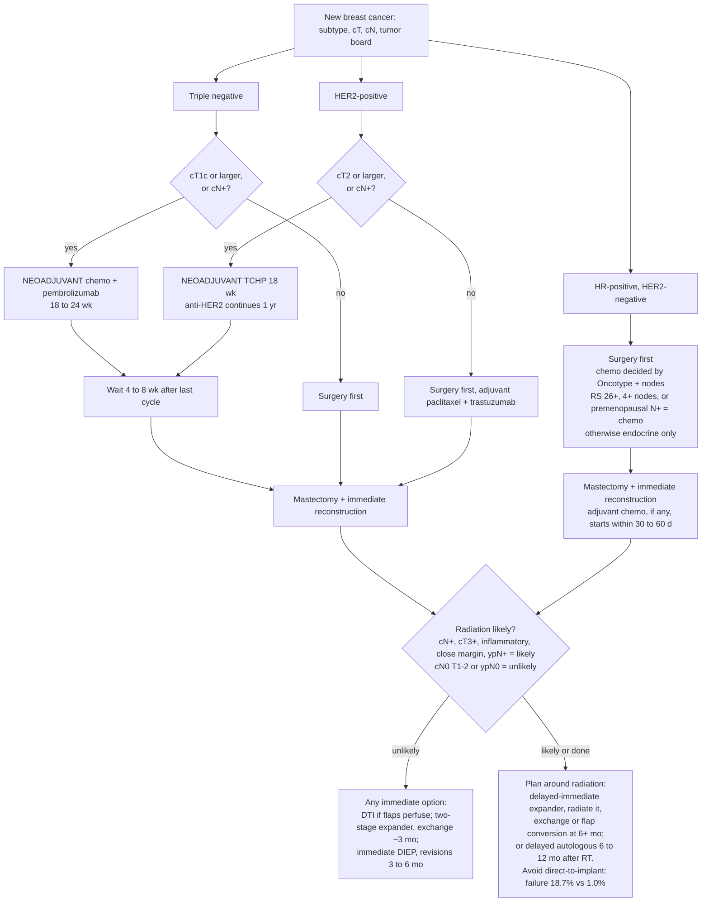
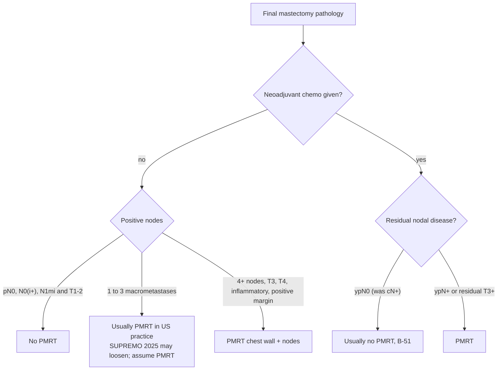

# Breast Reconstruction Timing Algorithm (Mermaid version)

Companion to the published page. GitHub and Claude Code desktop render these Mermaid diagrams. Oncology makes the final call; this is what the reconstructive surgeon should predict and counsel.

## Master algorithm: subtype to reconstruction plan

## Radiation decision after mastectomy

Positive sentinel node after mastectomy is often treated with axillary radiation instead of dissection (AMAROS), so a positive node almost always means radiation. Timing: no chemo, RT starts 3 to 6 weeks after surgery; with adjuvant chemo, RT follows chemo, about 4 to 6 months after mastectomy.

## Calendar timelines (weeks)

```mermaid
gantt
  title A. Neoadjuvant pathway (anchor: chemo start)
  dateFormat X
  axisFormat wk %s
  section Systemic
  Chemo 18 wk            :a1, 0, 18
  Wait 4 to 8 wk         :a2, 18, 24
  section Surgery
  Mastectomy + recon     :milestone, m1, 24, 0
  section Radiation
  RT 3 to 5 wk (starts 3 to 6 wk post-op) :a3, 28, 33
  Wait 6 months           :a4, 33, 59
  Exchange or flap conversion :milestone, m2, 59, 0
```

```mermaid
gantt
  title B. Surgery first, adjuvant chemo + RT (anchor: mastectomy)
  dateFormat X
  axisFormat wk %s
  section Surgery
  Mastectomy + expander  :milestone, m1, 0, 0
  Chemo must start       :b0, 0, 4
  section Systemic
  Chemo 12 to 16 wk (fill between cycles) :b1, 4, 20
  Wait 3 to 4 wk         :b2, 20, 24
  section Radiation
  RT 3 to 5 wk           :b3, 24, 29
  Wait 6 months          :b4, 29, 55
  Exchange or flap conversion :milestone, m2, 55, 0
  Symmetry and fat grafting 9 to 12 mo after RT :milestone, m3, 65, 0
```

```mermaid
gantt
  title C. No chemo, no radiation (anchor: mastectomy)
  dateFormat X
  axisFormat wk %s
  section Surgery
  Mastectomy + DTI, expander, or flap :milestone, m1, 0, 0
  Heal and expand        :c1, 0, 12
  Exchange (expander)    :milestone, m2, 12, 0
  Flap revisions, symmetry, nipple 3 to 6 mo :milestone, m3, 24, 0
```

```mermaid
gantt
  title D. Delayed reconstruction after radiation (anchor: last fraction)
  dateFormat X
  axisFormat wk %s
  section After RT
  Acute changes 0 to 3 mo        :d1, 0, 12
  Complications peak 3 to 6 mo, avoid :crit, d2, 12, 26
  Delayed DIEP or conversion window 6 to 12 mo :active, d3, 26, 52
```

## Reconstruction options against radiation status

| Option | Radiation unlikely | Radiation possible or planned | Radiation already given |
|---|---|---|---|
| Direct-to-implant | Recommended if flaps perfuse; small to moderate, minimal ptosis | **Avoid** (failure 18.7%, contracture 15 to 50%) | **Avoid** |
| Expander then implant | Recommended; exchange about 3 months | Acceptable with counseling; radiate expander, exchange 6+ months | Acceptable, higher failure; often needs latissimus or fat grafting |
| Immediate autologous flap | Recommended; best long-term satisfaction | Acceptable with counseling; fibrosis, 10 to 20% volume loss, fat necrosis | n/a |
| Delayed-immediate | Acceptable when pathology could surprise | **Recommended**; expander now, flap or implant at 6+ months | n/a |
| Delayed autologous | Acceptable by preference or medical delay | Acceptable; flat closure now, flap after RT | **Recommended**; 6 to 12 months after RT, failure 1% |

## Waiting intervals

| After this | Wait | Before | Why |
|---|---|---|---|
| Last neoadjuvant chemo cycle | 4 to 8 wk | Mastectomy and reconstruction | Count recovery; beyond 8 weeks survival worsens |
| Mastectomy, adjuvant chemo planned | ≤ 30 to 60 d | Chemo must start; wound closed and dry | Delay past 60 d increases mortality |
| Mastectomy, radiation without chemo | 3 to 6 wk | Radiation; expansion complete before simulation | Volume fixed at simulation |
| Last chemo cycle, radiation to follow | 3 to 4 wk | Radiation | Marrow recovery |
| Radiation ends, expander in place | ≥ 6 mo | Exchange or flap conversion | Failure 22.4% under 6 mo vs 7.7% |
| Radiation ends, no reconstruction | 6 to 12 mo | Delayed autologous | Complications peak 3 to 6 mo |
| Radiation ends, flap in place | ≥ 6 mo | Revisions, fat grafting, nipple | Fibrosis declares by 6 to 12 mo |
| Radiation ends, any reconstruction | 9 to 12 mo | Contralateral symmetry | Radiated side stabilizes |
| Fat grafting in irradiated tissue | ~3 mo | Next session or exchange | Graft take |
| Bevacizumab last dose | ≥ 28 d | Elective surgery; restart ≥ 28 d after and healed | FDA label |
| Tamoxifen, free flap planned | 28 d hold | Microsurgery, shared decision | Kelley 2012 vs 2022 meta-analysis |
| Nicotine | 4 wk before and after | Any reconstruction | ASPS |
| Expander fills during chemo | avoid days 7 to 14 | Fill between cycles | Nadir |

No hold and no healing effect: pembrolizumab, trastuzumab, pertuzumab, T-DM1, capecitabine, aromatase inhibitors. Screen checkpoint-inhibitor patients for thyroid and adrenal effects before anesthesia.

## The sentence for every note

"Adjuvant plan anticipated: [chemo yes/no, timing], [radiation likely/unlikely, basis]; reconstruction sequenced accordingly with [expander / flap / implant] and definitive stage no earlier than [date]."
